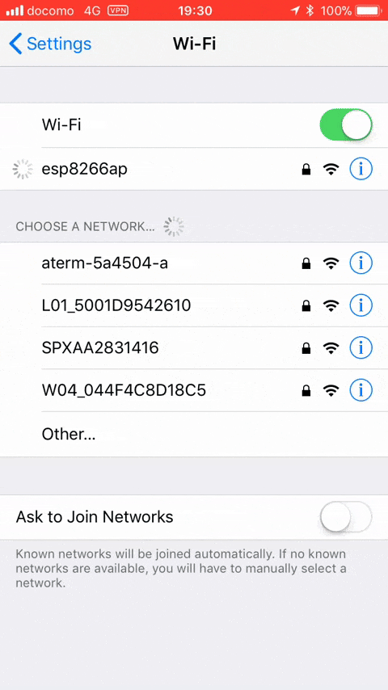
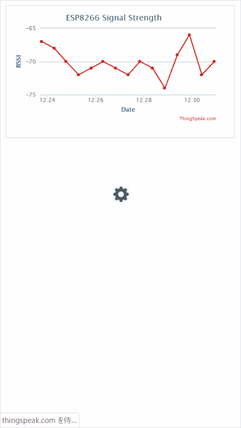
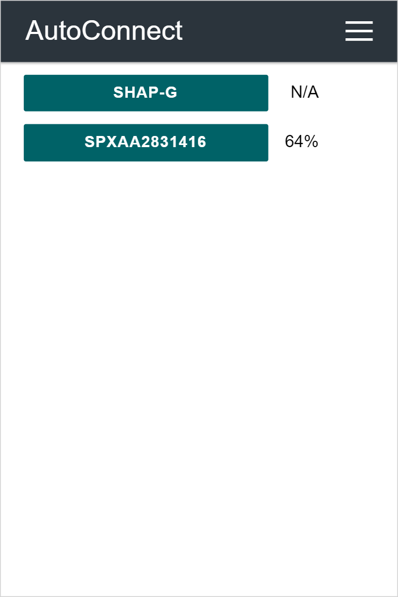
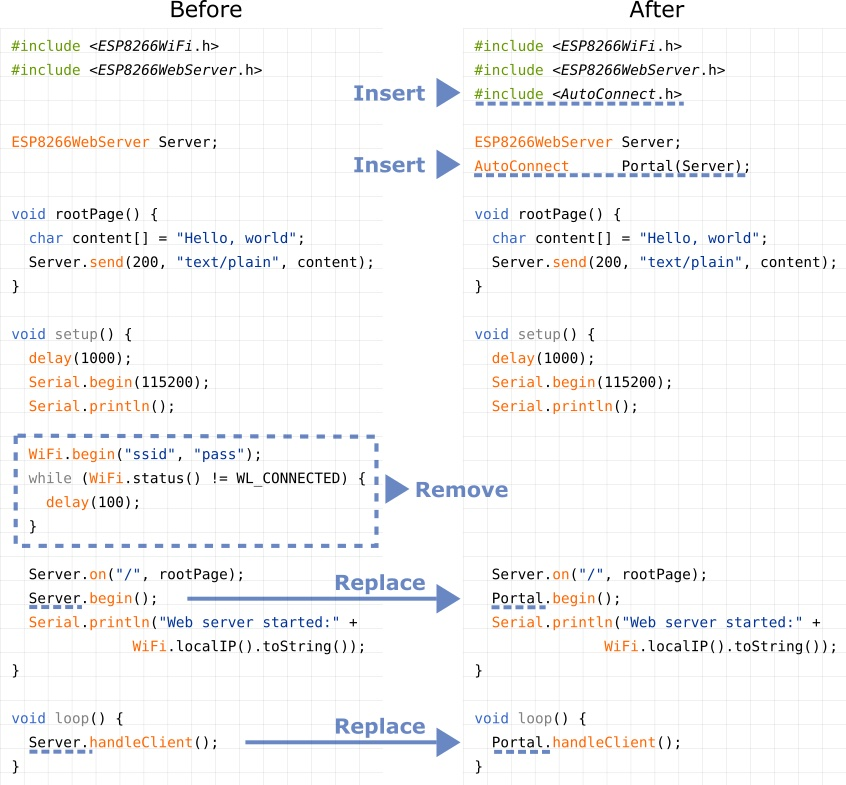

# AutoConnect for ESP8266/ESP32

[](https://github.com/Hieromon/AutoConnect/releases)
[](https://www.ardu-badge.com/AutoConnect)
[](https://travis-ci.org/Hieromon/AutoConnect)
[](https://github.com/Hieromon/AutoConnect/blob/master/LICENSE)

An Arduino library for ESP8266/ESP32 WLAN configuration at run time with web interface. 

## Overview

To the dynamic configuration for joining to WLAN with SSID and PSK accordingly. It an Arduino library united with *ESP8266WebServer* class of ESP8266 or *WebServer* class of ESP32.
Easily implementing the Web interface constituting the WLAN for ESP8266/ESP32 WiFi connection. With this library to make a sketch easily which connects from ESP8266/ESP32 to the access point at runtime by the web interface without hard-coded SSID and password.

<div align="center">&emsp;&emsp;&emsp;</div>

### No need pre-coded SSID &amp; password

It is no needed hard-coding in advance the SSID and Password into the sketch to connect between ESP8266/ESP32 and WLAN. You can input SSID &amp; Password from a smartphone via the web interface at runtime.

### Simple usage

AutoConnect control screen will be displayed automatically for establishing new connections. It aids by the <a href="https://en.wikipedia.org/wiki/Captive_portal">captive portal</a> when vested the connection cannot be detected.<br>By using the [AutoConnect menu](https://hieromon.github.io/AutoConnect/menu.html), to manage the connections convenient.

### Store the established connection

The connection authentication data as credentials are saved automatically in EEPROM of ESP8266/ESP32 and You can select the past SSID from the [AutoConnect menu](https://hieromon.github.io/AutoConnect/menu.html).

### Easy to embed in

AutoConnect can be embedded easily into your sketch, just "**begin**" and "**handleClient**".

###  Lives with the your sketches

The sketches which provide the web page using ESP8266WebServer/WebServer there is, AutoConnect will not disturb it. AutoConnect can use an already instantiated ESP8266WebServer object(ESP8266) or WebServer object(ESP32), or itself can assign it.

### Easily add user-owned web screen and  parameters <sup><sub>ENHANCED w/ v0.9.7</sub></sup>

You can easily add your own web screen that can consist of representative HTML elements as the styled TEXT, INPUT, BUTTON, CHECKBOX, RADIO, SELECT, SUBMIT into the menu. It can be invoked from the AutoConnect menu and parameters can be passed.

### Just loading the JSON description <sup><sub>ENHANCED w/ v0.9.7</sub></sup>

These HTML elements that make up the user-owned screen can be easily loaded from the JSON description stored in PROGMEM, SPIFFS or SD.

&emsp;
&emsp;


### Quick and easy to equip the OTA update feature <sup><sub>ENHANCED w/ v1.0.0</sub></sup>

You can quickly and easily equip the [OTA update feature](https://hieromon.github.io/AutoConnect/otaupdate.html) to your sketch and also you can operate the firmware update process via OTA from AutoConnect menu.

## Supported hardware

Apply the [Arduino core](https://github.com/esp8266/Arduino) of the ESP8266 Community.

- Generic ESP8266 modules
- Adafruit HUZZAH ESP8266 (ESP-12)
- ESP-WROOM-02
- Heltec WiFi Kit 8
- NodeMCU 0.9 (ESP-12) / NodeMCU 1.0 (ESP-12E)
- Olimex MOD-WIFI-ESP8266
- SparkFun Thing
- SweetPea ESP-210

Alter the platform applying the [arduino-esp32](https://github.com/espressif/arduino-esp32) for the ESP32 modules.

- ESP32Dev Board
- SparkFun ESP32 Thing
- WEMOS LOLIN D32
- Ai-Thinker NodeMCU-32S
- Heltec WiFi Kit 32
- M5Stack
- Unexpected Maker TinyPICO
- And other ESP32 modules supported by the Additional Board Manager URLs of the Arduino-IDE.

## Simple usage

### The AutoConnect menu

&emsp;&emsp;&emsp;

### How embed the AutoConnect to the sketches you have

Most simple approach to applying AutoConnect for the existing sketches, follow the below steps.



## More usages and Documentation

Full documentation is available on https://Hieromon.github.io/AutoConnect, some quick links at the list:

- The [Installation](https://hieromon.github.io/AutoConnect/index.html#installation) is the installation procedure and requirements for the library.
- [Getting started](https://hieromon.github.io/AutoConnect/gettingstarted.html) with the most simple sketch for using AutoConnect.
- The [Basic usage](https://hieromon.github.io/AutoConnect/basicusage.html) guides to using the library correctly.
- Details are explained in the [Advanced usage](https://hieromon.github.io/AutoConnect/advancedusage.html).
- Details and usage of custom Web pages are explained in the [Custom Web pages](https://hieromon.github.io/AutoConnect/acintro.html).
- The [API reference](https://hieromon.github.io/AutoConnect/api.html) describes the AutoConnect functions specification.
- There are hints in [Examples](https://hieromon.github.io/AutoConnect/howtoembed.html) for making sketches with AutoConnect.
- [FAQ](https://hieromon.github.io/AutoConnect/faq.html).

## Change log

### [1.2.2] Dec. 13, 2020

- Fixed an issue where OTA updates would crash on the ESP32 platform. (issue #284)

### [1.2.1] Dec. 5, 2020

- Fixed that not declared error with `AUTOCONNECT_NOUSE_JSON`. (issue #282)

### [1.2.0] Dec. 3, 2020
- Supports LittleFS file system with ESP8266 platform.
- Supports HTTP authentication. (issue #171)
- Supports AutoConnectConfig::preserveAPMode setting. (issue #210)
- Supports an **onConnect** exit.
- Supports a **whileCaptivePortal** exit. (issue #149, issue #244)
- Enhanced ticker to work even in handleClient loop.
- Enhanced the ability to upload a regular file with AutoConnectOTA. (issue #236)
- Enhanced AutoConnectInput to allow accepts password and number type. (issue #237, issue #255)
- Enhanced handleClient to launch the captive portal when losing WiFi connection.
- Added **getEEPROMUsedSize** that notifies the occupied size of the credential storage area. (issue #209)
- Added the **append** and the **detach** function that can be dynamically AutoConnectAux attaching and detaching. (issue #230)
- Added **AUTOCONNECT_APKEY_SSID** definition to seek access points by SSID. (issue #251)
- Added AutoConnectConfig::beginTimeout setting. (issue #247)
- Improved atuoReconnect to work even in handleClient loop. (issue #234, issue #251)
- Fixed incorrect connection wait time. (issue #216)
- Fixed an exception in the AutoConnect::end function.
- Avoids an empty-body warning when AC_DEBUG is disabled. (issue #218)
- Fixed not being able to specify channel ID with a mqttRSSI.ino example. (issue #262)
- Fixed an invalid SPIFFS compile error with ESP32.
- Fixed a core panic in the regex with ESP32.
- Fixed posterior being disabled in AutoConnectElement.
- Fixed deficiently forward references with HandleClient.ino example. (PR #275)

### [1.1.7] Apr. 19, 2020
- Fixed Apply button not work. (issue #206)

### [1.1.6] Apr. 17, 2020
- Fixed OTA page translation not work. (issue #204)

### [1.1.5] Apr. 15, 2020
- Changed the bootUri behavior to be an automatic pop-up at the captive portal. (PR #181)
- Supports AutoConnect menu configuration.
- Supports the built-in OTA feature.
- Supports an attempt order when available APs would be found multiple, and RSSI lower bound on AP signal strength. This option can specify the order of connection attempting according to the WiFi signal strength indicated with RSSI. (PR #187)

### [1.1.4] Feb. 14, 2020
- Supports for overriding text of the menu items with user-defined labels.
- Fixed the compiler warning with experimental WiFi mode of ESP8266.

### [1.1.3] Jan. 1, 2020
- Added AUTOCONNECT_NOUSE_JSON directive. (issue #167)
- Removed compiler warning of unused.
- Improved Config New button behavior. (issue #150)
- Fixed relocate Config New menu URI inability.

### [1.1.2] Oct. 22, 2019
- Fixed crash when no SSID found.
- Fixed memory leak on destruction. (PR #144)

### [1.1.1] Oct. 17, 2019
- Fixed crash with unique_ptr deleting reference content. (issue #138)
- Fixed disconnection request initialization missing. (issue #139)

### [1.1.0] Oct. 15, 2019
- Supports static IPs with the 'Configure new AP' menu. (issue #132)
- Fixed compilation error that no member named 'printTo' with ArduinoJson 5.

### [1.0.3] Sept. 30, 2019
- Fixed a return of AutoConnectCredential::entries(). (issue #133)

### [1.0.2] Sept. 19, 2019
- Fixed compilation error that no member named 'success' with ArduinoJson 5. (issue #130)
- Fixed SSID non termination. (issue #128)
- Fixed compilation error that getBytesLength missing with ESP32. (issue #125)
- Added #include directive restriction for EEPROM and ESP8266httpUpdate to FAQ. (issue #127)

### [1.0.1] Sept. 13, 2019
- Added a sketch for ESP32 boards that migrates credentials stored in EEPROM partition to the Preferences.

### [1.0.0] Sept. 7, 2019
- Supports Arduino core for ESP32 1.0.3.
- Supports AutoConnectUpdate for the OTA update.
- Supports Preferences for saving credentials with ESP32 core 1.0.3 and later. **In ESP32, the credentials stored past in EEPROM will lose**.
- Supports AutoConnectAux::isValid function.
- Supports the global attribute with all AutoConnectElements.

### [0.9.12] Aug. 18, 2019
- Fixed missing captive portal notifications on the newer mobile OS client. As a result of this fix, the SoftAP default IP address and gateway have been changed to **172.217.28.1**. (issue #85) 

### [0.9.11] July 13, 2019
- Supports new element as AutoConnectSytle that can insert the custom CSS into AutoConnectAux page. (PR#96)
- Supports that `<br>` tags can now be added to each element. (PR #95)
- Supports that able to place the checkbox label forward or backward. (PR #99)
- Supports flicker signal output according to the status of WiFi_mode. (issue #98)
- Supports AutoConnectAux::fetchElement function to retrieve inputted element values via a custom Web page.
- Fixed bug in AutoConnectCredential when offset is >256. (PR #103)
 
### [0.9.10] June 12, 2019
- Fixed the unable to get AutoConnectElemets values ​​in the sketch with ESP8266 arduino core 2.5.2. (issue #90)
- Fixed missing psram allocator. (issue #102)

### [0.9.9] May 25, 2019
- Supports ESP8266 Arduino core 2.5.2.
- Menu text/background color can be statically customized. refer to the [Custom colorized](https://hieromon.github.io/AutoConnect/colorized.html) for the detailed specification for the menu colorizing.
- Added ID attribute to HTML tag generated from AutoConnectText.
- Added the enable attribute to the AutoConnectElements.
- Fixed the input box layout collapsed.
- Fixed that the decoration of AutoConnectButton was disabled.
- Fixed that the value remains even after clearing the option with AutoConnectSelect.
- Fixed that an alignment violation exception occurred when loading AutoConnectAux described by JSON with PROGMEM attribute.

### [0.9.8] May 3, 2019
- Supports ArduinoJson 6.9.1 or later.
- Supports allocating JsonDocument buffer to PSRAM on ESP32 with ArduinoJson 6.10.0 or later.
- Supports **operator`[]`** as a shortcut for AutoConnectAux::getElement function.
- Supports **AutoConnectElement::as<T\>** function to easily coding for conversion from an AutoConnectElement to an actual type.
- Supports new element type **AutoConnectFile** and built-in file uploader.
- Supports a **format** attribute with the AutoConnectText element.
- Supports a **selected** attribute with the AutoConnectSelect element.
- Supports multiple element loading with AutoConnectAux::loadElement.
- Changed menu labels placement in source files structure.
- Changed API interface of AutoConnect::where function.
- Fixed blank page responds with Configure new.
- Fixed loading elements value missing.
- Fixed losing elements in saveElement with ArduinoJson V6.
- Fixed compile error with older than ESP8266 core 2.5.0.

### [0.9.7] Feb. 25, 2019
- Fixed crash in some environments. Thank you @ageurtse
- Supports AutoConnect menu extension by user sketch with **AutoConnectAux**.
- Supports loading and saving of user-defined parameters with JSON format.
- Improved the WiFi connection sequence at the first WiFi.begin. Even if **AutoConnectConfig::autoReconnect** is disabled when SSID and PSK are not specified, it will use the information of the last established access point. The autoReconnect option will achieve trying the connect after a previous connection failed.
- Supports the **AutoConnectConfig::immediateStart** option and immediately starts the portal without first trying WiFi.begin. You can start the captive portal at any time in combination with the **AutoConnectConfig::autoRise** option.
- Improved boot uri after reset. **AutoConnectConfig::bootUri** can be specified either /_ac or HOME path as the uri to be accessed after invoking Reset from AutoConnect menu.
- Improved source code placement of predefined macros. Defined common macros have been moved to ```AutoConnectDefs.h```.
- Supports **AutoConnectConfig::hostName**. It activates ```WiFi.hostname()```.
- Supports the captive portal time-out. It can be controlled by **AutoConnectConfig::portalTimeout** and **AutoConnectConfig::retainPortal**.

### [0.9.6] Sept. 27, 2018
- Improvement of RSSI detection for saved SSIDs.
- Fixed disconnection SoftAP completely at the first connection phase of the AutoConnect::begin.

### [0.9.5] Aug. 27, 2018
- Supports the espressif arduino-esp32 core.
- Fixed that crash may occur if the number of stored credentials in the EEPROM is smaller than the number of found WiFi networks.

### [0.9.4] May 5, 2018.
- Automatically focus passphrase after selecting SSID with Configure New AP.
- Supports AutoConnectConfig::autoReconnect option, it will scan the WLAN when it can not connect to the default SSID, apply the applicable credentials if it is saved, and try reconnecting.

### [0.9.3] March 23, 2018.
- Supports a static IP address assignment.

### [0.9.2] March 19, 2018.
- Improvement of string literal declaration with the examples, no library change.

### [0.9.1] March 13, 2018.
- A release of the stable.

## License

License under the [MIT license](LICENSE).
