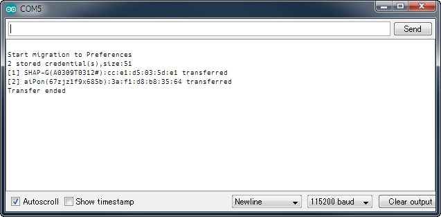

## CreditMigrate.ino - A migration tool for the saved credentials

### Description

Since AutoConnect v1.0.0 for ESP32, the storage location in the flash of established credentials has moved from EEPROM to Preferences. After You update AutoConnect to v1.0.0, past credentials saved by v0.9.12 earlier will *not be accessible* from the AutoConnect menu - **Open SSIDs**. You need to transfer once the stored credentials from the EEPROM area to the Preferences area.

**CreditMigrate.ino** transports the credentials stored in EEPROM to the Preferences area to inherit them for AutoConnect v1.0.0 or later.

### Restrictions

- CreditMigrate.ino is only applicable to ESP32 boards. It cannot be executed with a compile error on the ESP8266 boards. (ESP8266 does not require credential migration.)
- CreditMigrate.ino will work properly with the installed ESP32 core version is 1.0.2 or earlier. (In ESP32 core 1.0.3, EEPROM area has moved from partition to the nvs. CreditMigrate.ino will not work properly with ESP32 core 1.0.3. ESP32 core 1.0.2 is recommended)

### Saved credentials migration procedure on your ESP32 board

1. Connect your host PC and ESP32 module with serial and start Arduino IDE.
2. Confirm that the version of the ESP32 core currently installed via the board manager of ArduinoIDE is 1.0.2 or earlier.
3. Open **CreditMigrate.ino** as a sketch in the examples of the AutoConnect library folder.
4. From the Arduino IDE menu: **Tools > Board:** to select the one that matches your ESP32 board and set it up.
5. Open the serial monitor of Arduino IDE.
6. From the Arduino IDE menu: **Sketch > Upload** to compile and upload the sketch.
7. It will transport the past credentials that had been stored in EEPROM to Preferences. You can confirm the result on the serial monitor.

