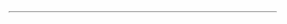
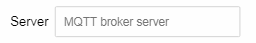
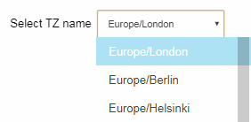
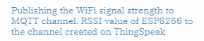

## The elements for the custom Web pages

Representative HTML elements for making the custom Web page are provided as AutoConnectElements.

- [AutoConnectButton](#autoconnectbutton): Labeled action button
- [AutoConnectCheckbox](#autoconnectcheckbox): Labeled checkbox
- [AutoConnectElement](#autoconnectelement-a-basic-class-of-elements): General tag
- [AutoConnectFile](#autoconnectfile): File uploader
- [AutoConnectInput](#autoconnectinput): Labeled text input box
- [AutoConnectRadio](#autoconnectradio): Labeled radio button
- [AutoConnectSelect](#autoconnectselect): Selection list
- [AutoConnectStyle](#autoconnectstyle): Custom CSS code
- [AutoConnectSubmit](#autoconnectsubmit): Submit button
- [AutoConnectText](#autoconnecttext): Style attributed text

## Layout on a custom Web page

AutoConnect will not actively be involved in the layout of custom Web pages generated from AutoConnectElements. However, each element has [an attribute to arrange placement](#post) on a custom web page by horizontally or vertically.

## Custom CSS for a custom Web page

All custom Web page styles are limited to the built-in unique CSS embedded in the library code. Direct modification of the CSS affects AutoConnect behavior. You can use dedicated elements to relatively safely modify the style of your custom Web page.
The [AutoConnectStyle](#autoconnectstyle) will insert the raw CSS code into the style block in HTML of the custom Web page.

## Form and AutoConnectElements

All AutoConnectElements placed on custom web pages will be contained into one form. Its form is fixed and created by AutoConnect. The form value (usually the text or checkbox you entered) is sent by [AutoConnectSubmit](#autoconnectsubmit) using the **POST** method with HTTP. The post method sends the actual form data which is a query string whose contents are the **name** and **value** of AutoConnectElements. You can retrieve the value for the parameter with the Sketch from the query string with [ESP8266WebServer::arg](https://github.com/esp8266/Arduino/tree/master/libraries/ESP8266WebServer#getting-information-about-request-arguments) function or [PageArgument](https://github.com/Hieromon/PageBuilder#arguments-of-invoked-user-function) class of the [AutoConnect::on](api.md#on) handler when the form is submitted.

## AutoConnectElement - <small>A basic class of elements</small>

AutoConnectElement is a base class for other element classes and has common attributes for all elements. It can also be used as a [variant](#variant-for-autoconnectelements) of each element. The following items are attributes that AutoConnectElement has and are common to other elements.

<i class="fa fa-eye"></i> **Sample**<br>
<small>**`AutoConnectElement element("element", "<hr>");`**</small>

<small>On the page:</small><br>

### <i class="fa fa-edit"></i> Constructor

```cpp
AutoConnectElement(const char* name, const char* value, const ACPosterior_t post)
```

### <i class="fa fa-caret-right"></i> name

Each element has a name. The **name** is the String data type. You can identify each element by the name to access it with sketches. 

### <i class="fa fa-caret-right"></i> value

The **value** is the string which is a source to generate an HTML code. Characteristics of Value vary depending on the element. The value of AutoConnectElement is native HTML code. A string of value is output as HTML as it is.

### <i class="fa fa-caret-right"></i> post

The **post** specifies a tag to add behind the HTML code generated from the element. Its purpose is to place elements on the custom Web page as intended by the user sketch.
AutoConnect will not actively be involved in the layout of custom Web pages generated from AutoConnectElements. Each element follows behind the previous one, with the exception of some elements. You can use the **post** value to arrange vertically or horizontal when the elements do not have the intended position on the custom Web Page specifying the following enumeration value as **ACPosterior_t** type for the **post**.

- **`AC_Tag_None`** : No generate additional tags.
- **`AC_Tag_BR`** : Add a `<br>` tag to the end of the element.
- **`AC_Tag_P`** : Include the element in the `<p> ~ </p>` tag.

The default interpretation of the post value is specific to each element.

AutoConnectElements | Default interpretation of the post value
----|----
AutoConnectElement | AC_Tag_None
AutoConnectButton | AC_Tag_None
AutoConnectCheckBox | AC_Tag_BR
AutoConnectFile | AC_Tag_BR
AutoConnectInput | AC_Tag_BR
AutoConnectRadio | AC_Tag_BR
AutoConnectSelect | AC_Tag_BR
AutoConnectSubmit | AC_Tag_None
AutoConnectText | AC_Tag_None

### <i class="fa fa-caret-right"></i> type

The **type** indicates the type of the element and represented as the *ACElement_t* enumeration type in the Sketch. Since AutoConnectElement also acts as a variant of other elements, it can be applied to handle elements collectively. At that time, the type can be referred to by the [**typeOf()**](apielements.md#typeof) function. The following example changes the font color of all [AutoConnectText](#autoconnecttext) elements of a custom Web page to gray.

```cpp hl_lines="5"
AutoConnectAux  customPage;

AutoConnectElementVT& elements = customPage.getElements();
for (AutoConnectElement& elm : elements) {
  if (elm.typeOf() == AC_Text) {
    AutoConnectText& text = reinterpret_cast<AutoConnectText&>(elm);
    text.style = "color:gray;";
  }
}
```

The enumerators for *ACElement_t* are as follows:

-  AutoConnectButton: **AC_Button**
-  AutoConnectCheckbox: **AC_Checkbox** 
-  AutoConnectElement: **AC_Element**
-  AutoConnectFile: **AC_File**
-  AutoConnectInput: **AC_Input**
-  AutoConnectRadio: **AC_Radio**
-  AutoConnectSelect: **AC_Select**
-  AutoConnectStyle: **AC_Style**
-  AutoConnectSubmit: **AC_Submit**
-  AutoConnectText: **AC_Text**
-  Uninitialized element: **AC_Unknown**

Furthermore, to convert an entity that is not an AutoConnectElement to its native type, you must [re-interpret](https://en.cppreference.com/w/cpp/language/reinterpret_cast) that type with c++. Or, you can be coding the Sketch more easily with using the [**as<T\>**](apielements.md#ast62) function.

```cpp hl_lines="6"
AutoConnectAux  customPage;

AutoConnectElementVT& elements = customPage.getElements();
for (AutoConnectElement& elm : elements) {
  if (elm.type() == AC_Text) {
    AutoConnectText& text = customPage[elm.name].as<AutoConnectText>();
    text.style = "color:gray;";
    // Or, it is also possible to write the code further reduced as follows.
    // customPage[elm.name].as<AutoConnectText>().style = "color:gray;";
  }
}
```

## AutoConnectButton

AutoConnectButton generates an HTML `#!html <button type="button">` tag and locates a clickable button to a custom Web page. Currently AutoConnectButton corresponds only to name, value, an *onclick* attribute of HTML button tag. An *onclick* attribute is generated from an `action` member variable of the AutoConnectButton, which is mostly used with a JavaScript to activate a script.

<i class="fa fa-eye"></i> **Sample**<br>
<small>**`AutoConnectButton button("button", "OK", "myFunction()");`**</small>

<small>On the page:</small><br>

### <i class="fa fa-edit"></i> Constructor

```cpp
AutoConnectButton(const char* name, const char* value, const String& action, const ACPosterior_t post)
```

### <i class="fa fa-caret-right"></i> name

It is the `name` of the AutoConnectButton element and matches the name attribute of the button tag. It also becomes the parameter name of the query string when submitted.

### <i class="fa fa-caret-right"></i> value

It becomes a value of the `value` attribute of an HTML button tag.

### <i class="fa fa-caret-right"></i> action

**action** is String data type and is an *onclick* attribute fire on a mouse click on the element. It is mostly used with a JavaScript to activate a script.[^1] For example, the following code defines a custom Web page that copies a content of `Text1` to `Text2` by clicking `Button`.

[^1]:JavaScript can be inserted into a custom Web page using AutoConnectElement.

```cpp hl_lines="3 4 5 10"
const char* scCopyText = R"(
<script>
function CopyText() {
  document.getElementById("Text2").value = document.getElementById("Text1").value;
}
</script>
)";
ACInput(Text1, "Text1");
ACInput(Text2, "Text2");
ACButton(Button, "COPY", "CopyText()");
ACElement(TextCopy, scCopyText);
```

### <i class="fa fa-caret-right"></i> post

Specifies a tag to add behind the HTML code generated from the element. The default values is `AC_Tag_None`.

## AutoConnectCheckbox

AutoConnectCheckbox generates an HTML `#!html <input type="checkbox">` tag and a `#!html <label>` tag. It places horizontally on a custom Web page by default.

<i class="fa fa-eye"></i> **Sample**<br>
<small>**`AutoConnectCheckbox checkbox("checkbox", "uniqueapid", "Use APID unique", false);`**</small>

<small>On the page:</small><br>

### <i class="fa fa-edit"></i> Constructor

```cpp
AutoConnectCheckbox(const char* name, const char* value, const char* label, const bool checked, const ACPosition_t labelPosition, const ACPosterior_t post)
```

### <i class="fa fa-caret-right"></i> name

It is the `name` of the AutoConnectCheckbox element and matches the name attribute of the input tag. It also becomes the parameter name of the query string when submitted.

### <i class="fa fa-caret-right"></i> value

It becomes a value of the `value` attribute of an HTML `#!html <input type="checkbox">` tag.

### <i class="fa fa-caret-right"></i> label

A label is an optional string. A label is always arranged on the right side of the checkbox. Specification of a label will generate an HTML `<label>` tag with an `id` attribute. The checkbox and the label are connected by the id attribute. 
Only <i class="far fa-square"></i> will be displayed if a label is not specified.

### <i class="fa fa-caret-right"></i> checked

A checked is a Boolean value and indicates the checked status of the checkbox. The value of the checked checkbox element is packed in the query string and sent.

### <i class="fa fa-caret-right"></i> labelPosition

The position of the label belonging to the checkbox can be specified around the element. The labelPosition specifies the position of the label to generate with **ACPostion_t** enumeration value. The default value is `AC_Behind`.

- **`AC_Infront`** : Place a label in front of the check box.
- **`AC_Behind`** : Place a label behind the check box.

### <i class="fa fa-caret-right"></i> post

Specifies a tag to add behind the HTML code generated from the element. The default values is `AC_Tag_BR`.

## AutoConnectFile

AutoConnectFile generates an HTML `#!html <input type="file">` tag and a `#!html <label>` tag. AutoConnectFile enables file upload from the client through the web browser to ESP8266/ESP32 module. You can select the flash in the module, external SD device or any output destination as the storage of the uploaded file.

<i class="fa fa-eye"></i> **Sample**<br>
<small>**`AutoConnectFile file("file", "", "Upload:", AC_File_FS)`**</small>

<small>On the page:</small><br>

### <i class="fa fa-edit"></i> Constructor

```cpp
AutoConnectFile(const char* name, const char* value, const char* label, const ACFile_t store, const ACPosterior_t post)
```

### <i class="fa fa-caret-right"></i> name

It is the `name` of the AutoConnectFile element and matches the name attribute of the input tag. It also becomes the parameter name of the query string when submitted.

### <i class="fa fa-caret-right"></i> value

File name to be upload. The value contains the value entered by the client browser to the `#!html <input type="file">` tag and is read-only. Even If you give a value to the constructor, it does not affect as an initial value like a default file name.

### <i class="fa fa-caret-right"></i> label

A `label` is an optional string. A label is always arranged on the left side of the input box. Specification of a label will generate an HTML `#!html <label>` tag with an id attribute. The input box and the label are connected by the id attribute.

### <i class="fa fa-caret-right"></i> store

Specifies the destination to save the uploaded file. The destination can be specified the following values ​​in the *ACFile_t* enumeration type.

- **`AC_File_FS`** : Save as the SPIFFS file in flash of ESP8266/ESP32 module.
- **`AC_File_SD`** : Save to an external SD device connected to ESP8266/ESP32 module.
- **`AC_File_Extern`** : Pass the content of the uploaded file to the uploader which is declared by the Sketch individually. Its uploader must inherit [**AutoConnectUploadHandler**](acupload.md#to-upload-to-a-device-other-than-flash-or-sd) class and implements *_open*, *_write* and *_close* function.

!!! note "Built-in uploader is ready."
    AutoConnect already equips the built-in uploader for saving to the SPIFFS as AC_File_FS and the external SD as AC_File_SD. It is already implemented inside AutoConnect and will store uploaded file automatically.

### <i class="fa fa-caret-right"></i> post

Specifies a tag to add behind the HTML code generated from the element. The default values is `AC_Tag_BR`.

## AutoConnectInput

AutoConnectInput generates an HTML `#!html <input type="text">`, `#!html <input type="number">` or `#!html <input type="password">` tag and a `#!html <label>` tag. It can also have a placeholder. The value of the input box is passed to the destination in the query string and can be retrieved programmatically. You can also update from the Sketches.

<i class="fa fa-eye"></i> **Sample**<br>
<small>**`AutoConnectInput input("input", "", "Server", "MQTT broker server");`**</small>

<small>On the page:</small><br>

### <i class="fa fa-edit"></i> Constructor

```cpp
AutoConnectInput(const char* name, const char* value, const char* label, const char* pattern, const char* placeholder, const ACPosterior_t post, const ACInput_t apply)
```

### <i class="fa fa-caret-right"></i> name

It is the `name` of the AutoConnectInput element and matches the name attribute, the id attribute of the input tag. It also becomes the parameter name of the query string when submitted.

### <i class="fa fa-caret-right"></i> value

It becomes a string value of the `value` attribute of an HTML `#!html <input type="text">` tag. The text entered from the custom Web page will be grouped in the query string of the form submission and the string set before accessing the page will be displayed as the initial value.

### <i class="fa fa-caret-right"></i> label

A `label` is an optional string. A label is always arranged on the left side of the input box. Specification of a label will generate an HTML `#!html <label>` tag with an id attribute. The input box and the label are connected by the id attribute.

### <i class="fa fa-caret-right"></i> pattern

A `pattern` specifies a [regular expression](https://www.w3schools.com/js/js_regexp.asp) that the AutoConnectInput element's value is checked against on form submission. If it is invalid, the background color will change, but it will be sent even if the data format does not match. To check whether the entered value matches the pattern, use the [isValid](apielements.md#isvalid) function.

- The password that must contain 8 or more characters that are of at least one number, and one uppercase and lowercase letter:<br>`(?=.*\d)(?=.*[a-z])(?=.*[A-Z]).{8,}`
- Email address as _characters@characters.domain_:<br>`[a-z0-9._%+-]+@[a-z0-9.-]+\.[a-z]{2,}`

- IP address:<br>`(([0-9]|[1-9][0-9]|1[0-9]{2}|2[0-4][0-9]|25[0-5])\\.){3}([0-9]|[1-9][0-9]|1[0-9]{2}|2[0-4][0-9]|25[0-5])`

- Host name of Internet:<br>`(([a-zA-Z0-9]|[a-zA-Z0-9][a-zA-Z0-9\-]*[a-zA-Z0-9])\.)*([A-Za-z0-9]|[A-Za-z0-9][A-Za-z0-9\-]*[A-Za-z0-9])`

- Date (MM/DD/YYYY) as range 1900-2099:<br>`(0[1-9]|1[012])[- \/.](0[1-9]|[12][0-9]|3[01])[- \/.](19|20)\d\d`

- Twitter account:<br>`^@?(\w){1,15}$`

### <i class="fa fa-caret-right"></i> placeholder

A placeholder is an option string. Specification of a placeholder will generate a `placeholder` attribute for the input tag.

### <i class="fa fa-caret-right"></i> post

Specifies a tag to add behind the HTML code generated from the element. The default values is `AC_Tag_BR`.

### <i class="fa fa-caret-right"></i> apply

Specifies the type of input that the text box accepts. AutoConnectInput will generate either a `input type="text"`, `input type="password"`, or `input type="number"` tag based on the `apply` specifying as input type. The input type can be specified the following values in the *ACInput_t* enumeration type.

- **`AC_Input_Text`** : `input type="text"`
- **`AC_Input_Password`** : `input type="password"`
- **`AC_Input_Number`** : `input type="number"`

## AutoConnectRadio

AutoConnectRadio generates few HTML `#!html <input type="radio">` tags as grouped and the same number of `#!html <label>` tags. AutoConnectRadio can keep the value of a radio button as a collection. The grouped values will be placed in the custom Web page to select only one exclusively.

<i class="fa fa-eye"></i> **Sample**<br>
<small>**`AutoConnectRadio radio("radio", { "30 sec.", "60 sec.", "180 sec." }, "Update period", AC_Vertical, 1);`**</small>

<small>On the page:</small><br>

### <i class="fa fa-edit"></i> Constructor

```cpp
AutoConnectRadio(const char* name, std::vector<String> const& values, const char* label, const ACArrange_t order, const uint8_t checked, const ACPosterior_t post)
```

### <i class="fa fa-caret-right"></i> name

It is the `name` of the AutoConnectRadio element and matches the name attribute of the input tags. It also becomes the parameter name of the query string when submitted.

### <i class="fa fa-caret-right"></i> values

A `values` is an array of String type for the radio button options which as actually [std::vector](https://en.cppreference.com/w/cpp/container/vector). It is an initialization list can be used. The input tags will be generated from each entry in the values, the amount of which is the same as the number of items in `values`.

### <i class="fa fa-caret-right"></i> label

A label is an optional string. A label will be arranged in the left or top of the radio buttons according to the **order**. Specification of a label will generate an HTML `#!html <label>` tag with an `id` attribute. The radio buttons and the label are connected by the id attribute.

### <i class="fa fa-caret-right"></i> order

A `order` specifies the direction to arrange the radio buttons. It is a value of type `ACArrange_t` and accepts one of the following:

- **`AC_Horizontal`** : Horizontal arrangement.
- **`AC_Vertical`** : Vertical arrangement.

A label will place in the left or the top according to the **order**.

### <i class="fa fa-caret-right"></i> checked

A `checked` specifies the index number (1-based) of the **values** to be checked. If this parameter is not specified neither item is checked.

### <i class="fa fa-caret-right"></i> post

Specifies a tag to add behind the HTML code generated from the element. The default values is `AC_Tag_BR`.

## AutoConnectStyle

AutoConnectStyle inserts the string given by the **value** into the style block of a custom Web page as it is raw.

!!! warning "The validity as CSS will not be checked"
    AutoConnectStyle does not do syntax checking and semantic analysis of value. Insert the specified string into the style block of the custom Web page without processing it.
    Therefore, specifying the wrong CSS will modulate the behavior of the custom Web page.

### <i class="fa fa-code"></i> Constructor

```cpp
AutoConnectStyle(const char* name, const char* value)
```

### <i class="fa fa-caret-right"></i> name

It is the `name` of the AutoConnectStyle element and is useful only to access this element from the Sketch. It does not affect the generated HTML code.

### <i class="fa fa-caret-right"></i> value

The raw CSS code. It is not necessary to write `<style>` `</style>` tags.

## AutoConnectSelect

AutoConnectSelect generates an HTML `#!html <select>` tag (drop-down list) and few `#!html <option>` tags.

<i class="fa fa-eye"></i> **Sample**<br>
<small>**`AutoConnectSelect select("select", { String("Europe/London"), String("Europe/Berlin"), String("Europe/Helsinki"), String("Europe/Moscow"), String("Asia/Dubai") }, "Select TZ name");`**</small>

<small>On the page:</small><br>

### <i class="fa fa-edit"></i> Constructor

```cpp
AutoConnectSelect(const char* name, std::vector<String> const& options, const char* label, const uint8_t selected, const ACPosterior_t post)
```

### <i class="fa fa-caret-right"></i> name

It is the `name` of the AutoConnectSelect element and matches the name attribute of the select tags.

### <i class="fa fa-caret-right"></i> options

An `options` is an array of String type for the options which as actually [std::vector](https://en.cppreference.com/w/cpp/container/vector) for an HTML `#!html <option>` tag. It is an initialization list can be used. The option tags will be generated from each entry in the options, the amount of which is the same as the number of items in an `options`.

### <i class="fa fa-caret-right"></i> label

A `label` is an optional string. A label is always arranged on the left side of the drop-down list. Specification of a label will generate an HTML `#!html <label>` tag with an id attribute. The select tag and the label are connected by the id attribute.

### <i class="fa fa-caret-right"></i> selected

A `selected` is an optional value. Specifies that an option should be pre-selected when the page loads.

### <i class="fa fa-caret-right"></i> post

Specifies a tag to add behind the HTML code generated from the element. The default values is `AC_Tag_BR`.

## AutoConnectSubmit

AutoConnectSubmit generates an HTML `#!html <input type="button">` tag attached `#!html onclick` attribute. The native code of the `#!html onclick` attribute is the submission of the form with the **POST** method.

<i class="fa fa-eye"></i> **Sample**<br>
<small>**`AutoConnectSubmit submit("submit", "Save", "/mqtt_save");`**</small>

<small>On the page:</small><br>

### <i class="fa fa-edit"></i> Constructor

```cpp
AutoConnectSubmit(const char* name, const char* value, const char* uri, const ACPosterior_t post)
```

### <i class="fa fa-caret-right"></i> name

It is the `name` of the AutoConnectSubmit element and matches the name attribute of the input tag.

### <i class="fa fa-caret-right"></i> value

It becomes a string of the `value` attribute of an HTML `#!html <input type="button">` tag. The `value` will be displayed as a label of the button.

### <i class="fa fa-caret-right"></i> uri

A `uri` specifies the URI to send form data when the button declared by AutoConnectSubmit is clicked.

The query string of the form data sent with AutoConnectSubmit contains the URI of the page. Its parameter name is `_acuri`. In Sketch, you can know the called URI by referring to the `_acuri` parameter with the destination page handler. The actual query string is as follows:

\_acuri=**CALLER_URI**

### <i class="fa fa-caret-right"></i> post

Specifies a tag to add behind the HTML code generated from the element. The default values is `AC_Tag_None`.

## AutoConnectText

AutoConnectText generates an HTML `#!html <div>` tag. A `#!html style` attribute will be attached if a [style](#style) parameter is passed.

<i class="fa fa-eye"></i> **Sample**<br>
<small>**`AutoConnectText text("text", "Publishing the WiFi signal strength to MQTT channel. RSSI value of ESP8266 to the channel created on ThingSpeak", "font-family:serif;color:#4682b4;");`**</small>

<small>On the page:</small><br>

### <i class="fa fa-edit"></i> Constructor

```cpp
AutoConnectText(const char* name, const char* value, const char* style, const char* format, const ACPosterior_t post)
```

### <i class="fa fa-caret-right"></i> name

A `name` does not exist in the generated HTML. It provides only a means of accessing elements with the Sketches.

### <i class="fa fa-caret-right"></i> value

It becomes content and also can contain the native HTML code, but remember that your written code is enclosed by the div tag.

### <i class="fa fa-caret-right"></i> style

A `style` specifies the qualification style to give to the content and can use the style attribute format as it is.

### <i class="fa fa-caret-right"></i> format

A `format` is a pointer to a null-terminated multi byte string specifying how to interpret the value. It specifies the conversion format when outputting values. The format string conforms to C-style printf library functions, but depends on the Espressif's SDK implementation. The conversion specification is valid only in **%s** format. (Left and Right justification, width are also valid.)

### <i class="fa fa-caret-right"></i> post

Specifies a tag to add behind the HTML code generated from the element. The default values is `AC_Tag_None`.

## How to coding for the elements

### <i class="fa fa-edit"></i> Declaration for the elements in Sketches

Variables of each AutoConnetElement can be declared with macros. By using the macros, you can treat element name that is String type as variable in sketches.[^2]

[^2]: The square brackets in the syntax are optional parameters, the stroke is a selection parameter, the bold fonts are literal.

ACElement ( *name* <small>\[</small> , *value* <small>\]</small> <small>\[</small> , <small>**AC\_Tag\_None**</small> | <small>**AC\_Tag\_BR**</small> | <small>**AC\_Tag\_P**</small> <small>\]</small> )

ACButton ( *name* <small>\[</small> , *value* <small>\]</small> <small>\[</small> , *action* <small>\]</small> <small>\[</small> , <small>**AC\_Tag\_None**</small> | <small>**AC\_Tag\_BR**</small> | <small>**AC\_Tag\_P**</small> <small>\]</small> )
 
ACCheckbox ( *name* <small>\[</small> , *value* <small>\]</small> <small>\[</small> , *label* <small>\]</small> <small>\[</small> , <small>**true**</small> | <small>**false**</small> <small>\]</small> <small>\[</small> , <small>**AC_Infront**</small> | <small>**AC_Behind**</small> <small>\]</small> <small>\[</small> , <small>**AC\_Tag\_None**</small> | <small>**AC\_Tag\_BR**</small> | <small>**AC\_Tag\_P**</small> <small>\]</small> )

ACFile ( *name* <small>\[</small> , *value* <small>\]</small> <small>\[</small> , *label* <small>\]</small> <small>\[</small> , <small>**AC\_File\_FS**</small> | <small>**AC\_File\_SD**</small> | <small>**AC\_File\_Extern**</small> <small>\]</small> <small>\[</small> , <small>**AC\_Tag\_None**</small> | <small>**AC\_Tag\_BR**</small> | <small>**AC\_Tag\_P**</small> <small>\]</small> )

ACInput ( *name* <small>\[</small> , *value* <small>\]</small> <small>\[</small> , *label* <small>\]</small> <small>\[</small> , *pattern* <small>\]</small> <small>\[</small> , *placeholder* <small>\]</small> <small>\[</small> , <small>**AC\_Tag\_None**</small> | <small>**AC\_Tag\_BR**</small> | <small>**AC\_Tag\_P**</small> <small>\]</small> <small>\[</small> , <small>**AC\_Input\_Text**</small> | <small>**AC\_Input\_Password**</small> | <small>**AC\_Input\_Number**</small> <small>\]</small>)

ACRadio ( *name* <small>\[</small> , *values* <small>\]</small> <small>\[</small> , *label* <small>\]</small> <small>\[</small> , <small>**AC\_Horizontal</small>** | <small>**AC\_Vertical**</small> <small>\]</small> <small>\[</small> , *checked* <small>\]</small> <small>\[</small> , <small>**AC\_Tag\_None**</small> | <small>**AC\_Tag\_BR**</small> | <small>**AC\_Tag\_P**</small> <small>\]</small> )

ACSelect ( *name* <small>\[</small> , *options* <small>\]</small> <small>\[</small> , *label* <small>\]</small> <small>\[</small> , <small>**AC\_Tag\_None**</small> | <small>**AC\_Tag\_BR**</small> | <small>**AC\_Tag\_P**</small> <small>\]</small> )

ACStyle ( *name* <small>\[</small> , *value* <small>\]</small> )

ACSubmit ( *name* <small>\[</small> , *value* <small>\]</small> <small>\[</small> , *uri* <small>\]</small> <small>\[</small> , <small>**AC\_Tag\_None**</small> | <small>**AC\_Tag\_BR**</small> | <small>**AC\_Tag\_P**</small> <small>\]</small> )

ACText ( *name* <small>\[</small> , *value* <small>\]</small> <small>\[</small> , *style* <small>\]</small> <small>\[</small> , *format* <small>\]</small> <small>\[</small> , <small>**AC\_Tag\_None**</small> | <small>**AC\_Tag\_BR**</small> | <small>**AC\_Tag\_P**</small> <small>\]</small> )

!!! memo "Declaration macro usage"
    For example, *AutoConnectText* can be declared using macros.
    ```cpp
    AutoConnectText caption("caption", "hello, world", "color:blue;")
    ```
    equals by using *ACText* macro.<br>
    ```cpp
    ACText(caption, "hello, world", "color:blue;")
    ```

### <i class="fa fa-edit"></i> Variant for AutoConnectElements

Some AutoConnectAux APIs specify AutoConnectElements as an argument. There are also functions that return a pointer to AutoConnectElements. AutoConnectElement behaves as a variant type of each element class to make these interfaces a single. Use [reinterpret_cast](https://en.cppreference.com/w/cpp/language/reinterpret_cast) to cast from a variant pointer to an Actual type pointer of AutoConnectElements.

```cpp
AutoConnectAux aux;
ACText(Text1, "hello, world");
aux.add(Text1);
AutoConnectText* text_p = reinterpret_cast<AutoConnectText*>(aux.getElement("Text1"));
AutoConnectText& text = aux.getElement<AutoConnectText>("Text1");
```
