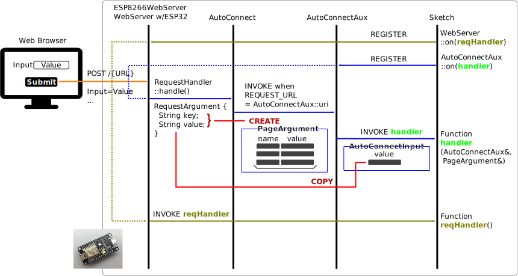
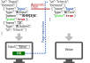
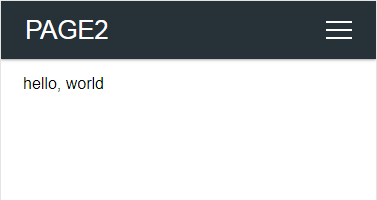
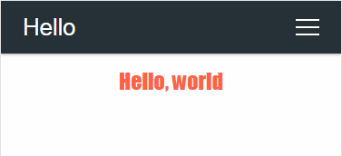
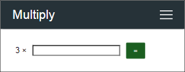

## Page, Container, Component

AutoConnectAux is the container for a custom Web page, AutoConnectElement is the component of a page. AutoConnectElements must be contained in AutoConnectAux object. (ie. they are the elements displayed on the custom Web page.) Then AutoConnect makes an AutoConnectAux to a page.

AutoConnectElements declared in sketch must be programmed to add to AutoConnectAux one after another. Elements are automatically included in AutoConnectAux by AutoConnect if you load it from the JSON document. In either method, it is common to use the function of AutoConnectAux to access an element with a sketch.

## Handing AutoConnectElements with the Sketches

The AutoConnectAux class has several functions to manipulate AutoConnectElements. The functions can add, delete, retrieve elements, and get and set values.

### <i class="fa fa-edit"></i> Add AutoConnectElements to the AutoConnectAux object

To add AutoConnectElment(s) to an AutoConnectAux object, use the add function.

```cpp
void AutoConnectAux::add(AutoConnectElement& addon)
```

```cpp
void AutoConnectAux::add(AutoConnectElementVT addons)
```

The add function adds the specified AutoConnectElement to AutoConnectAux. The AutoConnectElementVT type is the [*std::vector*](https://en.cppreference.com/w/cpp/container/vector) of the [*reference wrapper*](https://en.cppreference.com/w/cpp/utility/functional/reference_wrapper) to AutoConnectElements, and you can add these elements in bulk by using the [*list initialization*](https://en.cppreference.com/w/cpp/language/list_initialization) with the Sketch.

```cpp
typedef std::vector<std::reference_wrapper<AutoConnectElement>> AutoConnectElementVT;
```

AutoConnectElements contained in AutoConnectAux object are uniquely identified by name. When adding an AutoConnectElement, if an element with the same name already exists in the AutoConnectAux, checking the type, and if it is the same, the value will be replaced. If another type of AutoConnectElement exists with the same name, that add operation will be invalid.[^1] In the following example, AutoConnectButton `button` addition will invalid because `hello` with the same name already exists as AutoConnectText.

[^1]: The valid scope of the name is within an AutoConnectAux.

```cpp hl_lines="3"
AutoConnectAux  aux;
AutoConnectText text("hello", "hello, world");
AutoConnectButton button("hello", "hello, world", "alert('Hello world!')");  // This is invalid.
aux.add({ text, button });
```

Similarly this, the uniqueness of the name is also necessary within the JSON document

```json hl_lines="12"
{
  "name" : "aux",
  "uri" : "/aux",
  "menu" : true,
  "element" : [
    {
      "name": "hello",
      "type": "ACText",
      "value": "hello, world"
    },
    {
      "name": "hello",
      "type": "ACButton",
      "value": "hello, world",
      "action": "alert('Hello world!')"
    }
  ]
}
```

!!! note "Load all elements from JSON document"
    If you load all AutoConnectElements from JSON document into AutoConnect, you do not need to sketch the population process of the AutoConnectElements. It is managed by the AutoConnect library automatically.

### <i class="fa fa-edit"></i> Get AutoConnectElement from the AutoConnectAux

To retrieve an element from AutoConnectAux, use the getElement or getElements function. Normally, the getElement is needed when accessing the value of AutoConnectElement in the Sketch.

```cpp
AutoConnectElement* AutoConnectAux::getElement(const String& name)
```

```cpp
T& AutoConnectAux::getElement<T>(const String& name)
```

```cpp
AutoConnectElementVT* AutoConnectAux::getElements(void)
```

The [**getElement**](apiaux.md#getelement) function returns an AutoConnectElement with the specified name as a key. When you use this function, you need to know the type of AutoConnectElement in advance and specify its type <T\> to an argument of the getElement. A type of <T\> can be specified as follows.

```cpp
AutoConnectButton& AutoConnectAux::getElement<AutoConnectButton>(const String& name)
AutoConnectCheckbox& AutoConnectAux::getElement<AutoConnectCheckbox>(const String& name)
AutoConnectElement& AutoConnectAux::getElement<AutoConnectElement>(const String& name)
AutoConnectFile& AutoConnectAux::getElement<AutoConnectFile>(const String& name)
AutoConnectInput& AutoConnectAux::getElement<AutoConnectInput>(const String& name)
AutoConnectRadio& AutoConnectAux::getElement<AutoConnectRadio>(const String& name)
AutoConnectSelect& AutoConnectAux::getElement<AutoConnectSelect>(const String& name)
AutoConnectSubmit& AutoConnectAux::getElement<AutoConnectSubmit>(const String& name)
AutoConnectText& AutoConnectAux::getElement<AutoConnectText>(const String& name)
```

To retrieve an AutoConnectElement by specifying its type, use the following method.

```cpp
AutoConnectAux  aux;
aux.load("SOME_JSON_DOCUMENT");

// Retrieve the pointer of the AutoConnectText
AutoConnectText* text = reinterpret_cast<AutoConnectText*>(aux.getElement("TEXT_ELEMENT_NAME"));

// Retrieve the reference of the AutoConnectText
AutoConnectText& text = aux.getElement<AutoConnectText>("TEXT_ELEMENT_NAME");
```

The AutoConnectElement type behaves as a variant of other element types. Therefore use cast or template to convert to actual type as above. In the Sketch, you access the real type of AutoConnectElement after casting it and storing into the variable.

```cpp
const String auxJson = String("{\"title\":\"Page 1 title\",\"uri\":\"/page1\",\"menu\":true,\"element\":[{\"name\":\"caption\",\"type\":\"ACText\",\"value\":\"hello, world\"}]}");
AutoConnect portal;
portal.load(auxJson);
AutoConnectAux* aux = portal.aux("/page1");  // Identify the AutoConnectAux instance with uri
AutoConnectText& text = aux->getElement<AutoConnectText>("caption");  // Cast to real type and access members
Serial.println(text.value);
```

You can also use the [operator **`[]`** of AutoConnectAux](apiaux.md#operator) as another way to get the desired element. An operator **`[]`** is a shortcut for [getElement](apiaux.md#getelement) function with the reference casting and makes simplify the Sketch code and treats like an array with the elements placed on a custom Web page. Its argument is the name of the element to be acquired similarly to getElement function. In the Sketch, by combining the [**AutoConnectElement::as<T\>**](apielements.md#ast62) function with the operator `[]`, you can access the  AutoConnectElements reference according to its actual type. For example, the following sketch code returns the same as a reference of AutoConnectText element as the `caption`.

```cpp hl_lines="4 5"
AutoConnect portal;
portal.load(auxJson);
AutoConnectAux&  aux = *portal.aux("/page1");
AutoConnectText& text1 = aux.getElement<AutoConnectElement>("caption");
AutoConnectText& text2 = aux["caption"].as<AutoConnectText>();
```

!!! note "Need cast to convert to the actual type"
    An operator `[]` returns a reference of an AutoConnectElement. It is necessary to convert the type according to the actual element type with [AutoConnectElement::as<T\>](apielements.md#ast62) function.
    ```cpp
    AutoConnectButton& AutoConnectElement::as<AutoConnectButton>()
    AutoConnectCheckbox& AutoConnectElement::as<AutoConnectCheckbox>()
    AutoConnectElement& AutoConnectElement::as<AutoConnectElement>()
    AutoConnectFile& AutoConnectElement::as<AutoConnectFile>()
    AutoConnectInput& AutoConnectElement::as<AutoConnectInput>()
    AutoConnectRadio& AutoConnectElement::as<AutoConnectRadio>()
    AutoConnectSelect& AutoConnectElement::as<AutoConnectSelect>()
    AutoConnectSubmit& AutoConnectElement::as<AutoConnectSubmit>()
    AutoConnectText& AutoConnectElement::as<AutoConnectText>()
    ```

To get all the AutoConnectElements in an AutoConnectAux object use the [**getElements**](apiaux.md#getelements) function. This function returns the vector of the reference wrapper as **AutoConnectElementVT** to all AutoConnectElements registered in the AutoConnectAux.

```cpp
AutoConnectElementVT& AutoConnectAux::getElements(void)
```

### <i class="fa fa-edit"></i> Enable AutoConnectElements during the Sketch execution

AutoConnectElemets have an enable attribute to activate its own HTML generation. Sketches can change the HTMLization of their elements dynamically by setting or resetting the enable value. An element whose the enable attribute is true will generate itself HTML and place on the custom Web page.  And conversely, it will not generate the HTML when the value is false.

For example, to enable the submit button only when the ESP module is connected to the access point in STA mode, you can sketch the following:

```cpp hl_lines="30 31 32 33"
#include <ESP8266WiFi.h>
#include <ESP8266WebServer.h>
#include <AutoConnect.h>

static const char AUX[] PROGMEM = R("
{
  "name" : "aux",
  "uri" : "/aux",
  "menu" : true,
  "element" : [
    {
      "name": "input",
      "type": "ACInput",
      "label": "Input"
    },
    {
      "name": "send",
      "type": "ACSubmit",
      "uri": "/send"
    }
  ]
}
");

AutoConnect    portal;
AutoConnectAux page;

String onPage(AutoConectAux& aux, PageArgument& args) {
  AutoConnectSubmit& send = aux["send"].as<AutoConnectSubmit>();
  if (WiFi.isConnected())
    send.enable = (WiFi.getMode() == WIFI_STA);
  else
    send.enable = false;
  return String();
}

void setup() {
  page.load(AUX);
  page.on(onPage);
  portal.join(page);
  portal.begin();
}

void loop() {
  portal.handleClient();
}
```

!!! hint "Desirable to set or reset the enable attribute in the page handler"
    The enable attribute can be set at any time during the Sketch execution. The page handler with the [AC_EXIT_AHEAD](apiaux.md#on) option is sure to handle it.

## Loading &amp; saving AutoConnectElements with JSON

AutoConnect supports reading the custom Web page definitions written in JSON and also supports loading and saving of AutoConnectAux or AutoConnectElements. In both cases, the target object is a [JSON document for AutoConnect](acjson.md). However, it can not save all AutoConnectElements contained in the page as a custom Web page. (ie. AutoConnectAux)


### <i class="fa fa-upload"></i> Loading AutoConnectAux &amp; AutoConnectElements with JSON

To load a JSON document as AutoConnectAux use the [**AutoConnect::load**](api.md#load) function and load the JSON document of each AutoConnectElement using the [**AutoConnectAux::loadElement**](apiaux.md#loadelement) function. Although the functions of both are similar, the structure of the target JSON document is different.

The [AutoConnect::load](apiaux.md#load) function loads the entire AutoConnectAux and creates both the AutoConnectAux instance and each AutoConnectElement instance. A single JSON document can contain multiple custom Web pages. If you write JSON of AutoConnectAux as an array, the load function generates all the pages contained in that array. Therefore, it is necessary to supply the JSON document of AutoConnectAux as an input of the load function and must contain the elements described section [*JSON document structure for AutoConnectAux*](acjson.md#json-document-structure-for-autoconnectaux).

The [AutoConnectAux::loadElement](apiaux.md#loadelement) function loads the elements individually into an AutoConnectAux object. The structure of its supplying JSON document is not AutoConnectAux. It must be a [JSON structure for AutoConnectElement](acjson.md#json-object-for-autoconnectelements), but you can specify an array.

```cpp hl_lines="49 55"
// AutoConnectAux as a custom Web page.
const char page[] PROGMEM = R"raw(
{
  "title": "Settings",
  "uri": "/settings",
  "menu": true,
  "element": [
    {
      "name": "server",
      "type": "ACInput",
      "label": "Server"
    },
    {
      "name": "set",
      "type": "ACSubmit",
      "value": "SET",
      "uri" : "/set"
    }
  ]
}
)raw";

// Additional AutoConnectElements.
const char addons[] PROGMEM = R"raw(
[
  {
    "name": "notes",
    "type": "ACText",
    "value": "An update period as the below optionally."
  },
  {
    "name": "period",
    "type": "ACRadio",
    "value": [
      "30 sec.",
      "60 sec.",
      "180 sec."
    ],
    "arrange": "vertical",
    "checked": 1
  }
]
)raw";

AutoConnect     portal;
AutoConnectAux* auxPage;

// Load a custom Web page.
portal.load(page);

// Get a '/settings' page
auxPage = portal.aux("/settings");

// Also, load only AutoConnectRadio named the period.
auxPage->loadElement(addons, "period");

// Retrieve a server name from an AutoConnectText value.
AutoConnectText& serverName = auxPage->getElement<AutoConnectText>("server");
Serial.println(serverName.value);
```

### <i class="fa fa-download"></i> Saving AutoConnectElements with JSON

To save the AutoConnectAux or the AutoConnectElement as a JSON document, use the [AutoConnectAux::saveElement](apiaux.md#saveelement) function. It serializes the contents of the object based on the type of the AutoConnectElement. You can persist a serialized AutoConnectElements as a JSON document to a stream.

```cpp
// Open a parameter file on the SPIFFS.
SPIFFS.begin();
FILE param = SPIFFS.open("/param", "w");

// Save elements as the parameters.
auxPage->saveElement(param, { "server", "period" });

// Close a parameter file.
param.close();
SPIFFS.end();
```

The example above saves `server` and `period` elements from the AutoConnectAux object as mentioned above to the `/param` file on SPIFFS. Its JSON document of AutoConnectElements saved by its code looks like this:

```json
[
  {
    "name": "server",
    "type": "ACInput",
    "value": "An inputted server name",
    "label": "Server",
    "placeholder": ""
  },
  {
    "name": "period",
    "type": "ACRadio",
    "value": [
      "30 sec.",
      "60 sec.",
      "180 sec."
    ],
    "arrange": "vertical",
    "checked": 2
  }
]
```

Above JSON document can be loaded as it is into a custom Web page using the loadElement function. The loadElement function also loads the value of the element, so the saved value can be restored on the custom Web page.

## Custom field data handling

A sketch can access variables of AutoConnectElements in the custom Web page. The value entered into the AutoConnectElements on the page is stored in the member variable of each element by AutoConnect whenever GET/POST transmission occurs. 

The following diagram shows the flow of the input values of a custom Web page into a sketch and is the basis for actions to manipulate the values of custom Web pages using sketches.



### <i class="fa fa-desktop"></i> Where to pick up the values

A sketch composed of handlers can receive the value of AutoConnectElements entered in a custom Web page after sending, but that handler is different from the page where the value was entered. It is necessary to be aware that can accept the entered values by the next page handler after the transition.

Usually, two ways to retrieve entered values we have. One is to use the [ESP8266WebServer::arg](https://github.com/esp8266/Arduino/tree/master/libraries/ESP8266WebServer#getting-information-about-request-arguments) (or WebServer::arg for ESP32) function in the [`on handler`](https://github.com/esp8266/Arduino/tree/master/libraries/ESP8266WebServer#client-request-handlers) attached by ESP8266WebServer (WebServer w/ESP32 also).

```cpp hl_lines="33"
#include <ESP8266WiFi.h>
#include <ESP8266WebServer.h>
#include <AutoConnect.h>

static const char addonJson[] PROGMEM = R"raw(
{
  "title": "Hello",
  "uri": "/hello",
  "menu": true,
  "element": [
    {
      "name": "feels",
      "type": "ACInput",
      "label": "What's up?"
    },
    {
      "name": "send",
      "type": "ACSubmit",
      "value": "Just it!",
      "uri": "/feels"
    }
  ]
}
)raw";

ESP8266WebServer webServer;
AutoConnect portal(webServer);

// Here, /feels handler
void feelsOn() {
  
  // Retrieve the value of a input-box named "feels"
  String feel = webServer.arg("feels");

  // Echo back the value
  String echo = "<html><p style=\"color:blue;font-family:verdana;font-size:300%;\">" + feel + String(" and a bold world!</p></html>");
  webServer.send(200, "text/html", echo);
}

void setup() {
  delay(1000);
  webServer.on("/feels", feelsOn);  // Register /feels handler
  portal.load(addonJson);           // Load a custom Web page
  portal.begin();
}

void loop() {
  portal.handleClient();
}
```

An above example is the most simple sketch of handling values entered into a custom Web page. This sketch obtains the string entered in the AutoConnectInput named `feels` with the `/feels` handler after page transition, and the AutoConnectInput is an `<input type="text" name="feels">` element wrapped in the form as the actual HTML code. 

!!! info "Should be accessed `/_ac` first"
    When you actually try the above sketch, there is no a root handler. So the URL that should be accessed first is `/_ac` concatenated with the local IP address of the esp8266 module.

Another method is effective when custom Web pages have complicated page transitions. It is a way to straight access the AutoConnectElements member value. You can get the AutoConnectElement with the specified name using the [getElement](#get-autoconnectelement-from-the-autoconnectaux) function. The following sketch executes the above example with AutoConnect only, without using the function of ESP8266WebServer.

```cpp hl_lines="48 51"
#include <ESP8266WiFi.h>
#include <ESP8266WebServer.h>
#include <AutoConnect.h>

const static char addonJson[] PROGMEM = R"raw(
[
  {
    "title": "Hello",
    "uri": "/hello",
    "menu": true,
    "element": [
      {
        "name": "feels",
        "type": "ACInput",
        "label": "What's up?"
      },
      {
        "name": "send",
        "type": "ACSubmit",
        "value": "Just it!",
        "uri": "/feels"
      }
    ]
  },
  {
    "title": "Hello",
    "uri": "/feels",
    "menu": false,
    "element": [
      {
        "name": "echo",
        "type": "ACText",
        "style": "color:blue;font-family:verdana;font-size:300%;"
      }
    ]
  }
]
)raw";

AutoConnect portal;

// Here, /feels handler
String feelsOn(AutoConnectAux& aux, PageArgument& args) {

  // Get the AutoConnectInput named "feels".
  // The where() function returns an uri string of the AutoConnectAux that triggered this handler.
  AutoConnectAux* hello = portal.aux(portal.where());
  AutoConnectInput& feels = hello->getElement<AutoConnectInput>("feels");
  
  // Get the AutoConnectText named "echo".
  AutoConnectText&  echo = aux.getElement<AutoConnectText>("echo");
  
  // Echo back from input-box to /feels page.
  echo.value = feels.value +  String(" and a bold world!");
  return String("");
}

void setup() {
  delay(1000);
  portal.load(addonJson);                       // Load custom Web pages
  portal.on("/feels", feelsOn, AC_EXIT_AHEAD);  // Register /feels handler
  portal.begin();
}

void loop() {
  portal.handleClient();
}
```

The above example handles in the handler for the values of a custom Web page. An [AutoConnect::on](api.md#on) function registers a handler for the AutoConnectAux page of the specified uri. The argument of the custom Web page handler is an AutoConnectAux of the page itself and the [PageArgument](https://github.com/Hieromon/PageBuilder#arguments-of-invoked-user-function) object.

To retrieve the values entered in a custom Web page you need to access the AutoConnectElement of the page that caused the request to this page and to do this, you use the [AutoConnect::where](api.md#where) function. The `AutoConnect::where` function returns an uri string of the AutoConnectAux object of the custom Web page that caused the HTTP request.

!!! note "The where() function is available for only AutoConnectAux."
    The `AutoConnect::where` function is available only for the AutoConnectAux object. It is invalid for HTTP requests from individual pages registered with the **on** handler of ESP8266WebServer/WebServer for ESP32. In other words, the `AutoConnect::where` function only returns the last AutoConnecAux page called.

### <i class="fa fa-desktop"></i> When setting the initial values

An AutoConnectAux page is dynamically created by AutoConnect when its uri is requested. The initial value of AutoConnectElements can be set before its page request. It is also possible during `loop()`. To set the initial value when the page is accessed it needs by the handler of its page.

The [**AutoConnect::on**](api.md#on) and [**AutoConnectAux::on**](apiaux.md#on) functions register a handler for a custom Web page and also specify when to call that handler. The behavior of the two `on` functions is the same, only the class and arguments are different.

```cpp
bool AutoConnect::on(const String& uri, const AuxHandlerFunctionT handler, AutoConnectExitOrder_t order)
```
```cpp
void AutoConnectAux::on(const AuxHandlerFunctionT handler, const AutoConnectExitOrder_t order)
```

Parameter `uri` specifies an URI of the custom Web page, but an AutoConnectAux object with its URI must be registered with AutoConnect via the [AutoConnect::join](api.md#join) function beforehand.

!!! note "AutoConnect::on/AutoConnectAux::on is not ESP8266WebServer::on"
    The `on` function for AutoConnect is different from the `on` function of Arduino core ESP8266WebServer (WebServer for ESP32). You can share the same handler via wrapper, but access to AutoConnectElements is **valid only for handlers registered with `on` function for AutoConnect**.

`AuxHandlerFunctionT` type is a handler declaration using with [std::function](https://en.cppreference.com/w/cpp/utility/functional/function).

```cpp
String handler(AutoConnectAux& aux, PageArgument& args)
```

The handler of the custom Web page has two arguments by a reference of AutoConnectAux and a reference of PageArgument, it returns String. AutoConnect appends the string returned from the handler to the generated HTML. This allows you to add an HTML part before displaying the page.

`AutoConnectExitOrder_t` specifies when the handler is called with the following enumeration value.

: - **AC_EXIT_AHEAD** : Called before AutoConnect generates the HTML of the page. You set the value of AutoConnectElements in the handler then its value will be displayed on the page.
: - **AC_EXIT_LATER** : Called after AutoConnect generates the HTML of the page. You can append to HTML generated by AutoConnect.
: - **AC_EXIT_BOTH** : Called even before generating HTML and after generated.

The following example is a part of sketch contained the handlers. 

```cpp
// AutoConnect object declarations
ACInput(input1);
AutoConnectAux aux("/aux", { input1 });
AutoConnect portal;
// Pre-declare handlers
String initialize(AutoConnectAux&, PageArgument&);
String append(AutoConnectAux&, PageArgument&);

// Register handlers and launch the portal.
aux.on(initialize, AC_AHEAD);
aux.on(append, AC_LATER);
portal.join(aux);
portal.begin();

// Some code here...

// The handler called before HTML generating
String initialize(AutoConnectAux& aux, PageArgument& args) {
  AutoConnectInput& input1 = aux.getElement<AutoConnectInput>("input1");
  // Set initial value for the input box in a custom Web page.
  input1.value = "Initial value";
  // Nothing appendix for a generated HTML.
  return String();
}

// The handler called after HTML generated
String append(AutoConnectAux& aux, PageArgument& args) {
  // Append an HTML
  return String("<p>This text has been added.</p>");
}
```

### <i class="fa fa-wrench"></i> How you can reach the values

AutoConnectSubmit uses the POST method to send HTTP requests. A value of AutoConnectInput sent to the ESP8266 or ESP32 with POST is stored in the request body of the HTTP request:
```powershell
POST /feels HTTP/1.1
Host: ESP8266_IP_ADDRESS
name1=value1&name2=value2&name3=value3
```
ESP8266WebServer class will parse the query string and rebuilds its arguments when the above request arrives. A custom page handler registered with the [ESP8266WebServer::on](https://github.com/esp8266/Arduino/tree/master/libraries/ESP8266WebServer#client-request-handlers) function can access the value of AutoConnectElements with [ESP8266WebServe::arg](https://github.com/esp8266/Arduino/tree/master/libraries/ESP8266WebServer#getting-information-about-request-arguments) function. It reaches the values of AutoConnectElements without the intermediation of AutoConnect. Therefore, its handler will not be AutoConnectAux and can send a response to the client directly. The following example is part of a server sketch which has two web pages. The `/hello` page is a custom Web page of AutoConnectAux which has an input box named "input1". Another `/echo` page is a page handler for ESP8266WebServer, which uses the [ESP8266WebServer::send](https://github.com/esp8266/Arduino/tree/master/libraries/ESP8266WebServer#sending-responses-to-the-client) function to echo back the value of an input1 as an http response.

```cpp hl_lines="3 8"
ESP8266WebServer server;
AutoConnect      portal(server);
ACInput(input1, "", "INPUT");
ACSubmit(send, "HELLO", "/echo");
AutoConnectAux  aux("/hello", { input1, send });

server.on("/echo", []() {
  String echo = server.arg("input1");
  Serial.println(echo);
  server.send(200, "text/plain", echo);
});

portal.join(aux);
portal.begin();
```

Also, you can choose another way to access arguments without going through the ESP8266WebServer class. The [PageArgument](https://github.com/Hieromon/PageBuilder#arguments-of-invoked-user-function) object of the custom Web page handler argument is a copy of the arg object of the ESP8266WebServer class. Either of these methods is a simple and easy way to access parameters in custom Web page handlers. However, if you need to access from outside of the handler to the value of AutoConnectElements, you need to accomplish it using with the [AutoConnectAux::getElement](#get-autoconnectelement-from-the-autoconnectaux) function. The following sketch code replaces the above example with JSON and PageArgument, and its behaves is equivalent basically to the above sketch.

```cpp
const static char auxPage[] PROGMEM = R"raw(
[
  { "title":"Hello", "uri":"/hello", "menu":true, "element":[
    { "name":"input1", "type": "ACInput", "label": "INPUT" },
    { "name":"send", "type":"ACSubmit", "value":"HELLO", "uri":"/echo" }]
  },
  { "title":"Echo", "uri":"/echo", "menu":false, "element":[
    { "name":"echo", "type":"ACText" }]
  }
]
)raw";

AutoConnect portal;

portal.load(auxPage);
portal.on("/echo", [](AutoConnectAux& aux, PageArgument& args) {
  AutoConnectText& ac_echo = aux.getElement<AutoConnectText>("echo");
  ac_echo.value = args.arg("input1");
  return String();  
});

portal.begin();
```

### <i class="fa fa-wrench"></i> Transfer of input values ​​across pages

Since v1.0.0, AutoConnect supports a new attribute with each element that allows automatic transfer of input values across pages without sketching. AutoConnect will copy the input value of the elements declared as [global](apielements.md#global_2) to the same-named global elements on a different custom Web pages at the page transition timing.

 

The **global** attribute will be useful for echoing input values back to another custom Web pages. This copy operation can be performed between different types. (eg., copy value from AutoConnectInput to AutoConnectText) The following example reflects the input value of PAGE1 to the AutoConnectText field of PAGE2 without sketch code.

```cpp hl_lines="8 10 28 30"
static const char PAGE1[] PROGMEM = R"(
{
  "title": "PAGE1",
  "uri": "/page1",
  "menu": true,
  "element": [
    {
      "name": "input1",
      "type": "ACInput",
      "global": true
    },
    {
      "name": "send",
      "type": "ACSubmit",
      "value": "OK",
      "uri": "/page2"
    }
  ]
}
)";
static const char PAGE2[] PROGMEM = R"(
{
  "title": "PAGE2",
  "uri": "/page2",
  "menu": false,
  "element": [
    {
      "name": "input1",
      "type": "ACText",
      "global": true
    }
  ]
}
)";

AutoConnect portal;
AutoConnectAux page1;
AutoConnectAux page2;

void setup() {
  page1.load(PAGE1);
  page2.load(PAGE2);
  portal.join( { page1, page2 });
  portal.begin();
}

void loop() {
  portal.handleClient();
}
```

<i class="fa fa-arrow-down"></i><br><i class="fa fa-eye"></i> The value entered in **input1 declared in PAGE1** is reflected in **input1 of PAGE2** as an AutoConnectText value even if there is no sketch code to transfer it to PAGE2. It's shown as like:<br>
<span style="width:300px;height:159px"></span>
<span style="margin-left:7px;"></span>
<span style="margin-left:7px;width:300px;height:159px"></span>

!!! note "Copy only for same-named and the global"
    The input value will be copied only if the global attribute of the destination element is true. If an element with the same name is declared non-global, the value is not copied.

### <i class="fa fa-wrench"></i> Retrieve the values with WebServer::on handler

ESP8266WebServer class and the WebServer class assume that the implementation of the ReqestHandler class contained in the WebServer library will handle the URL requests. Usually, it is sketch code registered by ESP8266WebServer::on function.

When a page transition from a custom Web page created by AutoConnectAux to a handler registered with ESP2866WebServer::on function, a little trick is needed to retrieve the values of AutoConnectElements. (i.e. the URI of the ESP8266WebServer::on handler is specified in the [uri](acelements.md#uri) attribute of [AutoConnectSubmit](acelements.md#autoconnectsubmit)) AutoConnect cannot intervene in the procedure in which the ESP8266WebServer class calls the on-page handler coded with the Sketch. Therefore, it is necessary to retrieve preliminary the values of AutoConnectElements using the [AutoConnectAux::fetchElement](apiaux.md#fetchelement) function for value processing with the on-page handler.

The following sketch is an example of extracting values inputted on a custom web page with an on-page handler and then processing it.

```cpp hl_lines="13 20 27 38"
ESP8266WebServer server;
AutoConnect portal(server);
AutoConnectAux Input;

const static char InputPage[] PROGMEM = R"r(
{
  "title": "Input", "uri": "/input", "menu": true, "element": [
    { "name": "input", "type": "ACInput", "label": "INPUT" },
    {
      "name": "save",
      "type": "ACSubmit",
      "value": "SAVE",
      "uri": "/"
    }
  ]
}
)r";

// An on-page handler for '/' access
void onRoot() {
  String  content =
  "<html>"
  "<head><meta name='viewport' content='width=device-width, initial-scale=1'></head>"
  "<body><div>INPUT: {{value}}</div></body>"
  "</html>";

  Input.fetchElement();    // Preliminary acquisition

  // For this steps to work, need to call fetchElement function beforehand.
  String value = Input["input"].value;
  content.replace("{{value}}", value);
  server.send(200, "text/html", content);
}

void setup() {
  Input.load(InputPage);
  portal.join(Input);
  server.on("/", onRoot);  // Register the on-page handler
  portal.begin();  
}

void loop() {
  portal.handleClient();
}
```

### <i class="fa fa-edit"></i> Overwrite the AutoConnectElements

Sketches can update the attributes of AutoConnectElements with two approaches. A one is to assign directly to the attributes of a member variable of its element. The other is to overwrite them with loading the element by [AutoConnectAux::loadElement](apiaux.md#loadelement). 

The elements for attributes described in the JSON document for AutoConnectElements overwrites the member variables of the target AutoConnectElements. However, AutoConnectAux::loadElement keeps the member variables unchanged if there is no element in the JSON document. This overwriting behavior is the same for the [AutoConnect::load](api.md#load) function.

For example, the combination of the Sketch and JSON document as follows updates only the style while keeping Caption (ie. "Hello, world") as AutoConnectText value.

<i class="fab fa-js-square"></i> External JSON document for the below sketch to modify the text style.
```json hl_lines="4"
{
  "name" : "Caption",
  "type" : "ACText",
  "style": "text-align:center;font-size:24px;font-family:'Impact','Futura',sans-serif;color:tomato;"
}
```

<i class="fa fa-arrow-down"></i><br>
<i class="fa fa-code"></i> the Sketch (a part of code), load above JSON.
```cpp hl_lines="1"
ACText(Caption, "Hello, world");
AutoConnectAux helloPage("/hello", "Hello", true, { Caption });
AutoConnect portal;

String onHello(AutoConnectAux& aux, PageArgument& args) {
  aux.loadElement(JSON);
  return String();
}

void setup() {
  helloPage.on(onHello);
  portal.join(helloPage);
  portal.begin();
}

void loop() {
  portal.handleClient();
}
```
<i class="fa fa-arrow-down"></i><br>
<i class="fa fa-eye"></i> It's shown as like:<span style="margin-left:14px;width:272px;height:118px;border:1px solid lightgray;"></span>

### <i class="far fa-check-square"></i> Check data against on submission

By giving a [pattern](apielements.md#pattern) to [AutoConnectInput](apielements.md#autoconnectinput), you can find errors in data styles while typing in custom Web pages. The pattern is specified with [regular expression](https://developer.mozilla.org/en-US/docs/Web/JavaScript/Guide/Regular_Expressions).[^2] If the value during input of AutoConnectInput does not match the regular expression specified in the pattern, its background color changes to pink. The following example shows the behavior when checking the IP address in the AutoConnectInput field.

[^2]:Regular expression specification as a pattern of AutoConnectInput is [JavaScript compliant](https://developer.mozilla.org/en-US/docs/Web/JavaScript/Guide/Regular_Expressions).

```json hl_lines="10"
{
  "title" : "Page-1",
  "uri" : "/page1",
  "menu" : true,
  "element" : [
    {
      "name" : "Server",
      "type" : "ACInput",
      "label": "Server address",
      "pattern": "^(([0-9]|[1-9][0-9]|1[0-9]{2}|2[0-4][0-9]|25[0-5])\\.){3}([0-9]|[1-9][0-9]|1[0-9]{2}|2[0-4][0-9]|25[0-5])$"
    }
  ]
}
```

<i class="fa fa-arrow-down"></i><br><i class="fa fa-eye"></i> It's shown as like:<br>
<span style="display:block;width:306px;height:136px;border:1px solid lightgrey;"></span>

If you are not familiar with regular expressions, you may feel that description very strange. Matter of fact, it's a strange description for those who are unfamiliar with the formal languages. If your regular expression can not interpret the intended syntax and semantics, you can use an online tester. The [regex101](https://regex101.com/) is an exceptional online tool for testing and debugging regular expressions.

###  Input data validation

The [pattern](apielements.md#pattern) attribute of [AutoConnectInput](apielements.md#autoconnectinput) only determines the data consistency on the web browser based on the given regular expression. In order to guarantee the validity of input data, it is necessary to verify it before actually using it.

You can validate input data from [AutoConnectInput](apielements.md#autoconnectinput) using the [isValid](apielements.md#isvalid) function before actually processing it.  The [isValid](apielements.md#isvalid) function determines whether the [value](apielements.md#value_3) currently stored in [AutoConnectInput](apielements.md#autoconnectinput) matches the [pattern](apielements.md#pattern).

You can also use the [AutoConnectAux::isValid](apiaux.md#isvalid) function to verify the data input to all [AutoConnectInput](apielements.md#autoconnectinput) elements on the custom Web page at once. The two sketches below show the difference between using [AutoConnectInput::isValid](apielements.md#isvalid) and using [AutoConnectAux::isValid](apiaux.md#isvalid). In both cases, it verifies the input data of the same AutoConnectInput, but in the case of using AutoConnectAux::isValid, the amount of sketch coding is small.

**A common declaration**

```cpp
const char PAGE[] PROGMEM = R"(
{
  "title": "Custom page",
  "uri": "/page",
  "menu": true,
  "element": [
    {
      "name": "input1",
      "type": "ACInput",
      "pattern": "^[0-9]{4}$"
    },
    {
      "name": "input2",
      "type": "ACInput",
      "pattern": "^[a-zA-Z]{4}$"
    }
  ]
}
)";
AutoConnectAux page;
page.load(PAGE);
```

**Using AutoConnectInput::isValid**

```cpp
AutoConnectInput& input1 = page["input1"].as<AutoConnectInput>();
AutoConnectInput& input2 = page["input2"].as<AutoConnectInput>();
if (!input1.isValid() || !input2.isValid())
  Serial.println("Validation error");
```

**Using AutoConnectAux::isValid**

```cpp
if (!page.isValid())
  Serial.println("Validation error");
```

### <i class="fas fa-exchange-alt"></i> Convert data to actually type

The values in the AutoConnectElements field of the custom Web page are all typed as String. A sketch needs to be converted to an actual data type if the data type required for sketch processing is not a String type. For the typical data type conversion method, refer to section [*Tips for data conversion*](datatips.md#convert-autoconnectelements-value-to-actual-data-type).

## Place HTML elements undefined in AutoConnectElements

Of the many HTML elements for markup, AutoConnet can only support a limited number. If you are designing a custom web page and the elements you want are not in AutoConnectElements, consider using an AutoConnectElement. [AutoConnectElement](acelements.md#autoconnectelement-a-basic-class-of-elements) can be applied in many cases when trying to place HTML tag elements that are undefined in AutoConnectElemets on custom web pages.

!!! warning "Not all of them work"
    The strongest constraint is the heap size required to generate HTML for the entire custom Web page. AutoConnect creates a custom web page as a chunk of String. It's not a stream. Therefore, it may not be possible to generate long HTML pages. See also [FAQ](faq.md#some-autoconnect-page-is-cut-off).

### <i class="far fa-file-code"></i> Place a markup or a styled HTML tag

If the HTML element you want to place is just the tag that makes up the appearance of the web page, assign the tag element directly to the [value](apielements.md#value_2) member of AutoConnectElement. If the tag you are trying to place is for static markup effects, just write the `value` as follows:

```json
{
  "name": "headline",
  "type": "ACElement",
  "value": "<hr style='height:1px;border-width:0;color:gray;background-color:#52a6ed'>"
}
```

If the element has a hierarchy like a `<table> ~ </table>`, describe the entire element in the `value`:

```json
{
  "name": "table",
  "type": "ACElement",
  "value": "<table><tr><th>Board</th><th>Platform</th></tr><tr><td>NodeMCU</td><td>Espressif8266</td></tr><tr><td>ESP32-DevKitC</td><td>Espressif32</td></tr></table>"
}
```

Also, using [AutoConnectStyle](acelements.md#autoconnectstyle) combined, you can give the style effect of only that element.

```json
{
  "name": "tablestyle",
  "type": "ACStyle",
  "value": "table.style{font-family:arial,sans-serif;border-collapse:collapse;width:100%;color:black;}table.style td,table.style th{border:1px solid #dddddd;text-align:center;padding:8px;}table.style tr:nth-child(even){background-color:#dddddd;}"
},
{
  "name": "table",
  "type": "ACElement",
  "value": "<table class='style'><tr><th>Board</th><th>Platform</th></tr><tr><td>NodeMCU</td><td>Espressif8266</td></tr><tr><td>ESP32-DevKitC</td><td>Espressif32</td></tr></table>"
}
```

<i class="fa fa-arrow-down"></i><br>
<i class="fa fa-eye"></i> As you see it:
  <table class="achandling">
  <tr>
    <th>Board</th>
    <th>Platform</th>
  </tr>
  <tr>
    <td>NodeMCU</td>
    <td>Espressif8266</td>
  </tr>
  <tr>
    <td>ESP32-DevKitC</td>
    <td>Espressif32</td>
  </tr>
</table>

### <i class="far fa-file-code"></i> Place the input elements within a form

There is still no dedicated AutoConnectElement for entering other than equivalent to `checkbox`, `file`, `number`, `password`, `radio` and `text` for `<input type="...">` HTML element. But you can substitute them with the AutoConnectElement.

For example, if you use the `<input>` element of `type="date"` to place a field where you can enter a date, the AutoConnectElement would look like this:

```json
{
  "name": "date",
  "type": "ACElement",
  "value": "<label for='picker'>Date:</label><input type='date' id='picker' name='date'>"
}
```

And it becomes a textbox that validates the input or a special date picker interface.  
Then, instead of accessing that AutoConnectElement directly, obtains entered date value from the POST body included in the HTTP request from the hosted ESP8266WebServer class. Its process carries out with the [AutoConnectAux page handler](achandling.md#how-you-can-reach-the-values) following:

```cpp
String aux_page_handler(AutoConnectAux &aux, PageArgument &arg) {
  Serial.println(arg.arg("date"));  // Obtain a date value entered
  return "";
}
```

AutoConnect passes a [PageArgument](https://github.com/Hieromon/PageBuilder#arguments-of-invoked-user-function) to the AutoConnectAux page handler. The handler can use the [PageArgument::arg](https://github.com/Hieromon/PageBuilder#string-pageargumentargstring-name) function to get the parameters contained in the HTTP request for the page. 
Also, the equivalent can also be implemented using [ESP8266WebServer::arg](https://github.com/esp8266/Arduino/tree/master/libraries/ESP8266WebServer#getting-information-about-request-arguments) function with the [ESP8266WebServer client request handler](https://github.com/esp8266/Arduino/tree/master/libraries/ESP8266WebServer#client-request-handlers).

### <i class="fab fa-js-square"></i> Using JavaScript

What is described in this section belongs to the tips of what effectiveness a web page can have using AutoConnectElement, rather than the correct usage for AutoConnect.  
You can use AutoConnectElement to embed JavaScript into the custom Web page as with HTML elements for markup. The reason for embedding JavaScript on a page depends on your requirements, but One of the most common requirements is the need to access elements of a web page. You can implement the requirements by having the AutoConnectElement have JavaScript that contains DOM access.

The following screenshot shows an example of accessing AutoConnectText via the DOM using an AutoConnectElement with JavaScript. This web page is a very simple example and returns the result of multiplying the multiplier entered in an AutoConnectInput field.



This custom Web page is generated from the following JSON document:

```json
{
  "uri": "/jselement",
  "title": "Multiply",
  "menu": true,
  "element": [
    {
      "name": "multiplier",
      "type": "ACInput",
      "label": "3 &times; ",
      "apply": "number",
      "posterior": "none"
    },
    {
      "name": "op",
      "type": "ACButton",
      "value": " = ",
      "action": "multi()",
      "posterior": "none"
    },
    {
      "name": "answer",
      "type": "ACText"
    },
    {
      "name": "js",
      "type": "ACElement",
      "value": "<script type='text/javascript'>function multi() {document.getElementById('answer').innerHTML=3*document.getElementById('multiplier').value;}</script>"
    }
  ]
}  
```

An input field for a `multiplier` is defined by AutoConnectInput. The field for displaying the results exists with the name `answer`. The multiplication function is what AutoConnectElement has as JavaScript and it has the following content:

```js
function multi() {
  document.getElementById('answer').innerHTML = 3 * document.getElementById('multiplier').value;
}
```

And the action for calling the `multi()` function is the `=` labeled button as the AutoConnectButton element. AutoConnect generates the [**name**](acjson.md#name) attribute of each AutoConnectElement as the **Id** of the HTML tag. The Id should be useful for DOM access.

!!! warning "JavaScript that is too long can cause insufficient memory"
    If it reaches thousands of bytes, AutoConnect will not be able to complete the HTML generation for the page.

### <i class="fas fa-globe"></i> Communicate with the Sketch using XHR

AutoConnectElement allows having scripts that create sessions based on [**XHR**](https://developer.mozilla.org/en-US/docs/Glossary/XHR_(XMLHttpRequest)). XMLHttpRequest (XHR) is a JavaScript API to create AJAX requests. Its methods provide the ability to send network requests between the browser and a server. The Sketch simply implements the server-side process as a response handler to a normal HTTP request and can equip with a dynamic custom Web page. This technique is tricky but does not cause page transitions and is useful for implementing dynamic pages. As a matter of fact, [AutoConnectOTA](otabrowser.md#updates-with-the-web-browserupdated-wv115) class is implemented by using this technique and is a custom Web page by AutoConnectAux.

Here's a simple example of JavaScript-based on XHR and a server-side request handler. It's like a clock that displays the time in real-time on an AutoConnect custom web page. The sketch in the following example is roughly divided into two structures.  
The AutoConnectElement defined with the name `js` gets the server time with XHR and updates the response via the DOM with the AutoConnectText named `time` and substance is the following JavaScript:

```js
var xhr;

function clock() {
    xhr.open('GET', '/clock');
    xhr.responseType = 'text';
    xhr.send();
}

window.onclose = function() {
    xhr.abort();
};

window.onload = function() {
    xhr = new XMLHttpRequest();
    xhr.onreadystatechange = function() {
        if (this.readyState == 4 && xhr.status == 200) {
            document.getElementById('time').innerHTML = this.responseText;
        }
    };
    setInterval(clock, 1000);
};
```

This script issues a GET request to `/clock` every second and updates the element of Id=`time` with the text content of its response. As this script shows, it will issue a send request using the [XMLHttpRequest](https://developer.mozilla.org/en-US/docs/Web/API/XMLHttpRequest) object.

The other component is located on the AutoConnect-hosted ESP8266WebServer server. This component gets the current time from the NTP server and sends the value as text to the client.

```cpp
void auxClock() {
  time_t  t;
  struct tm *tm;
  char    dateTime[24];

  t = time(NULL);
  tm = localtime(&t);
  sprintf(dateTime, "%04d/%02d/%02d %02d:%02d:%02d.",
                    tm->tm_year + 1900, tm->tm_mon + 1, tm->tm_mday,
                    tm->tm_hour, tm->tm_min, tm->tm_sec);
  server.send(200, "text/plain", dateTime);
}
```

Then just register the `auxClock` function as a `/clock` URL handler with the hosted ESP8266Server instance.

```cpp
server.on("/clock", auxClock);
```

As you can see from the above two components, AutoConnect does not intervene in those communications and no page transitions occur. A complete sketch that integrates the above components and includes a custom Web page declaration for time display looks like this:

```cpp
#include <Arduino.h>
#include <ESP8266WiFi.h>
#include <ESP8266WebServer.h>
#include <AutoConnect.h>
#include <time.h>

static const char JSPAGE[] PROGMEM = R"'(
{
  "uri": "/jselement",
  "title": "Clock",
  "menu": true,
  "element": [
    {
      "name": "time",
      "type": "ACText"
    },
    {
      "name": "js",
      "type": "ACElement",
      "value": "<script type='text/javascript'>var xhr;function clock(){xhr.open('GET', '/clock');xhr.responseType='text';xhr.send();}window.onclose=function(){xhr.abort();};window.onload=function(){xhr=new XMLHttpRequest();xhr.onreadystatechange=function(){if(this.readyState==4&&xhr.status==200){document.getElementById('time').innerHTML=this.responseText;}};setInterval(clock,1000);};</script>"
    }
  ]
}  
)'";

ESP8266WebServer  server;
AutoConnect portal(server);

void auxClock() {
  time_t  t;
  struct tm *tm;
  char    dateTime[24];

  t = time(NULL);
  tm = localtime(&t);
  sprintf(dateTime, "%04d/%02d/%02d %02d:%02d:%02d.",
                    tm->tm_year + 1900, tm->tm_mon + 1, tm->tm_mday,
                    tm->tm_hour, tm->tm_min, tm->tm_sec);
  server.send(200, "text/plain", dateTime);
}

void setup() {
  delay(1000);
  portal.load(FPSTR(JSPAGE));
  if (portal.begin()) {
    server.on("/clock", auxClock);
    configTime(0, 0, "europe.pool.ntp.org");
  }
}

void loop() {
  portal.handleClient();
}
```

## Transitions of the custom Web pages

### Scope &amp; Lifetime of AutoConnectAux

AutoConnectAux and AutoConnectElements must live while the custom Web pages are available. The implementation of the custom Web page inherits from requestHandler driven from ESP8266WebServer (WebServer for ESP32), so the instance of AutoConnectAux and AutoConnectElements must exist for the duration of effect of handleClient. The following example is incorrect for manipulating custom Web pages. Its AutoConnectAux instance will be destructed at the exit of the setup().

```cpp hl_lines="20"
#include <ESP8266WiFi.h>
#include <ESP8266WebServer.h>
#include <AutoConnect.h>

static const auxPage[] PROGMEM = R"raw(
{
  "title": "Page-1",
  "uri": "/page1",
  "menu": true,
  "element": [
    { "name":"Server", "type":"ACText", "label":"Server address" }
  ]
}
)raw";

AutoConnect  portal;

void setup() {
  // This declaration is wrong.
  AutoConnectAux aux;
  aux.load(auxPage);
  portal.join(aux);
  portal.begin();
}

void loop() {
  portal.handleClient();
}
```

### The URI of the custom Web pages

The transition of the custom Web page follows the URI of the page, but the ESP8266WebServer class does not know the URI of an AutoConnectAux page. (Registering a custom Web page does not use the *ESP8266WebServer::on*/*WebServer::on* function.) Therefore ESP8266WebServer class does not detect its URI access. If you want to detect an http request to AutoConnectAux's custom Web page, you need to register its URI with the [AutoConnectAux::on](apiaux.md#on) function.

In addition to this, there are restrictions in the handler for the custom Web page as shown in the following section.

### Limitations

The custom Web pages handler has the following limitations.

- Do not send HTTP responses from the handler.

    If the handler returns its own response, the custom Web page will be lost.

- Use AutoConnectSubmit whenever possible.

    AutoConnect will hold the values of a custom Web Page is sent by AutoConnectSubmit.

- Can not handle the custom Web pages during a connection is not established yet.

    During the connection attempt, the web browser of the client will send a probe for a captive portal. Its request will cause unintended custom Web page transitions.

- Can not place URI of the custom Web pages to AUTOCONNECT_URI.

    AutoConnect will not work if you place a custom Web page to [AUTOCONNECT_URI](api.md#defined-macros).

- Can not use the element named **SUBMIT**.

    You can not use 'SUBMIT' as the element name of AutoConnectElements in a custom Web page that declares the AutoConnectSubmit element. (Case sensitive ignored) AutoConnect does not rely on the `input type=submit` element for the form submission and uses [HTML form element submit](https://developer.mozilla.org/en-US/docs/Web/API/HTMLFormElement/submit) function instead. So, the submit function will fail if there is an element named 'submit' in the form.

!!! caution "Do not handle for the same page"
    Do not duplicate AutoConnect::on with ESP8266WebServer::on (also WebServer::on) for the same custom web page.

<script>
  window.onload = function() {
    Gifffer();
  };
</script>
