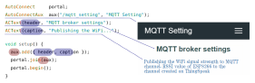

## What it is

<span style="margin-left:20px;margin-bottom:10px;float:right;width:280px;height:497px;border:1px solid lightgray;"></span>
AutoConnect can handle custom Web pages prepared by user sketches individually. Custom Web pages can be integrated into the AutoConnect menu and executed as menu items and can have input-output parameters and handle them.

For example, you can program some sketches that publish messages by entering the URI or unique ID of the MQTT broker on a custom page. You do not need to code the processing to handle the web page. It retrieves the input parameters and passes to the MQTT broker connection API is only.

## How it works

AutoConnect creates the custom Web pages dynamically at runtime. Sketch describes the custom Web pages using classes and APIs necessary for dynamic creation which are [**AutoConnectAux**](apiaux.md#autoconnectaux) and the variant of [**AutoConnectElements**](acelements.md). AutoConnectAux is an object dependent on AutoConnect, which provides an easy way to incorporate custom Web pages into AutoConnect like the one on the right figure. The elements make up a custom Web page are provided as an AutoConnectElement class.

Furthermore, an input box, a check box, a submit button, etc. are implemented by classes derived from AutoConnectElement.
<p align="center"></p>
AutoConnectAux is a container for AutoConnectElements. To make a custom Web page, create elements that make up the page and put it in the AutoConnectAux object. Joining its AutoConnectAux object to AutoConnect will integrate the custom Web page into the AutoConnect menu.



The above figure shows a code sequence that declares AutoConnectElements and put in the AutoConnectAux container and integrates those into AutoConnect. It declares two text elements named *header* and *caption*, adds them to the AutoConnectAux object as *aux*, binds to an AutoConnect object named *portal*. This sequence is the basic procedure for creating custom Web pages with the Sketch. The further explanation is available in section [AutoConnectElements](acelements.md) also.

## Custom Web pages in AutoConnect menu

<ul class="horizontal-list">
    <li>
    AutoConnect integrates custom Web page objects into menus as AutoConnectAux. The AutoConnectAux object contains URI and title as member variables and has an indicator to display in the AutoConnect menu.<br>You give the title and URI of the custom Web page to the AutoConnectAux object with Sketch. Then the title of the custom Web page would be displayed in the AutoConnect menu as the left figure.<sup id="fnref:1"><a class="footnote-ref" href="#fn:1" rel="footnote">1</a></sup> It is a hyperlink to a custom Web page which will be displayed tapped it.</li>
</ul>

[^1]:There is no overlay in the actual menu.

## Multiple custom Web pages

You can create multiple custom Web pages and specify pages that can be called from the menu. The following sketch shows a code sequence for integrating three custom Web pages into one and embedding them in a menu.


<ul class="horizontal-list">
    <li><p style="margin:0 20px 0 -20px"><span style="margin-left:20px;float:right;width:280px;height:497px;border:1px solid lightgrey;"></span>In the above code, the third parameter of <i>aux2</i> is <b>false</b>. The third parameter of the AutoConnectAux constructor is an indicator for whether it's shown to the AutoConnect menu. Right animation is an execution result of the above code. You will see that the menu applies only two items for three custom Web pages. the Sketch of this animation is written to transition to <i>aux2</i> by the utility of the <a href="acelements.html#autoconnectsubmit"><b>AutoConnectSubmit</b></a> element owned by <i>aux1</i>.<sup id="fnref:2"><a class="footnote-ref" href="#fn:2" rel="footnote">2</a></sup><br>The <i>aux2</i> page transitions only from the <i>aux1</i> page. As shown in mqttRSSI in the library example, its page replies the saving result for the parameters entered on the previous page. It can not be invoked directly from the menu and want to hide them with AutoConnect menu items. The utility of the third parameter of the AutoConnectAux constructor is that.</p></li>
</ul>

[^2]:
    the Sketch is actually this:
    ```cpp
    #include <ESP8266WiFi.h>
    #include <ESP8266WebServer.h>
    #include <AutoConnect.h>
    
    AutoConnect     portal;
    
    ACText(header, "MQTT broker settings");
    ACText(caption1, "Publishing the WiFi...");
    ACSubmit(save, "SAVE", "/mqtt_save");
    AutoConnectAux  aux1("/mqtt_setting", "MQTT Setting", true, { header, caption1, save });
    
    ACText(caption2, "Save parameters");
    ACSubmit(start, "START", "/mqtt_start"); 
    AutoConnectAux  aux2("/mqtt_save", "MQTT Setting", false, { caption2, start });
    
    AutoConnectAux  aux3("/mqtt_start", "MQTT Start");
    
    void setup() {
      portal.join({ aux1, aux2, aux3 });
      portal.begin();
    }
    
    void loop() {
      portal.handleClient();
    }
    ```

## Basic steps to use custom Web pages

So, the basic procedure for handling of the custom Web pages is as follows:

1. Create or define [AutoConnectAux](apiaux.md#autoconnectaux).
2. Create or define [AutoConnectElement(s)](acelements.md).
3. Add [AutoConnectElement(s)](acelements.md) to AutoConnectAux.
4. Create more AutoConnectAux containing [AutoConnectElement(s)](acelements.md), if necessary.
5. [Register](api.md#on) the [request handlers](achandling.md#custom-web-page-handler-programming-model) for the custom Web pages.
6. [Join](api.md#join) prepared AutoConnectAux(s) to AutoConnect.
7. Invoke [AutoConnect::begin()](api.md#begin).
8. Perform [AutoConnect::handleClient()](api.md#handleclient).

## Write the custom Web page with JSON

You can write the custom Web page in JSON without using sketch codes.[^3] It is possible to describe the entire page in JSON and can be described for each element also. The JSON document can be saved in SPIFFS or SD and read using AutoConnect's [**load**](api.md#load) function. you can reduce the steps of the basic procedure with this approach, but this way consumes a lot of memory. 
The following JSON code and sketch will execute the custom Web page as an example in the above figure. That is, the Sketch of this code and footnote[^2] is equivalent.

**custom_page.json**
```json
[
  {
    "title": "MQTT Setting",
    "uri": "/mqtt_setting",
    "menu": true,
    "element": [
      {
        "name": "header",
        "type": "ACText",
        "value": "MQTT broker settings"
      },
      {
        "name": "caption1",
        "type": "ACText",
        "value": "Publishing the WiFi..."
      },
      {
        "name": "save",
        "type": "ACSubmit",
        "value": "SAVE",
        "uri": "/mqtt_save"
      }
    ]
  },
  {
    "title": "MQTT Setting",
    "uri": "/mqtt_save",
    "menu": false,
    "element": [
      {
        "name": "caption2",
        "type": "ACText",
        "value": "Save parameters"
      },
      {
        "name": "start",
        "type": "ACSubmit",
        "value": "START",
        "uri": "/mqtt_start"
      }
    ]
  },
  {
    "title": "MQTT Start",
    "uri": "/mqtt_start",
    "menu": true,
    "element": []
  }
]
```

**the Sketch**
```cpp hl_lines="11 12"
#include <ESP8266WiFi.h>
#include <ESP8266WebServer.h>
#include <FS.h>
#include <AutoConnect.h>

AutoConnect  portal;

void setup() {
  SPIFFS.begin();

  File page = SPIFFS.open("/custom_page.json", "r");
  portal.load(page);

  page.close();
  SPIFFS.end();

  portal.begin();
}

void loop() {
  portal.handleClient();
}
```

[^3]: Installation of the [ArduinoJson](https://github.com/bblanchon/ArduinoJson) as the latest release of version 5 series is required.

## Passing parameters with sketches and custom Web pages

A sketch can access variables of [AutoConnectElements](acelements.md) on the custom Web page. The value entered into the AutoConnectElements is stored to the [member variables](acelements.md#form-and-autoconnectelements) of the element by AutoConnect whenever GET / POST transmission occurs. Your sketches can get these values with the request handler which will be registered by [AutoConnect::on](api.md#on) function. And if you assign a value to an element before a request to the page occurs, its value will appear as the initial value when the page is displayed. The details are explained in section [*Custom field data handling*](achandling.md#custom-field-data-handling).

<script>
  window.onload = function() {
    Gifffer();
  };
</script>
