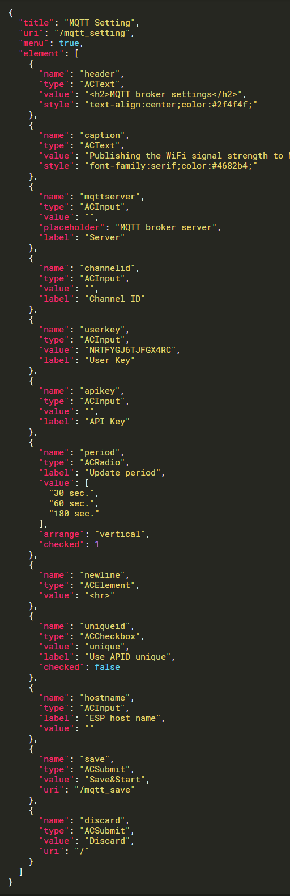

You can embed custom Web pages written in [**JSON**](https://www.json.org/index.html) into AutoConnect without AutoConnectAux &amp; AutoConnectElements declaration. Custom Web page declaration by JSON can  embed in the sketch as a fixed string or can store in the external file such as SPIFFS for stream loading. Also, you can also load and save AutoConnectElements objects individually.[^1]

[^1]:Loading and saving AutoConnect parameters adopt this method.

By providing the following JSON document to AutoConnect, you can include the custom Web page like the below:

<div style="float:left;width:50%;height:470px;overflow:auto"></div>


A JSON document for AutoConnect can contain the custom Web page multiple. You can further reduce the sketch process by loading multiple pages of JSON document at once.

!!! caution "Need ArduinoJson v5"
    To process the AutoConnectAux &amp; AutoConnectElements written in the JSON is you need to install the [ArduinoJson version 5](https://arduinojson.org/v5/doc/installation/) library.

## JSON objects &amp; elements for the custom Web page

### <i class="fa fa-caret-right"></i> JSON document structure for AutoConnectAux

AutoConnectAux will configure custom Web pages with JSON objects. The elements that make up the object are as follows:

```
{
  "title" : title,
  "uri" : uri,
  "menu" : true | false,
  "element" : element_array
}
```

#### <i class="fa fa-key"></i> **title**
: A title of the custom Web page. This is string value. String specified *title* will be displayed in the AutoConnection menu.

#### <i class="fa fa-key"></i> **uri**
: String of URI path that specifies where to place the custom Web page. It needs to be a location from the root path including '**/**'.

#### <i class="fa fa-key"></i> **menu**
: This is a Boolean value indicating whether to include the custom Web page in the AutoConnect menu. If the page only responds to another page and you want to prevent the direct use from the menu, you can exclude from the AutoConnect menu. If this key is false, it will not appear in the menu.

#### <i class="fa fa-key"></i> **element**
: Describe an array of JSON objects as *element_array*. It is a JSON object array of the [AutoConnectElements](#json-object-for-autoconnectelements) that make up the custom Web page.

!!! note "Order of elements on a custom Web page"
    The order in which AutoConnectElements are placed on a custom Web page is the order in the JSON document.

### <i class="fa fa-copy"></i> Multiple custom Web pages declaration in JSON document

You can put declarations of multiple custom Web pages in one JSON document. In that case, declare an array of each custom Web page with JSON. The following JSON document contains three custom Web pages:

```json
[
  {
    "title" : "Page 1 title",
    "uri" : "/page1",
    "menu" : true,
    "element" : [
      {
        "name" : "caption",
        "type" : "ACText",
        "value" : "hello, world"
      },
      {
        "name" : "send",
        "type" : "ACSubmit",
        "uri" : "/page2"
      }
    ]
  },
  {
    "title" : "Page 1 title",
    "uri" : "/page2",
    "menu" : false,
    "element" : [
      {
        "name" : "responds",
        "type" : "ACText",
        "value" : "Good day"
      },
      {
        "name" : "send",
        "type" : "ACSubmit",
        "uri" : "/page3"
      }
    ]
  },
  {
    "title" : "Page 3 title",
    "uri" : "/page3",
    "menu" : true,
    "element" : [
      {
        "name" : "responds",
        "type" : "ACText",
        "value" : "bye"
      }
    ]
  }
]
```

### <i class="fa fa-caret-right"></i> JSON object for AutoConnectElements

JSON description for AutoConnectElements describes as an array in the *element* with arguments of [each constructor](acelements.md#constructor).

```
{
  "name" : name,
  "type" : type,
  key_according_to_type : the_value | array_of_value,
  [ key_according_to_type : the_value | array_of_value ]
}
```

#### <i class="fa fa-key"></i> **name**
: A string of the name for the element.

#### <i class="fa fa-key"></i> **type**
: A string of the type for the element. For this type, specify the following string corresponding to each element.
: -  AutoConnectButton: [**ACButton**](#acbutton)
: -  AutoConnectCheckbox: [**ACCheckbox** ](#accheckbox)
: -  AutoConnectElement: [**ACElement**](#acelement)
: -  AutoConnectFile: [**ACFile**](#acfile)
: -  AutoConnectInput: [**ACInput**](#acinput)
: -  AutoConnectRadio: [**ACRadio**](#acradio)
: -  AutoConnectSelect: [**ACSelect**](#acselect)
: -  AutoConnectSubmit: [**ACSubmit**](#acsubmit)
: -  AutoConnectText: [**ACText**](#actext)

#### <i class="fa fa-key"></i> **<i>key_according_to_type</i>**

This is different for each AutoConnectElements, and the key that can be specified by the type of AutoConnectElements is determined.

#### <i class="fa fa-caret-right"></i> ACButton
: - **value** : Specifies the button label. This value also applies to the `value` attribute of an HTML `button` tag.
: - **action** : Specifies an action to be fire on a mouse click on the button. It is mostly used with a JavaScript to activate a script, or it directly describes a JavaScript.

#### <i class="fa fa-caret-right"></i> ACCheckbox
: - **value** : Specifies the value to be supplied to the checkbox. It will be packed in the query string as `name=value` when the checkbox is ticked.
: - **label** : Specifies a label of the checkbox. Its placement is always to the right of the checkbox.
: - **checked** : Specifies checking status as a **boolean** value. The value of the checked checkbox element is packed in the query string and sent.

#### <i class="fa fa-caret-right"></i> ACElement
: - **value** : Specifies the source code of generating HTML. The value is native HTML code and is output as HTML as it is.

#### <i class="fa fa-caret-right"></i> ACFile
: - **value** : The file name of the upload file will be stored. The `value` is read-only and will be ignored if specified.
: - **label** : Specifies a label of the file selection box. Its placement is always to the left of the file selection box.
: - **store** : Specifies the destination to save the uploaded file. Its value accepts one of the following:<p>
<b>fs</b>&nbsp;: Save as the SPIFFS file in flash of ESP8266/ESP32 module.<br>
<b>sd</b>&nbsp;: Save to an external SD device connected to ESP8266/ESP32 module.<br>
<b>extern</b>&nbsp;: Pass the content of the uploaded file to the uploader which is declared by the sketch individually. Its uploader must inherit [**AutoConnectUploadHandler**](acupload.md#to-upload-to-a-device-other-than-flash-or-sd) class and implements *_open*, *_write* and *_close* function.</p>

#### <i class="fa fa-caret-right"></i> ACInput
: - **value** : Specifies the initial text string of the input box. If this value is omitted, placeholder is displayed as the initial string.
: - **label** : Specifies a label of the input box. Its placement is always to the left of the input box.
: - **placeholder** : Specifies short hint of the input box.

#### <i class="fa fa-caret-right"></i> ACRadio
: - **value** : Specifies the collection of radio buttons as an array element.
: - **label** : Specifies a label of the collection of radio buttons, not for each button. The arrangement will be the top or left side according to the `arrange`.
: - **arrange** : Specifies the orientation of the radio buttons. Its value accepts one of the following:<p>
<b>horizontal</b>&nbsp;: Horizontal arrangement.<br>
<b>vertical</b>&nbsp;: Vertical arrangement.</p>

: - **checked** : Specifies the index number (1-based) of the radio buttons collection to be checked.

#### <i class="fa fa-caret-right"></i> ACSelect
: - **label** : Specifies a label of the drop-down list. Its placement is always to the left of the drop-down list.
: - **option** : Specifies the initial value collection of the drop-down list as an array element.

#### <i class="fa fa-caret-right"></i> ACSubmit
: - **value** : Specifies a label of the submit button.
: - **uri** : Specifies the URI to send form data when the button is clicked.

#### <i class="fa fa-caret-right"></i> ACText
: - **value** : Specifies a content and also can contain the native HTML code, but remember that your written code is enclosed by the div tag.
: - **style** : Specifies the qualification style to give to the content and can use the style attribute format as it is.
: - **format** : Specifies how to interpret the value. It specifies the conversion format when outputting values. The format string conforms to the C-style printf library functions, but depends on the espressif sdk implementation. The conversion specification is valid only for **%s** format. (Left and Right justification, width are also valid.)

!!! caution "AutoConnect's JSON parsing process is not perfect"
    It is based on analysis by ArduinoJson, but the semantic analysis is simplified to save memory. Consequently, it is not an error that a custom Web page JSON document to have unnecessary keys. It will be ignored.

## Loading JSON document

### <i class="fa fa-caret-right"></i> Loading from the streamed file

AutoConnect supports loading of JSON document from the following instances:

- String
- PROGMEM
- Stream

To load custom Web pages JSON document into AutoConnect, use the [load](api.md#load) function of the AutoConnect class. Its JSON document can read must be completed as a description interpretable by the ArduinoJson library. It cannot import custom Web pages if there are syntax errors for the JSON. If you can not see the custom Web page prepared by JSON, you can check the syntax with [ArduinoJson Assistant](https://arduinojson.org/v5/assistant/). It is useful for pre-checking.

```cpp
bool AutoConnect::load(const String& aux)
```
```cpp
bool AutoConnect::load(const __FlashStringHelper* aux)
```
```cpp
bool AutoConnect::load(Stream& aux)
```
An example of using each function is as follows.
```cpp
AutoConnect  portal;

// Loading from String
const String aux = String("{\"title\":\"Page 1 title\",\"uri\":\"/page1\",\"menu\":true,\"element\":[{\"name\":\"caption\",\"type\":\"ACText\",\"value\":\"hello, world\"}]}");
portal.load(aux);

// Loading from PROGMEM
const char aux[] PROGMEM = R"raw(
{
  "title" : "Page 1 title",
  "uri" : "/page1",
  "menu" : true,
  "element" : [
    {
      "name" : "caption",
      "type" : "ACText",
      "value" : "hello, world"
    }
  ]
}
)raw";
portal.load(aux);

// Loading from Stream assumes "aux.json" file should be store in SPIFFS.
File aux = SPIFFS.open("aux.json", "r");
portal.load(aux);
aux.close();
```

AutoConnect passes the given JSON document directly to the [**parseObject()**](https://arduinojson.org/v5/api/jsonbuffer/parseobject/) function of the ArduinoJson library for parsing. Therefore, the constraint of the parseObject() function is applied as it is in the parsing of the JSON document for the AutoConnect. That is, if the JSON string is read-only, duplicating the input string occurs and consumes more memory.

### <i class="fa fa-caret-right"></i> Adjust the JSON document buffer size

AutoConnect uses ArduinoJson library's dynamic buffer to parse JSON documents. Its dynamic buffer allocation scheme depends on the version 5 or version 6 of ArduinoJson library. Either version must have enough buffer to parse the custom web page's JSON document successfully. AutoConnect has the following three constants internally to complete the parsing as much as possible in both ArduinoJson version. These constants are macro defined in [AutoConnectDefs.h](https://github.com/Hieromon/AutoConnect/blob/master/src/AutoConnectDefs.h).

If memory insufficiency occurs during JSON document parsing, you can adjust these constants to avoid insufficiency by using the [JsonAssistant](https://arduinojson.org/v6/assistant/) with deriving the required buffer size in advance.

```cpp
#define AUTOCONNECT_JSONBUFFER_SIZE     256
#define AUTOCONNECT_JSONDOCUMENT_SIZE   (8 * 1024)
#define AUTOCONNECT_JSONPSRAM_SIZE      (16* 1024)
```

#### AUTOCONNECT_JSONBUFFER_SIZE

This is a unit size constant of [DynamicJsonBuffer](https://arduinojson.org/v5/faq/what-are-the-differences-between-staticjsonbuffer-and-dynamicjsonbuffer/) and works when the library used is ArduinoJson version 5. A buffer size of the JSON document increases with this unit. This value relates to the impact of the fragmented heap area. If it is too large, may occur run-out of memory.

#### AUTOCONNECT_JSONDOCUMENT_SIZE

This is a size of [DynamicJsonDocument](https://arduinojson.org/v6/api/dynamicjsondocument/) for ArduinoJson version 6. This buffer is not automatically expanding, and the size determines the limit.

#### AUTOCONNECT_JSONPSRAM_SIZE

For ESP32 module equips with PSRAM, you can allocate the JSON document buffer to PSRAM. Buffer allocation to PSRAM will enable when **PSRAM:Enabled** option selected in the Arduino IDE's Board Manager menu. It is available since ArduinoJson 6.10.0.

## Saving JSON document

The sketch can persist AutoConnectElements as a JSON document and also uses [this function](achandling.md#saving-autoconnectelements-with-json) to save the values ​​entered on the custom Web page. And you can reload the saved JSON document into AutoConnectElements as the field in a custom Web page using the [load function](achandling.md#loading-autoconnectaux-autoconnectelements-with-json). 
