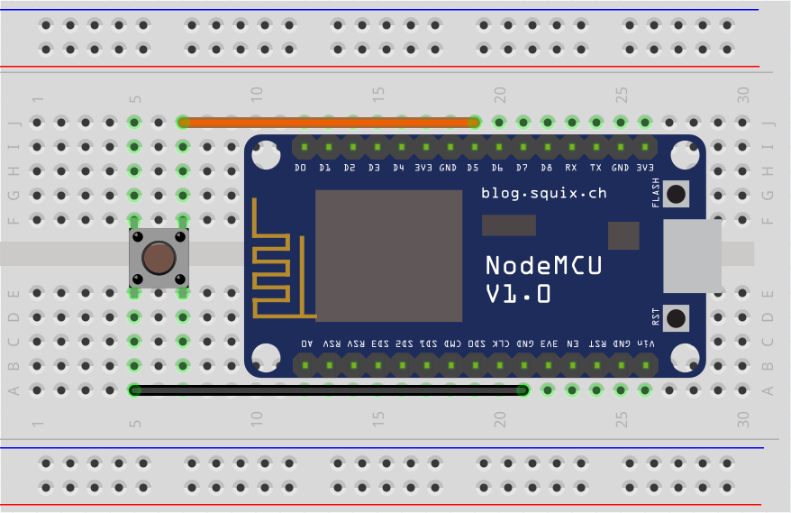
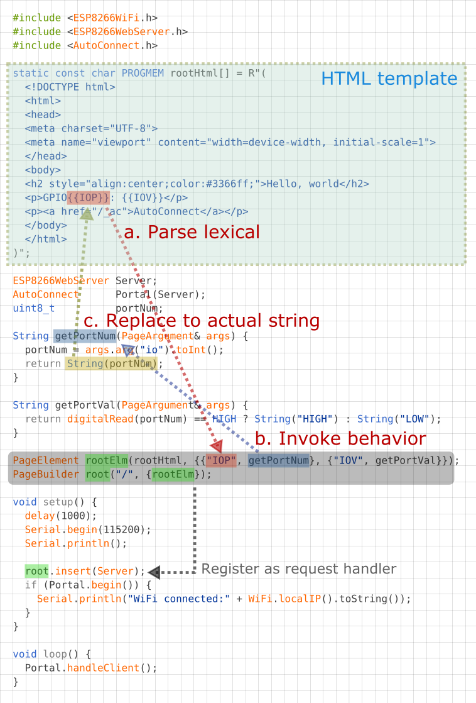

AutoConnect also has features that are not directly related to WiFi connection abilities. They're mostly like a little accessory but can reduce the amount of sketch code. 

- [Built-in OTA update](#built-in-ota-update-feature)
- [Choice of the filesystem for ESP8266](#choice-of-the-filesystem-for-esp8266)
- [Debug Print](#debug-print)
- [File uploading via built-in OTA feature](#file-uploading-via-built-in-ota-feature)
- [Refers the hosted ESP8266WebServer/WebServer](#refers-the-hosted-esp8266webserverwebserver)
- [Reset the ESP module after disconnecting from WLAN](#reset-the-esp-module-after-disconnecting-from-wlan)
- [Ticker for WiFi status](#ticker-for-wifi-status)
- [Usage for automatically instantiated ESP8266WebServer/WebServer](#usage-for-automatically-instantiated-esp8266webserverwebserver)
- [Use with the PageBuilder library](#use-with-the-pagebuilder-library)

## Built-in OTA update feature

AutoConnect features a built-in OTA function to update ESP module firmware. You can easily make the Sketch that equips OTA and able to operate with the AutoConnect menu.

<span style="display:block;margin-left:auto;margin-right:auto;width:284px;height:462px;border:1px solid lightgrey;"></span>

[*AutoConnectConfig::ota*](apiconfig.md#ota) specifies to import the [built-in OTA update class](otabrowser.md) into the Sketch.  
See the [Updates with the Web Browser](otabrowser.md) chapter for details.

## Choice of the filesystem for ESP8266

For ESP8266, since the Arduino core v2.7.0, SPIFFS has deprecated and the migration to [**LittleFS**](https://arduino-esp8266.readthedocs.io/en/latest/filesystem.html?highlight=littleFS#spiffs-deprecation-warning) is being promoted currently. AutoConnect has adopted LittleFS as the default filesystem to follow the core standard.

However, SPIFFS is still valid. AutoConnect can correctly compile and execute sketches made with SPIFFS assumed. When you make an AutoConnect sketch with SPIFFS enabled, you need to change the macro definition that [`AutoConnectDefs.h`](https://github.com/Hieromon/AutoConnect/blob/master/src/AutoConnectDefs.h#L39) has.  
**AC_USE_SPIFFS** definition will enable SPIFFS as the filesystem.

```cpp
#define AC_USE_SPIFFS
```

See also the [FAQ](faq.md#unable-to-change-any-macro-definitions-by-the-sketch) to help you enable AC_USE_SPIFFS correctly.

## Debug Print

You can output AutoConnect monitor messages to the **Serial**. A monitor message activation switch is in an include header file [`AutoConnectDefs.h`](https://github.com/Hieromon/AutoConnect/blob/master/src/AutoConnectDefs.h) of library source. Define [**AC_DEBUG**](https://github.com/Hieromon/AutoConnect/blob/master/src/AutoConnectDefs.h#L14) macro to output the monitor messages.[^1]

[^1]:The source code placement of common macros for AutoConnect since v0.9.7 has changed.

```cpp
#define AC_DEBUG
```

AutoConnect does not automatically start the Serial even if AC_DEBUG is activated. The Sketch should start the Serial during its setup phase using **`Serial.begin(BAUDRATE)`**.

!!! note "How to enable AC_DEBUG"
    The **#define** is a C++ preprocessor directive. The build process of the Sketch by the Arduino IDE is processed independently of the subsequent C++ compilation unit. Writing the #define directive for AC_DEBUG in the Sketch has no effect on the AutoConnect library.  
    To compile the AutoConnect library with the AC_DEBUG directive, you can either edit the library source code directly (usually it is located in ~/Arduino/libraries/AutoConnect/src) or use a build system which can configure the preprocessor directives externally such as [**PlatformIO**](https://platformio.org/).

## File uploading via built-in OTA feature

The [built-in OTA update feature](otabrowser.md) can update the firmware as well as upload regular files placed in the file system on the ESP module. It allows a regular file is uploaded via OTA using the [**Update**](menu.md#update) of AutoConnect menu without adding a particular custom Web page that contains AutoConnectFile. This ability is useful for transferring the JSON document of the custom web page definition, the external parameter file of your sketch, and so on into the target ESP module via OTA.

The built-in OTA update feature determines where to save the uploaded file according to the filename pattern. By default, a filename with ends a **`.bin`** extension is subject to firmware updates. A file that has the other extension will be saved as a regular to the filesystem in the flash. The file extension that should be treated as the firmware is defined as the [`AUTOCONNECT_UPLOAD_ASFIRMWARE`](https://github.com/Hieromon/AutoConnect/blob/master/src/AutoConnectDefs.h#L280) macro in [AutoConnectDefs.h](https://github.com/Hieromon/AutoConnect/blob/master/src/AutoConnectDefs.h) header file of the library source code. When dealing with another extension for the updating file as firmware change this macro definition.

```cpp
#define AUTOCONNECT_UPLOAD_ASFIRMWARE ".bin"
```

!!! note "Specify with the PlatformIO"
    `AUTOCONNECT_UPLOAD_ASFIRMWARE` pattern will be embedded into the binary sketch is determined at compile time. The [**PlatformIO**](https://platformio.org/platformio-ide) build system allows you to change the pattern expression for each project without modifying the library source code.
    
    ```ini
    build_flags=-DAUTOCONNECT_UPLOAD_ASFIRMWARE='".bin"'
    ```

## Refers the hosted ESP8266WebServer/WebServer

Constructing an AutoConnect object variable without parameters then creates and starts an ESP8266WebServer/WebServer inside the AutoConnect. This object variable could be referred by [AutoConnect::host](api.md#host) function to access ESP8266WebServer/WebServer instance as like below.

```cpp hl_lines="4"
AutoConnect Portal;

Portal.begin();
ESP8266WebServer& server = Portal.host();
server.send(200, "text/plain", "Hello, world");
```

!!! info "When host() is valid"
    The host() can be referred at after [AutoConnect::begin](api.md#begin).

## Reset the ESP module after disconnecting from WLAN

[Disconnect](menu.md#disconnect) by menu operation allows the ESP8266/ESP32 module to reset automatically after disconnecting from WLAN. This behavior is enabled by default and can be disabled by [*AutoConnectConfig::autoReset*](apiconfig.md#autoreset) settings.

```cpp hl_lines="3"
AutoConnect       Portal;
AutoConnectConfig Config;
Config.autoReset = false; // Continue sketch processing even after disconnecting from by AutoConnect menu.
Portal.config(Config);
Portal.begin();
```

The [**autoReset**](apiconfig.md#autoreset) setting will automatically reset the ESP module when disconnecting WiFi only if you intentionally navigate the [menu](menu.md#disconnect). And it does not participate in passive disconnection conditions such as disconnection due to sketch processing or loss of WiFi signal. 

You can combine [**autoReset**](apiconfig.md#autoreset) with [**autoReconnect**](apiconfig.md#autoreconnect) to disconnect from WiFi and automatically reconnect to another AP while continuing the Sketch operation.

The Sketch below shows an example of a  meaningful combination of [**autoReset**](apiconfig.md#autoreset) and [**autoReconnect**](apiconfig.md#autoreconnect). It can connect to the access point once with the captive portal but assumes that it can be disconnected from the WLAN by intentional menu navigation. In that case, the Sketch will continue processing without resetting the module. Then an external switch allows to start automatic reconnecting. In this situation, if known access points appear nearby, the ESP module will automatically reconnect to them in the handleClient loop. In this state transition, the module continues the Sketch process without resetting.

```cpp
AutoConnect       Portal;
AutoConnectConfig Config;

const int reconnectSwitch = 14; // Assign the reconnect switch to GPIO14

ICACHE_RAM_ATTR void detectsReconnect() {
  if (!Config.autoReconnect) {  // Chattering elimination
    // autoReconnect is enabled by interrupt of the GPIO trigger,
    Config.autoReconnect = true;  // Activate reconnection
    Config.reconnectInterval = 2; // Attempt to reconnect at 60 seconds intervals.
    Portal.config(Config);
    Serial.printf("Turn on autoReconnect, interval %d[s]\n", Config.reconnectInterval * AUTOCONNECT_UNITTIME);
  }
}

void setup() {
  delay(1000);
  Serial.begin(115200);
  Serial.println();
  
  Config.ticker = true;   // Setting up WiFi connection indicator
  Portal.config(Config);  

  if (Portal.begin()) {
    Config.autoReset = false;
    Portal.config(Config);

    // Set external switch pin to reconnect as interrupt, assign interrupt function and set RISING mode
    pinMode(reconnectSwitch, INPUT_PULLUP);
    attachInterrupt(digitalPinToInterrupt(reconnectSwitch), detectsReconnect, RISING);
  }
}

void loop() {
  if (WiFi.status() == WL_CONNECTED) {
    /*
    Here, your sketch process with WiFi connection
    */
  }
  else {
    /*
    Here, your sketch process without WiFi connection
    */
  }

  // Post process, turn to initial state of autoReconnect.
  if (Config.autoReconnect) {
    if (WiFi.status() == WL_CONNECTED) {
      Config.autoReconnect = false;
      Portal.config(Config);
    }
  }

  // The actual reconnection takes place within handleClient.
  Portal.handleClient();
}
```

!!! info "An external switch wiring to GPIO"
    The wiring for the above Sketch assumes a momentary effects switch that connects the GPIO pin 14 to GND. You can experience it with easily wire on a breadboard using a NodeMCU as like:

    

## Ticker for WiFi status

Flicker signal can be output from the ESP8266/ESP32 module according to WiFi connection status. By wiring the LED to the signal output pin with the appropriate limiting resistor, you can know the WiFi connection status through the LED blink during the inside behavior of AutoConnect::begin and loop of AutoConnect::handleClient.

[*AutoConnectConfig::ticker*](apiconfig.md#ticker) option specifies flicker signal output. The following sketch is an example of blinking the active-low LED connected to `GPIO16` depending on the WiFi connection status.[^2]

[^2]: The ESP module pin mapping is different for each breakout. Definitions for assigning pin numbers to pin names usually exist in the variant definition program of Arduino core packages. (e.g. [esp8266/arduino core](https://github.com/esp8266/Arduino/tree/master/variants), [arduino-esp32 core](https://github.com/espressif/arduino-esp32/tree/master/variants))  
You may find the definition as `pins_arduino.h`.

```cpp
AutoConnect        portal;
AutoConnectConfig  Config;
Config.ticker = true;
config.tickerPort = 16;
Config.tickerOn = LOW;
portal.config(Config);
portal.begin();
```

The AutoConnect ticker indicates the WiFi connection status in the following three flicker patterns:

- Short blink: The ESP module stays in AP_STA mode.
- Short-on and long-off: No STA connection state. (i.e. WiFi.status != WL_CONNECTED)
- No blink: WiFi connection with access point established and data link enabled. (i.e. WiFi.status = WL_CONNECTED)

The flicker cycle length is defined by some macros in [`AutoConnectDefs.h`](https://github.com/Hieromon/AutoConnect/blob/master/src/AutoConnectDefs.h#L180) header file.

```cpp
#define AUTOCONNECT_FLICKER_PERIODAP  1000 // [ms]
#define AUTOCONNECT_FLICKER_PERIODDC  (AUTOCONNECT_FLICKER_PERIODAP << 1) // [ms]
#define AUTOCONNECT_FLICKER_WIDTHAP   96  // (8 bit resolution)
#define AUTOCONNECT_FLICKER_WIDTHDC   16  // (8 bit resolution)
```

- **AUTOCONNECT_FLICKER_PERIODAP**:  
  Assigns a flicker period when the ESP module stays in AP_STA mode.
- **AUTOCONNECT_FLICKER_PERIODDC**:  
  Assigns a flicker period when WiFi is disconnected.
- **AUTOCONNECT_FLICKER_WIDTHAP** and **AUTOCONNECT_FLICKER_WIDTHDC**:  
  Specify the duty rate for each period [ms] in 8-bit resolution.

!!! note "Ticker during OTA"
    The LED blinking will always be a short blinking during the update via OTA, regardless of the definition of the flicker cycle.

[*AutoConnectConfig::tickerPort*](apiconfig.md#tickerport) specifies a port that outputs the flicker signal. If you are using an LED-equipped ESP module board, you can assign a LED pin to the tick-port for the WiFi connection monitoring without the external LED. The default pin is arduino valiant's **LED\_BUILTIN**. You can refer to the Arduino IDE's variant information to find out which pin actually on the module assign to **LED\_BUILTIN**.[^3]

[^3]: It's defined in the `pins_arduino.h` file, located in the sub-folder named **variants** wherein Arduino IDE installed folder.

[*AutoConnectConfig::tickerOn*](apiconfig.md#tickeron) specifies the active logic level of the flicker signal. This value indicates the active signal level when driving the ticker. For example, if the LED connected to tickPort lights by LOW, the tickerOn is **LOW**. The logic level of LED_BUILTIN for popular modules are as follows:

module | Logic level | LED_BUILTIN Pin | Arduino alias
----|----|:---:|----
NodeMCU V1.0 | Active-low | 16 | D0
WEMOS D1 mini | Active-low | 2 | D4
SparkFun ESP8266 Thing | Active-high | 5 |
Adafruit Feather HUZZAH ESP8266 | Active-low | 0 |
NodeMCU 32s | Active-high | 2 | T2
LOLIN32 Pro | Active-low | 5 | SS
SparkFun ESP32 Thing | Active-high | 5
Adafruit Feather HUZZAH32 | Active-high | 13 | A12

## Usage for automatically instantiated ESP8266WebServer/WebServer

The Sketch can handle URL requests using ESP8266WebServer or WebServer that AutoConnect started internally. ESP8266WebServer/WebServer instantiated dynamically by AutoConnect can be referred to by [AutoConnect::host](api.md#host) function. The Sketch can use the '**on**' function, '**send**' function, '**client**' function and others by ESP8266WebServer/WebServer reference of its return value.

```cpp hl_lines="8 9 13 14 20 21 27"
#include <ESP8266WiFi.h>
#include <ESP8266WebServer.h>
#include <AutoConnect.h>

AutoConnect       Portal;

void handleRoot() {
  ESP8266WebServer& IntServer = Portal.host();
  IntServer.send(200, "text/html", "Hello, world");
}

void handleNotFound() {
  ESP8266WebServer& IntServer = Portal.host();
  IntServer.send(404, "text/html", "Unknown.");
}

void setup() {
  bool r = Portal.begin();
  if (r) {
    ESP8266WebServer& IntServer = Portal.host();
    IntServer.on("/", handleRoot);
    Portal.onNotFound(handleNotFound);    // For only onNotFound.
  }
}

void loop() {
  Portal.host().handleClient();
  Portal.handleRequest();
  /* or following one line code is equ.
  Portal.handleClient();
  */
}
```

!!! note "ESP8266WebServer/WebServer function should be called after AutoConnect::begin"
    The Sketch cannot refer to an instance of ESP8266WebServer/WebServer until AutoConnect::begin completes successfully.

!!! warning "Do not use with ESP8266WebServer::begin or WebServer::begin"
    ESP8266WebServer/WebServer is already running inside the AutoConnect.

## Use with the [PageBuilder](https://github.com/Hieromon/PageBuilder) library

In ordinary, the URL handler will respond to the request from the client by sending some HTML. It will dynamically generate the HTML to respond to based on the sensing data etc. for the changing scene, but it contains elements of variable values in the middle of the HTML fixed string. Therefore, sketches tend to be in a tangled that repeats the logic for data handling and string splicing in turn, which tends to be less readable and maintainable.

[PageBuilder](https://github.com/Hieromon/PageBuilder) library is an HTML assembly aid. it can handle predefined HTML like the template and simplify an HTML string assemble logic, and also the generated HTML send automatically.

An example sketch used with the PageBuilder as follows and it explains how it aids for the HTML generating. Details for [Github repository](https://github.com/Hieromon/PageBuilder).



<script>
  window.onload = function() {
    Gifffer();
  };
</script>
