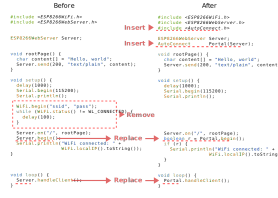

## Simple usage

### <i class="fa fa-edit"></i> Embed to the Sketches

How embed the AutoConnect to the Sketches you have. Most simple approach to applying AutoConnect for the existing Sketches, follow the below steps. The below Sketch is for ESP8266. For ESP32, replace ```ESP8266WebServer``` with ```WebServer``` and ```ESP8266WiFi.h``` with ```WiFi.h``` respectively.



:fontawesome-regular-edit: Insert <code class="highlight"><span class="cp">#include</span> <span class="cpf">&lt;AutoConnect.h&gt;</span></code> to behind of <code class="highlight"><span class="cp">#include</span> <span class="cpf">&lt;ESP8266WebServer.h&gt;</span></code>.

:fontawesome-regular-edit: Insert <code class="highlight"><span class="na">AutoConnect</span> <em>PORTAL(WEBSERVER);</em></code> to behind of <code class="highlight"><span class="na">ESP8266WebServer</span> <em>WEBSERVER;</em></code> declaration.<sup id="fnref:1"><a class="footnote-ref" href="#fn:1" rel="footnote">1</a></sup>

:fontawesome-regular-edit: Remove <code class="highlight">WiFi.<span class="na">begin</span>(<em>SSID</em>,<em>PSK</em>)</code> and the subsequent logic for the connection status check.

:fontawesome-regular-edit: Replace <code class="highlight"><em>WEBSERVER</em>.<span class="na">begin</span><span class="p">()</span></code> to <code class="highlight"><em>PORTAL</em>.<span class="na">begin</span><span class="p">()</span></code>.<sup id="fnref:2"><a class="footnote-ref" href="#fn:2" rel="footnote">2</a></sup>

:fontawesome-regular-edit: Replace <code class="highlight"><em>WEBSERVER</em>.<span class="na">handleClient</span><span class="p">()</span></code> to <code class="highlight"><em>PORTAL</em>.<span class="na">handleClient</span><span class="p">()</span></code>.<sup id="fnref:3"><a class="footnote-ref" href="#fn:3" rel="footnote">3</a></sup>

:fontawesome-regular-edit: If the connection checks logic is needed, you can check the return value according to <code class="highlight"><em>PORTAL</em>.<span class="na">begin</span><span class="p">()</span></code> with <code class="highlight">true</code> or <code class="highlight">false</code>.

[^1]:
Each *VARIABLE* conforms to the actual declaration in the Sketches.  

[^2]:
WiFi SSID and Password can be specified AutoConnect::begin() too.

[^3]:
Replacement the **handleClient** method is not indispensable. AutoConnect can still connect with the captive portal as it is ESP8266WebServer::handleClient. But it can **not valid AutoConnect menu**.

## Basic usage

### <i class="fa fa-caret-right"></i> Basic logic sequence for the user Sketches

#### 1. A typical logic sequence

!!! note ""
    1. <strong>Include headers,</strong> `ESP8266WebServer.h`/`WebServer.h` and `AutoConnect.h`  
    2. <strong>Declare an ESP8266WebServer variable for ESP8266 or a WebServer variable for ESP32.</strong>  
    3. <strong>Declare an AutoConnect variable.</strong>  
    4. <strong>Implement the URL handlers provided for the </strong>`on`<strong> method of ESP8266WebServer/WebServer with the *function()*.</strong>  
    5. <strong>setup()</strong>  
       5.1 <strong>Sets URL handler the *function()* to ESP8266WebServer/WebServer by</strong>`ESP8266WebServer::on`<strong>/</strong>`WebServer::on`<strong>.</strong>  
       5.2 <strong>Starts </strong>`AutoConnect::begin()`<strong>.</strong>  
       5.3 <strong>Check WiFi connection status.</strong>  
    6. <strong>loop()</strong>  
       6.1 <strong>Do the process for actual Sketch.</strong>  
       6.2 <strong>Invokes </strong>`AutoConnect::handleClient()`<strong>, or invokes </strong>`ESP8266WebServer::handleClient()`<strong>/</strong>`WebServer::handleClient`<strong> then </strong>`AutoConnect::handleRequest()`<strong>.</strong>  

#### 2. Declare AutoConnect object

[Two options](#esp8266webserver-hosted-or-parasitic) are available for [AutoConnect constructor](api.md#constructors).

```cpp
AutoConnect VARIABLE(&ESP8266WebServer);  // For ESP8266
AutoConnect VARIABLE(&WebServer);         // For ESP32
```
or

```cpp
AutoConnect VARIABLE;
```

- **The parameter with an ESP8266WebServer/WebServer variable:** An ESP8266WebServer/WebServer object variable must be declared. AutoConnect uses its variable to handles the [AutoConnect menu](menu.md).

- **With no parameter:** the Sketch does not declare ESP8266WebServer/WebServer object. In this case, AutoConnect allocates an instance of the ESP8266WebServer/WebServer internally. The logic sequence of the Sketch is somewhat different as the above. To register a URL handler function by *ESP8266WebServer::on* or *WebServer::on* should be performed after [*AutoConnect::begin*](api.md#begin).

#### 3. No need WiFI.begin(...)

AutoConnect internally performs *WiFi.begin* to establish a WiFi connection. There is no need for a general process to establish a connection using *WiFi.begin* with a Sketch code.

#### 4. Alternate ESP8266WebServer::begin() and WebServer::begin()

[*AutoConnect::begin*](api.md#begin) executes *ESP8266WebServer::begin*/*WebServer::begin* internally too and it starts the DNS server to behave as a Captive portal. So it is not needed to call *ESP8266WebServer::begin*/*WebServer::begin* in the Sketch.

!!! info "Why DNS Server starts"
    AutoConnect traps the detection of the captive portal and achieves a connection with the WLAN interactively by the AutoConnect menu. It responds SoftAP address to all DNS queries temporarily to trap. Once a WiFi connection establishes, the DNS server contributed by AutoConnect stops.

#### 5. AutoConnect::begin with SSID and Password

SSID and Password can also specify by [*AutoConnect::begin*](api.md#begin). ESP8266/ESP32 uses provided SSID and Password explicitly. If the connection false with specified SSID with Password then a captive portal is activated. SSID and Password are not present, ESP8266 SDK will attempt to connect using the still effectual SSID and password. Usually, it succeeds.

#### 6. Use ESP8266WebServer::on and WebServer::on to handle URL

AutoConnect is designed to coexist with the process for handling the web pages by user Sketches. The page processing function which will send an HTML to the client invoked by the "*on::ESP8266WebServer*" or the "*on::WebServer*" function is the same as when using ESP8266WebServer/WebServer natively.

#### 7. Use either ESP8266WebServer::handleClient()/WebServer::handleClient() or AutoConnect::handleClient()

Both classes member function name is the same: *handleClient*, but the behavior is different. Using the AutoConnect embedded along with ESP8266WebServer::handleClient/WebServer::handleClient has limitations. Refer to the below section for details. 

### <i class="fa fa-caret-right"></i> ESP8266WebServer/WebServer hosted or parasitic

The interoperable process with an ESP8266WebServer/WebServer depends on the parameters of the [AutoConnect constructor](api.md#constructors).

Declaration parameter for the constructor | Use ESP8266WebServer::handleClient or WebServer::handleClient only | Use AutoConnect::handleClient
----|----|---
[None](api.md#constructors) | AutoConnect menu not available.<br>To use AutoConnect menu, need [AutoConnect::handleRequest()](api.md#handlerequest).<br>also to use ESP8266WebServer/WebServer natively, need [AutoConnect::host()](api.md#host). | AutoConnect menu available.<br>To use ESP8266WebServer/WebServer natively, need [AutoConnect::host()](api.md#host).
[Reference to ESP8266WebServer/WebServer](api.md#withparameter) | AutoConnect menu not available.<br>To use AutoConnect menu, need [AutoConnect::handleRequest()](api.md#handlerequest). | AutoConnect menu available.

- **By declaration for the AutoConnect variable with no parameter**: The ESP8266WebServer/WebServer instance is hosted by AutoConnect automatically then the Sketches use [*AutoConnect::host*](api.md#host) as API to get it after [*AutoConnect::begin*](api.md#begin) performed.

- **By declaration for the AutoConnect variable with the reference of ESP8266WebServer/WebServer**: AutoConnect will use it. the Sketch can use it is too.

- **In use ESP8266WebServer::handleClient()/WebServer::handleClient()**: AutoConnect menu can be dispatched but not works normally. It is necessary to call [*AutoConnect::handleRequest*](api.md#void-handlerequest) after *ESP8255WebServer::handleClient*/*WebServer::handleClient* invoking.

- **In use [AutoConnect::handleClient()](api.md#void-handleclient)**: The handleClient() process and the AutoConnect menu is available without calling *ESP8266WebServer::handleClient*.

!!! info "Why AutoConnect::handleRequest is needed when using ESP8266WebServer::handleClient/WebServer::handleClient"
    The AutoConnect menu function may affect WiFi connection state. It follows that the menu process must execute outside *ESP8266WebServer::handleClient* and *WebServer::handleClient*.  
    [*AutoConnect::handleClient*](api.md#void-handleclient) is equivalent *ESP8266WebServer::handleClient* and *WEbServer::handleClient* included [*AutoConnect::handleRequest*](api.md#void-handlerequest).

