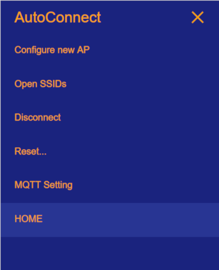

## AutoConnect menu colorizing ##

You can easily change the color of the AutoConnect menu. Menu colors can be changed statically by the AutoConnect menu color definition determined at compile time. You cannot change the color while the sketch is running.

The menu color scheme has been separated to `AutoConnectLabels.h` placed the AutoConnect library folder.[^1] You can change the color scheme of the menu with the following three color codes. The color code also accepts CSS standard color names.[^2]

[^1]: Usually, it will locate to the Arduino/libraries/AutoConnect/src folder of user documents.

[^2]: The W3C HTML and CSS standards have listed only 16 valid color names: aqua, black, blue, fuchsia, gray, green, lime, maroon, navy, olive, purple, red, silver, teal, white, and yellow. Major browsers can accept more color names, but they are not web safe in typically.

In `AutoConnectLabels.h` you can find three definition macros for menu colors:

- \#define <b>AUTOCONNECT_MENUCOLOR_TEXT</b>  
Defines the menu text color.

- \#define <b>AUTOCONNECT_MENUCOLOR_BACKGROUND</b>  
Defines the menu background color.

- \#define <b>AUTOCONNECT_MENUCOLOR_ACTIVE</b>  
Defines the active menu item background color.

## Typical color schemes

Here are some color schemes picked up.

### <i class="fas fa-palette"></i> Indigo

```cpp
#define AUTOCONNECT_MENUCOLOR_TEXT        "#ffa500"
#define AUTOCONNECT_MENUCOLOR_BACKGROUND  "#1a237e"
#define AUTOCONNECT_MENUCOLOR_ACTIVE      "#283593"
```



### <i class="fas fa-palette"></i> Dim-gray

```cpp
#define AUTOCONNECT_MENUCOLOR_TEXT        "#fffacd"
#define AUTOCONNECT_MENUCOLOR_BACKGROUND  "#696969"
#define AUTOCONNECT_MENUCOLOR_ACTIVE      "#808080"
```


### <i class="fas fa-palette"></i> Brown

```cpp
#define AUTOCONNECT_MENUCOLOR_TEXT        "#e6e6fa"
#define AUTOCONNECT_MENUCOLOR_BACKGROUND  "#3e2723"
#define AUTOCONNECT_MENUCOLOR_ACTIVE      "#4e342e"
```


