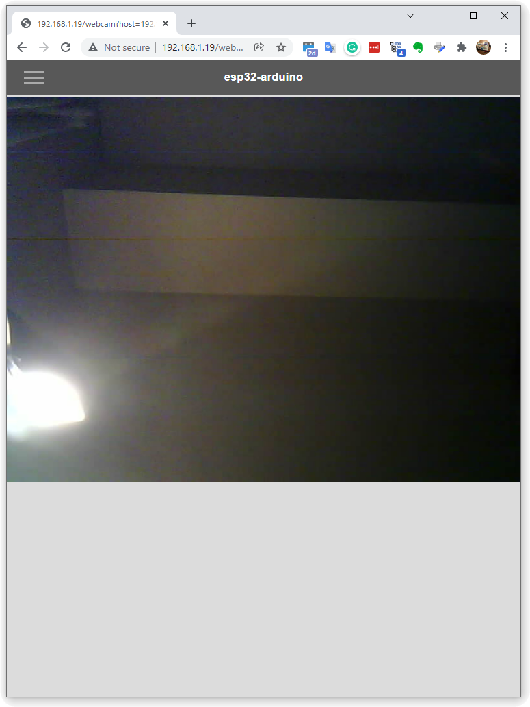
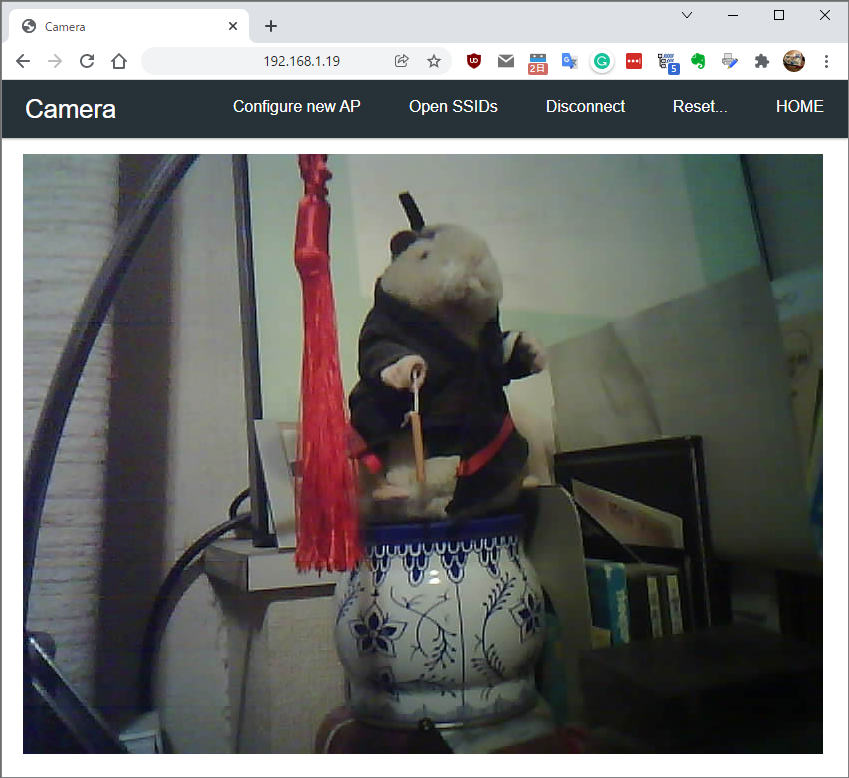
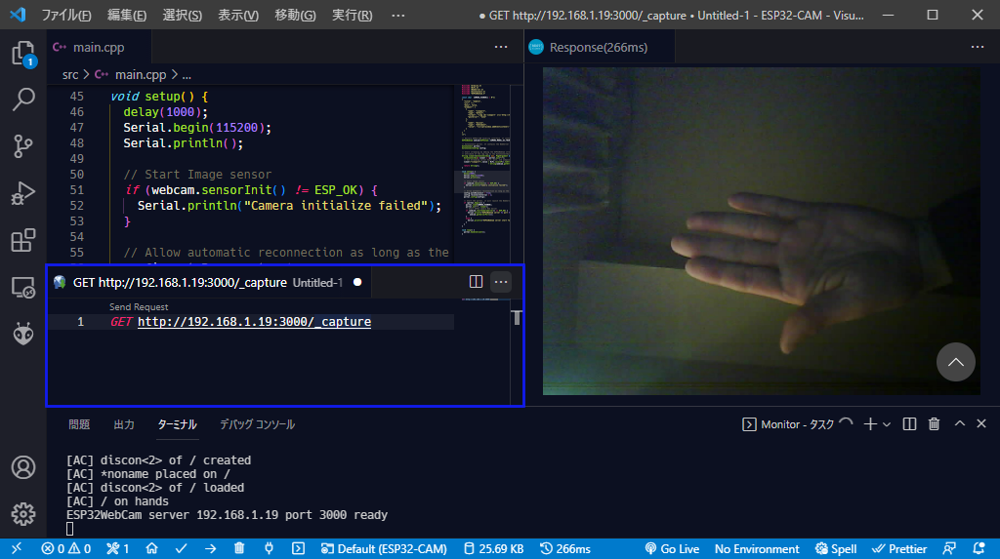
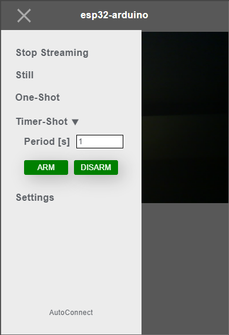
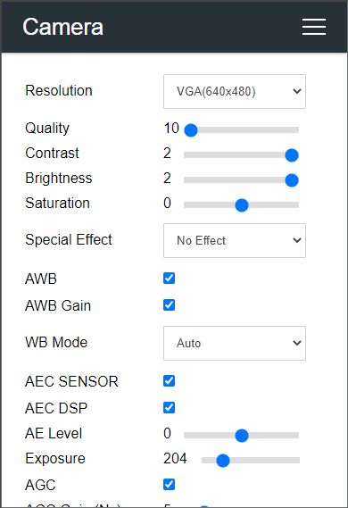

## What this example presents

ESP-IDF is offering [ESP32 Camera Driver](https://github.com/espressif/esp32-camera) as an interface to small image sensors that can work with ESP32. This driver supports a variety of popular image sensors, such as the OV2640, which has low power consumption and mega-pixel sensing capability. By reading through this chapter you will know how to make the sketch featuring a UI that looks like the followings. Of course, it has the convenience of AutoConnect as well. This example shows how to sketch the Web Camera Application that involves using AutoConnect together with the ESP32 Camera Driver.




## Why we can not use app_httpd.cpp together with AutoConnect

The ESP32 library of the ESP32 Arduino core features a [`CameraWebServer.ino`](https://github.com/espressif/arduino-esp32/tree/master/libraries/ESP32/examples/Camera/CameraWebServer) that includes an interface to drive the Camera Driver. The core process of the server-side of that sketch application is [`app_httpd.cpp`](https://github.com/espressif/arduino-esp32/blob/master/libraries/ESP32/examples/Camera/CameraWebServer/app_httpd.cpp), which consists of initializing and configuring the image sensor, configuring and capturing image frames, and sending the image frames through an internally started [HTTP server](https://docs.espressif.com/projects/esp-idf/en/latest/esp32/api-reference/protocols/esp_http_server.html#http-server).

While Web UI provided by `CameraWebServer.ino` is sophisticated, the role of `app_httpd.cpp` is focused on responding to the [Fetch](https://developer.mozilla.org/en-US/docs/Web/API/Fetch_API) required by the Web UI (which is actually an HTML page specific to each sensor model that is extracted from the gzipped [`camera_index.h`](https://github.com/espressif/arduino-esp32/blob/master/libraries/ESP32/examples/Camera/CameraWebServer/camera_index.h)). It is a set of primitive functions that are integrated with the Web UI. Also, `app_httpd.cpp` has hardcoded the TCP port of the internally invoking HTTP server as fixed at 80, which conflicts with the HTTP port used by a typical captive portal. Therefore, It is impossible to apply `app_httpd.cpp` which has fixed 80 TCP port depending on the WebUI of `CameraWebServer.ino` to sketches using AutoConnect as it is.

!!! info "CameraWebServer.ino extended version available on GitHub"
	[An extended version of app_httpd.cpp](https://github.com/easytarget/esp32-cam-webserver) is available on the GitHub repository to make it a bit more flexible for different usage scenarios. It also can handling the captive portal itself.

## Strategy

As mentioned earlier, `app_httpd.cpp` is integrated with `CameraWebServer.ino`'s Web UI. However, its functionality can be separated into two parts: an interface for driving the image sensor correctly and sending the captured images on the HTTP stream as requested by the client. It also has the ability to configure the sensor settings over the network remotely, but this can be omitted at the expense of interactivity. (We can implement that feature after the initial purpose is achieved)

So, I have prepared two separate classes with these functions. [**ESP32WebCam**](#esp32webcam-features) and [**ESP32Cam**](#esp32cam-features) are independent classes inspired by app-httpd.cpp, and they can interface with the ESP32 Camera Driver individually, or send out motion JPEGs via an HTTP server task running inside the class.

These two classes are completely independent of the AutoConnect library and can be incorporated into your various other sketches on their own. the source code for the ESP32WebCam and ESP32Cam classes can be found in the [AutoConnect library examples](https://github.com/Hieromon/AutoConnect/blob/master/examples/WebCamServer) and are distributed together. The API specifications for these two classes are described later in this chapter.

## Implementing a Streaming Server with ESP32-CAM using AutoConnect

A minimal sketch that involves the ESP32WebCam and ESP32Cam classes and incorporates them together with AutoConnect is shown below. This sketch will work with [Ai-Thinker ESP32-CAM](https://docs.aithinker.com/en/esp32-cam), which is one of the most popular ESP32 modules with OmniVision OV2640 image sensor.

In order to experience this sketch, copy the five files [`ESP32WebCam.h`](https://github.com/Hieromon/AutoConnect/tree/master/examples/WebCamServer/ESP32WebCam.h), [`ESP32WebCam.cpp`](https://github.com/Hieromon/AutoConnect/tree/master/examples/WebCamServer/ESP32WebCam.cpp), [`ESP32Cam.h`](https://github.com/Hieromon/AutoConnect/tree/master/examples/WebCamServer/ESP32Cam.h), [`ESP32Cam.cpp`](https://github.com/Hieromon/AutoConnect/tree/master/examples/WebCamServer/ESP32WebCam.cpp), and [`ESP32Cam_pins.h`](https://github.com/Hieromon/AutoConnect/tree/master/examples/WebCamServer/ESP32Cam_pins.h) from the [WebCamServer folder](https://github.com/Hieromon/AutoConnect/tree/master/examples/WebCamServer) located AutoConnect library examples to the same folder as the sketchbook folder where you placed this sketch. Connect the ESP32-CAM module to your PC and launch the Arduino IDE. Then select the correct board you using from the Tool menu of Arduino IDE and compile it. (Don't forget to open the serial monitor)

```cpp
#include <Arduino.h>
#include <WiFi.h>
#include <WebServer.h>
#include <AutoConnect.h>
#include "ESP32WebCam.h"

const char  CAMERA_VIEWER[] = R"*(
{
  "title": "Camera",
  "uri": "/",
  "menu": false,
  "element": [
    {
      "name": "viewport",
      "type": "ACText",
      "format": "",
      "posterior": "none"
    },
    {
      "name": "discon",
      "type": "ACElement",
      "value": "<script>window.addEventListener('pagehide',function(){window.stop();});</script>"
    }
  ]
}
)*";

// Declare ESP32-CAM handling interface. It contains ESP-IDF Web Server.
ESP32WebCam webcam(ESP32Cam::CAMERA_MODEL_AI_THINKER);

// AutoConnect portal. It contains the WebServer from ESP32 Arduino Core.
AutoConnect portal;
AutoConnectConfig config;

// AutoConnectAux page handler, it starts streaming by adding the ESP32WebCam
// streaming endpoint to the src attribute of the img tag on the AutoConnectAux page.
String viewer(AutoConnectAux& aux, PageArgument &args) {
  AutoConnectAux& viewer = *portal.aux("/");
  // Set the Streaming server host, port, and endpoint
  viewer["viewport"].value = WiFi.localIP().toString() + ":" + String(webcam.getServerPort())
                           + String(webcam.getStreamPath());
  return String();
}

void setup() {
  delay(1000);
  Serial.begin(115200);
  Serial.println();

  // Start Image sensor
  if (webcam.sensorInit() != ESP_OK) {
    Serial.println("Camera initialize failed");
  }

  // Allow automatic re-connection as long as the WiFi connection is established.
  config.autoReconnect = true;
  config.reconnectInterval = 1;
  portal.config(config);

  // Start the portal, it will launch the WebServer for the portal from inside of AutoConnect.
  if (portal.begin()) {
    portal.load(CAMERA_VIEWER);
    portal.on("/", viewer);
    // Start ESP32 Camera Web Server
    if (webcam.startCameraServer() == ESP_OK) {
      Serial.printf("ESP32WebCam server %s port %u ready\n", WiFi.localIP().toString().c_str(),
        webcam.getServerPort());
    }
    else {
      Serial.println("ESP32WebCam server start failed");
    }
  }
}

void loop() {
  portal.handleClient();
}
```

If your ESP32-CAM module still has no connection with any access point, a captive portal will open. Use your cellphone to connect the ESP32-CAM to the access point. When ESP32-CAM successfully connects to the access point, you will see the IP address on the serial monitor. You visit the IP address from your browser, you can see the image captured by the ESP32-CAM.



!!! note "Streaming stops caused by ERR_CONNECTION_RESET"
    Sometimes the browser will throw the above error and the streaming will stop. In the simple sketch above, which does not include the transmission error recovery process, the TCP packet transmission is incomplete due to a weak WiFi signal or other reasons, and the browser will stop loading the image. Send errors can be recovered by incorporating an event handler into the img tag, and an example of its implementation is shown later in this chapter.

## Program structure

The sketch of AutoConnect using ESP32WebCam and ESP32Cam classes is divided into several components, which will take a similar form in any sketch application. Their logical components are as follows:

1. Include ESP32WebCam.h header file.
```cpp
#include "ESP32WebCam.h"
```

2. AutoConnectAux defines a custom web page in JSON description. It includes an `img` tag that displays the captured image. The `src` attribute of the `img` tag is not hard-coded and can be dynamically set in a custom web page handler to make the sketch more applicable to various situations.
```json
{
  "name": "viewport",
  "type": "ACText",
  "format": "",
  "posterior": "none"
}
```

3. Insert AutoConnectElement in the JSON description of your custom web page with JavaScript enclosed in ```<script>~</script>``` in HTML to stop streaming on page transition.
```js
window.addEventListener('pagehide', function () {
  window.stop();
});
```

    !!! info "Why window.stop() is needed"
        That's because image streaming is achieved by continuous loading of Motion JPEG using [HTTP multipart/x-mixed-replace](https://docstore.mik.ua/orelly/web2/xhtml/ch13_03.htm) keep-alive stream. With this type of MIME content, the server will continue to push the content unless the client explicitly notifies the server of the end of the session. The method of notifying the end of the session varies depending on the client browser, and by issuing `window.stop()`, the difference in the behavior of each browser is absorbed.

4. Declare ESP32WebCam instance. It accompanies the parameters with the appropriate model specifiers.
```cpp
ESP32WebCam webcam(ESP32Cam::CAMERA_MODEL_AI_THINKER);
```
    For details on identifiers that can be specified as image sensor models, please refer to the [APIs](#esp32webcam-class-apis) described below.

5. Declare AutoConnect instance. If your sketch requires a native web page that is not an AutoConnectAux, you can declare a WebServer instance at the same place to make it easier to call from functions in your sketch.
```cpp
AutoConnect portal;
```

6. Declare AutoConnectConfig to control WiFi connection behavior if necessary.
```cpp
AutoConnectConfig config;
```

7. Prepare an AutoConnectAux custom page handler for the declared above AutoConnectAux JSON. Typically, this handler is responsible for handling the ESP32Cam class via the endpoint interface provided by the ESP32Cam class. In the above sketch, we have only given the endpoint (i.e. `http://{WiFi.localIP}:3000/_stream`) for streaming by the ESP32WebCam class as the `src` attribute of the `img` tag identified `id=viewport`, since we are focusing on the minimum necessary processing. ESP32WebCam class will deliver the captured image with just this operation.
```cpp
AutoConnectAux& viewer = *portal.aux("/");
viewer["viewport"].value = WiFi.localIP().toString() + ":" + String(webcam.getServerPort())
                         + String(webcam.getStreamPath());
```
    For more information about ESP32Cam capability and ESP32WebCam endpoints, please refer to the [Endpoint interfaces](#esp32webcam-endpoint-interfaces) described below.
    
    !!! hint "Using AutoConnectText with format string"
        In the sketch above, the [format](apielements.md#format) attribute of AutoConnectText is used to set the `src` attribute of the `img` tag. The [AutoConnectText format attribute](apielements.md#format) produces the same output as a C-style `printf(format, value)`, depending on the string that can be derived from the value.  
        ```cpp
        printf("", "localhost:3000/_stream");
        ```

8. Start the sketch and initialize the camera using [ESP32WebCam::sensorInit](#sensorinit). [**`ESP_OK`**](https://docs.espressif.com/projects/esp-idf/en/latest/esp32/api-reference/system/esp_err.html#macros) will returned on success to initialize the image sensor.
```cpp
ESP32WebCam webcam(ESP32Cam::CAMERA_MODEL_AI_THINKER);

if (webcam.sensorInit() != ESP_OK) {
  Serial.println("Camera initialize failed");
}
```

9. Configure WiFi state control to maintain connection. Usually, [AutoConnectConfig::autoReconnect](adconnection.md#automatic-reconnect-background) will keep WiFi connection stateful.
```cpp
config.autoReconnect = true;
config.reconnectInterval = 1;
portal.config(config);
```

10. Start the portal, and load the view page.
```cpp
portal.begin();
portal.load(CAMERA_VIEWER);
```

11. Register the view page handler and start the streaming server using [ESP32WebCam::startCameraServer](#startcameraserver). [**`ESP_OK`**](https://docs.espressif.com/projects/esp-idf/en/latest/esp32/api-reference/system/esp_err.html#macros) will returned on start the streaming server successfully.
```cpp
portal.on("/", viewer);
if (webcam.startCameraServer() == ESP_OK) {
  Serial.printf("ESP32WebCam server ready: %s\n", WiFi.localIP().toString().c_str());
}
else {
  Serial.println("ESP32WebCam server start failed");
}
```

12. Loop for portal.handleClient().

The [`app_httpd.cpp`](https://github.com/espressif/arduino-esp32/blob/master/libraries/ESP32/examples/Camera/CameraWebServer/app_httpd.cpp), which is the core of [`CameraWebServer.ino`](https://github.com/espressif/arduino-esp32/tree/master/libraries/ESP32/examples/Camera/CameraWebServer)'s functionality, has a mixture of an interface with the [ESP32 Camera Driver](https://github.com/espressif/esp32-camera) and remote control over the network via an [HTTP server](https://docs.espressif.com/projects/esp-idf/en/latest/esp32/api-reference/protocols/esp_http_server.html). While it is highly functional, but it will cause a decline in versatility. ESP32WebCam and ESP32Cam separate the mixed functionality of `app_httpd.cpp` into two classes, each with a single role. This makes them versatile and simple to use. And they can coexist with AutoConnect.

If you only need to stream from the image sensor, you can simplify the sketch structure as in the example above. The simplicity of the sketch is mainly due to the usefulness of the ESP32WebCam and ESP32Cam classes. In driving the [ESP32 Camera Driver](https://github.com/espressif/esp32-camera) on the ESP32-CAM module, the sketch interfaces with the ESP32WebCam class and processes the ESP32Cam class through the ESP32WebCam endpoint interface.


## ESP32WebCam Class and ESP32Cam Class

The ESP32WebCam class has an endpoint interface to allow the sketch to manipulate the image sensor over the network. The sketch can use HTTP GET method to capture images, stream the captured images, and save them to SD card. It also starts its own HTTP server task internally, and this HTTP server runs as a separate task from the WebServer hosted by AutoConnect.

The ESP32Cam class is a wrapper that governs the native interface with the [ESP32 Camera Driver](https://github.com/espressif/esp32-camera) which is a component of ESP-IDF. It can initialize the sensor, set the sensor characteristics, save and load the settings, and save the captured images to the SD card.

In the case of accessing image sensors located across a network, the sketch will usually have a UI to remotely control the ESP32-CAM. If the UI is intended to be a web interface, the sketch will use a request handler that is compatible with the ESP32 WebServer hosted by AutoConnect to serve the manipulation web page. That page can be an AutoConnectAux-based custom web page, or it can be the [RequestHanlder](https://github.com/espressif/arduino-esp32/blob/master/libraries/WebServer/src/detail/RequestHandler.h) callback that can respond to the [ESP32 WebServer class](https://github.com/espressif/arduino-esp32/tree/master/libraries/WebServer). In any case, those UI pages can remotely access the image sensor of the ESP32-CAM module through the HTTP endpoint interface deployed at a specific URL of the HTTP server launched by the ESP32WebCam class, and do the required processing.

### [ESP32WebCam](#esp32webcam-class-apis) features:

- Run the HTTP server as a background task.
- Stream Motion JPEG via HTTP multipart/x-mixed-replace MIME.
- Serves a captured image via HTTP.
- Instruct the ESP32Cam to save the captured image to the SD card via HTTP.

Of these processing requests, the ESP32Cam class is responsible for the ones that actually need to interface with the camera driver. (However, reading from the frame buffer is excluded. ESP32WebCam reads image data directly from the frame buffer of the image sensor without ESP32Cam.) The ESP32Cam class manipulates sensor characteristics, including setting image frame properties, image format settings, and exposure, gain, white balance, and band filter settings. It also saves the captured image to an SD card wired to the ESP32-CAM.

### [ESP32Cam](#esp32cam-class-apis) features:

- Directs and acquires sensor settings.
- Save and load the sensor settings to the flash memory on the ESP32 module.
- Save the captured image to the SD card which is wired to ESP32 module.
- Save captured images to SD card periodically using an ESP32 built-in [hardware timer](https://github.com/espressif/arduino-esp32/blob/master/cores/esp32/esp32-hal-timer.h).

## ESP32WebCam Class APIs

### <i class="fa fa-code"></i> Constructor

```cpp
ESP32WebCam(const uint16_t port = ESP32CAM_DEFAULT_HTTPPORT)
```

```cpp
ESP32WebCam(const ESP32Cam::CameraId model, const uint16_t port = ESP32CAM_DEFAULT_HTTPPORT)
```

Instantiate ESP32WebCam. The constructor also instantiates [ESP32Cam](#esp32cam-class-apis), so there is no need to explicitly declare the ESP32Cam class in the sketch. At the time of declaring the constructor, the camera is not initialized and the HTTP server is not started. Each of them requires a separate dedicated function to be called.<dl class="apidl">
    <dt>**Parameters**</dt>
    <dd><span class="apidef">port</span><span class="apidesc">Port number of the HTTP server that ESP32WebCam starts. Default port number defined by <a href="https://github.com/Hieromon/AutoConnect/tree/master/examples/WebCamServer/ESP32WebCam.h#L36"><code>ESP32CAM_DEFAULT_HTTPPORT</code></a> macro directive in <a href="https://github.com/Hieromon/AutoConnect/tree/master/examples/WebCamServer/ESP32WebCam.h"><code>ESP32WebCam.h</code></a></span></dd>
    <dd><span class="apidef">model</span><span class="apidesc">Specifies the model of the onboard image sensor. The image sensor models that can be specified are as follows:

- ESP32Cam::CAMERA_MODEL_WROVER_KIT
- ESP32Cam::CAMERA_MODEL_ESP_EYE
- ESP32Cam::CAMERA_MODEL_M5STACK_NO_PSRAM
- ESP32Cam::CAMERA_MODEL_M5STACK_PSRAM
- ESP32Cam::CAMERA_MODEL_M5STACK_V2_PSRAM
- ESP32Cam::CAMERA_MODEL_M5STACK_WIDE
- ESP32Cam::CAMERA_MODEL_M5STACK_ESP32CAM
- ESP32Cam::CAMERA_MODEL_M5STACK_UNITCAM
- ESP32Cam::CAMERA_MODEL_AI_THINKER
- ESP32Cam::CAMERA_MODEL_TTGO_T_JOURNAL
    </span></dd>
</dl>

### <i class="fa fa-code"></i> getCapturePath

```cpp
const char* getCapturePath(void)
```

Get a path containing the first '`/`' of the currently valid endpoint URL to capture.<dl class="apidl">
    <dt>**Return value**</dt><dd>A path of capturing URL. Default path defined by <a href="#the-default-settings-for-the-endpoint-interface-provided-by-esp32webcam-are-as-follows"><code>ESP32CAM_DEFAULT_PATH_CAPTURE</code></a> macro directive in <a href="https://github.com/Hieromon/AutoConnect/tree/master/examples/WebCamServer/ESP32WebCam.h"><code>ESP32WebCam.h</code></a>.</dd>
</dl>

### <i class="fa fa-code"></i> getPromptPath

```cpp
const char* getPromptPath(void)
```

Get a path containing the first '`/`' of the currently valid endpoint URL to prompt.<dl class="apidl">
    <dt>**Return value**</dt><dd>A path of prompting URL. Default path defined by <a href="#the-default-settings-for-the-endpoint-interface-provided-by-esp32webcam-are-as-follows"><code>ESP32CAM_DEFAULT_PATH_PROMPT</code></a> macro directive in <a href="https://github.com/Hieromon/AutoConnect/tree/master/examples/WebCamServer/ESP32WebCam.h"><code>ESP32WebCam.h</code></a>.</dd>
</dl>

### <i class="fa fa-code"></i> getServerHandle

```cpp
httpd_handle_t getServerHandle(void)
```

Returns the [handle of the HTTP server](https://docs.espressif.com/projects/esp-idf/en/latest/esp32/api-reference/protocols/esp_http_server.html#_CPPv414httpd_handle_t) started by ESP32WebCam.<dl class="apidl">
    <dt>**Return value**</dt><dd>Returns the [httpd_handle_t](https://docs.espressif.com/projects/esp-idf/en/latest/esp32/api-reference/protocols/esp_http_server.html#_CPPv414httpd_handle_t) value of an HTTP server started by ESP32WebCam. If the HTTP server task is not running, <code>nullptr</code> is returned.</dd>
</dl>

### <i class="fa fa-code"></i> getServerPort

```cpp
uint16_t getServerPort(void)
```

Returns the port number that the HTTP server on listens to.<dl class="apidl">
    <dt>**Return value**</dt><dd>Returns a port number of an HTTP server started by ESP32WebCam. Default port number defined by <code>ESP32CAM_DEFAULT_HTTPPORT</code> macro directive in <a href="https://github.com/Hieromon/AutoConnect/tree/master/examples/WebCamServer/ESP32WebCam.h#L36"><code>ESP32WebCam.h</code></a></dd></dd>
</dl>

### <i class="fa fa-code"></i> getStreamPath

```cpp
const char* getStreamPath(void)
```

Get a path containing the first '`/`' of the currently valid endpoint URL to streaming.<dl class="apidl">
    <dt>**Return value**</dt><dd>A path of streaming URL. Default path defined by <a href="#the-default-settings-for-the-endpoint-interface-provided-by-esp32webcam-are-as-follows"><code>ESP32CAM_DEFAULT_PATH_STREAM</code></a> macro directive in <a href="https://github.com/Hieromon/AutoConnect/tree/master/examples/WebCamServer/ESP32WebCam.h"><code>ESP32WebCam.h</code></a>.</dd>
</dl>

### <i class="fa fa-code"></i> isServerStarted

```cpp
bool isServerStarted(void)
```

Returns a boolean value indicating whether the HTTP server task is running or not.<dl class="apidl">
    <dt>**Return value**</dt>
    <dd><span class="apidef">true</span><span class="apidesc">The HTTP Server tasks is running.</span></dd>
    <dd><span class="apidef">false</span><span class="apidesc">The HTTP server task has not been started.</span></dd>
</dl>

### <i class="fa fa-code"></i> sensor

```cpp
ESP32Cam& sensor(void)
```

Returns a reference to [ESP32Cam](#esp32cam-class-apis), which is instantiated internally by ESP32WebCam constructor.<dl class="apidl">
    <dt>**Return value**</dt><dd>A reference to ESP32Cam instance. The image sensor is not initialized just by calling the ESP32WebCam constructor. To initialize the sensor, you need to call the [<code>sensorInit()</code>](#sensorinit) function.<p>
```cpp
ESP32WebCam webcam();
webcam.sensorInit();
```
</p>
</dl>

### <i class="fa fa-code"></i> sensorInit

```cpp
esp_err_t sensorInit(void)
```

```cpp
esp_err_t sensorInit(const ESP32Cam::CameraId model)
```

Initialize the image sensor via the [ESP32Cam](#esp32cam-class-apis) class. The sketch needs to initialize the sensor with the sensorInit function prior to all processing of the image sensor.<dl class="apidl">
    <dt>**Parameters**</dt>
    <dd><span class="apidef">model</span><span class="apidesc">Specifies the model of the onboard image sensor. The image sensor models that can be specified are same as the [constructor parameter](#constructor).</span></dd>
    <dt>**Return value**</dt>
    <dd><span class="apidef">ESP_OK</span><span class="apidesc" style="padding-left:300px">An image sensor successfully initialized.</span></dd>
    <dd><span class="apidef">ESP_ERR_CAMERA_NOT_SUPPORTED</span><span class="aidesc" style="padding-left:300px">Specified model is not supported.</span></dd>
    <dd><span class="apidef">ESP_ERR_CAMERA_NOT_DETECTED</span><span class="aidesc" style="padding-left:300px">An image sensor not detected.</span></dd>
    <dd><span class="apidef">ESP_ERR_CAMERA_FAILED_TO_SET_FRAME_SIZE</span><span class="aidesc" style="padding-left:300px">Frame identifier is invalid.</span></dd>
    <dd><span class="apidef">ESP_ERR_CAMERA_FAILED_TO_SET_OUT_FORMAT</span><span class="aidesc" style="padding-left:300px">Output image format is invalid.</span></dd>
    <dd><span class="apidef">ESP_FAIL</span><span class="aidesc"  style="padding-left:300px">Other error occurred.</span></dd>
</dl>

### <i class="fa fa-code"></i> setCapturePath

```cpp
void setCapturePath(const char* path)
```

Reconfigure the already defined path of the endpoint for capture.<dl class="apidl">
    <dt>**Parameters**</dt>
    <dd><span class="apidef">path</span><span class="apidesc">Specifies the path of the [capture endpoint](#capture) to be set newly, as a string starting with '<code>/</code>'. If this path is not specified, the default path defined by <a href="#the-default-settings-for-the-endpoint-interface-provided-by-esp32webcam-are-as-follows"><code>ESP32CAM_DEFAULT_PATH_CAPTURE</code></a> macro directive will be assumed.</span></dd>
</dl>

### <i class="fa fa-code"></i> setPromptPath

```cpp
void setPromptPath(const char* path)
```

Reconfigure the already defined path of the endpoint for prompt.<dl class="apidl">
    <dt>**Parameters**</dt>
    <dd><span class="apidef">path</span><span class="apidesc">Specifies the path of the [prompt endpoint](#prompt) to be set newly, as a string starting with '<code>/</code>'. If this path is not specified, the default path defined by <a href="#the-default-settings-for-the-endpoint-interface-provided-by-esp32webcam-are-as-follows"><code>ESP32CAM_DEFAULT_PATH_PROMPT</code></a> macro directive will be assumed.</span></dd>
</dl>

### <i class="fa fa-code"></i> setServerPort

```cpp
void setServerPort(const uint16_t port)
```

Reconfigure the already defined port number of an HTTP server.<dl class="apidl">
    <dt>**Parameters**</dt>
    <dd><span class="apidef">port</span><span class="apidesc">Specifies port number of an HTTP Server. Default port number defined by <a href="https://github.com/Hieromon/AutoConnect/tree/master/examples/WebCamServer/ESP32WebCam.h#L36"><code>ESP32CAM_DEFAULT_HTTPPORT</code></a> macro directive will be assumed.</span></dd>
</dl>

### <i class="fa fa-code"></i> setStreamPath

```cpp
void setStreamPath(const char* path)
```

Reconfigure the already defined path of the endpoint for stream.<dl class="apidl">
    <dt>**Parameters**</dt>
    <dd><span class="apidef">path</span><span class="apidesc">Specifies the path of the [stream endpoint](#stream) to be set newly, as a string starting with '<code>/</code>'. If this path is not specified, the default path defined by <a href="#the-default-settings-for-the-endpoint-interface-provided-by-esp32webcam-are-as-follows"><code>ESP32CAM_DEFAULT_PATH_STREAM</code></a> macro directive will be assumed.</span></dd>
</dl>

### <i class="fa fa-code"></i> startCameraServer

```cpp
esp_err_t startCameraServer(const char* streamPath)
```

```cpp
esp_err_t startCameraServer(const char* streamPath, const char* capturePath, const char* promptPath)
```

```cpp
esp_err_t startCameraServer(const char* streamPath, const char* capturePath, const char* promptPath, const uint16_t port)
```

```cpp
esp_err_t startCameraServer(const char* streamPath, const uint16_t port)
```

```cpp
esp_err_t startCameraServer(const uint16_t port)
```

```cpp
esp_err_t startCameraServer(void)
```

Begins the HTTP server task, and start the endpoint service. By starting the HTTP server task, the endpoint interface provided by ESP32WebCam will be available.<dl class="apidl">
    <dt>**Parameters**</dt>
    <dd><span class="apidef">streamPath</span><span class="apidesc">Specifies the path of the <a href="#stream">stream endpoint</a>. Default stream path is defined by <a href="#the-default-settings-for-the-endpoint-interface-provided-by-esp32webcam-are-as-follows"><code>ESP32CAM_DEFAULT_PATH_STREAM</code></a> macro directive in `ESP32WebCam.h` header file.</span></dd>
    <dd><span class="apidef">capturePath</span><span class="apidesc">Specifies the path of the <a href="#capture">capture endpoint</a>. Default capture path is defined by <a href="#the-default-settings-for-the-endpoint-interface-provided-by-esp32webcam-are-as-follows"><code>ESP32CAM_DEFAULT_PATH_CAPTURE</code></a> macro directive in `ESP32WebCam.h` header file.</span></dd>
    <dd><span class="apidef">promptPath</span><span class="apidesc">Specifies the path of the <a href="#prompt">prompt endpoint</a>. Default prompt path is defined by <a href="#the-default-settings-for-the-endpoint-interface-provided-by-esp32webcam-are-as-follows"><code>ESP32CAM_DEFAULT_PATH_PROMPT</code></a> macro directive in `ESP32WebCam.h` header file.</span></dd>
    <dd><span class="apidef">port</span><span class="apidesc">Specifies port number on which the HTTP server listens. Default port number is **3000** which defined by <a href="https://github.com/Hieromon/AutoConnect/tree/master/examples/WebCamServer/ESP32WebCam.h#L36"><code>ESP32CAM_DEFAULT_HTTPPORT</code></a> macro directive in `ESP32WebCam.h` header file.</span></dd>
    <dt>**Return value**</dt>
    <dd><span class="apidef">ESP_OK</span><span class="apidesc" style="padding-left:300px;display:block;position:inherit;">An HTTP server task successfully started.</span></dd>
    <dd><span class="apidef">ESP_ERR_HTTPD_HANDLERS_FULL</span><span class="aidesc" style="padding-left:300px;display:block;position:inherit;">All slots for registering URI handlers have been consumed.</span></dd>
    <dd><span class="apidef">ESP_ERR_HTTPD_ALLOC_MEM</span><span class="aidesc" style="padding-left:300px;display:block;position:inherit;">Failed to dynamically allocate memory for resource.</span></dd>
    <dd><span class="apidef">ESP_ERR_HTTPD_TASK</span><span class="aidesc" style="padding-left:300px;display:block;position:inherit;">Failed to launch server task/thread.</span></dd>
    <dd><span class="apidef">ESP_FAIL</span><span class="aidesc"  style="padding-left:300px;display:block;position:inherit;">Other error occurred.</span></dd>
</dl>

!!! note "HTTP server task stack size"
    ESP32WebCam allocates 8KB of stack when it starts the HTTP server task. This stack size is larger than the size allocated by the default [`HTTPD_DEFAULT_CONFIG`](https://github.com/espressif/arduino-esp32/blob/caef4006af491130136b219c1205bdcf8f08bf2b/tools/sdk/esp32/include/esp_http_server/include/esp_http_server.h#L28) in ESP-IDF. This is to include the stack consumed by the file system of the SD card triggered by the timer shot. This stack size can be changed as needed, and the default value is defined in the `ESP32Cam.h` header file as `ESP32CAM_TIMERTASK_STACKSIZE`.

### <i class="fa fa-code"></i> stopCameraServer

```cpp
void stopCameraServer(void)
```

Stop an HTTP server task and free resources.

## ESP32WebCam Endpoint Interfaces

ESP32WebCam has endpoint interfaces for simple manipulation of image sensors over the network via an internally launched HTTP server, which follows the traditional HTTP request and response, not WebAPI or REST. It supports the HTTP GET[^1] method and will be available after the HTTP server is started by the [ESP32WebCam::startCameraServer](#startcameraserver) function.

If you are using Visual Studio Code as your build system for Arduino sketch, you can easily experiment with the ESP32WebCam endpoint interface using the VSCode extension. [REST Client](https://marketplace.visualstudio.com/items?itemName=humao.rest-client) is an excellent VSCode extension that allows you to send HTTP requests directly from within the editor. The following screenshot shows the result of sending an HTTP request directly to the capture endpoint of ESP32WebCam using the REST Client on a VSCode with the [PlatformIO](https://platformio.org/) build system.



The top left editor pane is the sketch code described above, and the bottom pane is the serial monitor output of the sketch. The pane between the top and bottom panes is the REST Client. Run the sketch, and when the serial monitor shows a message that ESP32Cam has started the HTTP server, use the REST client to send an HTTP GET request as `GET http://{HOST}:{PORT}/_capture` (In the screenshot above, the request is sent to `http://192.168.1.19:3000/_capture`) to the capture endpoint.[^2] You will see the response of the image captured by ESP32-CAM in the right pane.

#### The default settings for the endpoint interface provided by ESP32WebCam are as follows:

| Endpoint | Default path | Function | Default value defined in [`ESP32WebCam.h`](https://github.com/Hieromon/AutoConnect/tree/master/examples/WebCamServer/ESP32WebCam.h) |
|----|---|---|---|
| Capture | `/_capture` | Responds as a captured image | [`ESP32CAM_DEFAULT_PATH_CAPTURE`](https://github.com/Hieromon/AutoConnect/tree/master/examples/WebCamServer/ESP32WebCam.h#L41) |
| Prompt | `/_prompt` | Save and load the captured image, Save the sensor settings | [`ESP32CAM_DEFAULT_PATH_PROMPT`](https://github.com/Hieromon/AutoConnect/tree/master/examples/WebCamServer/ESP32WebCam.h#L46) |
| Stream | `/_stream` | Stream image | [`ESP32CAM_DEFAULT_PATH_STREAM`](https://github.com/Hieromon/AutoConnect/tree/master/examples/WebCamServer/ESP32WebCam.h#L51) |

[^1]: ESP32WebCam endpoint interface supports only HTTP GET method, it cannot respond to other HTTP methods such as POST.
[^2]: Do not use the REST Client to send requests to the stream endpoints, the REST Client does not fully support multipart/x-mixed-replace mime.

### <i class="fa fa-globe"></i> Capture

```powershell
GET http://{HOST}:{PORT}{PATH}
```

The capture endpoint responds captured image with the image/jpeg mime format.<dl class="apidl">
    <dt>**Parameters**</dt>
    <dd><span class="apidef">HOST</span><span class="apidesc">[Host](https://datatracker.ietf.org/doc/html/rfc3986#section-3.2.2) address of ESP32-CAM.</span></dd>
    <dd><span class="apidef">PORT</span><span class="apidesc">[Port](https://datatracker.ietf.org/doc/html/rfc3986#section-3.2.3) number of HTTP server listening on. Default port number is **3000** which defined by [`ESP32CAM_DEFAULT_HTTPPORT`](https://github.com/Hieromon/AutoConnect/tree/master/examples/WebCamServer/ESP32WebCam.h#L36) macro directive in `ESP32WebCam.h` header file.</span></dd>
    <dd><span class="apidef">PATH</span><span class="apidesc">A [path](#the-default-settings-for-the-endpoint-interface-provided-by-esp32webcam-are-as-follows) for the capture endpoint.</span></dd>
    <dt><b>Response code</b></dt>
    <dd><span class="apidef">200</span><span class="apidesc">Content body contains captured image data.</span></dd>
</dl>

### <i class="fa fa-globe"></i> Prompt

```powershell
GET http://{HOST}:{PORT}{PATH}?{QUERY}
```

You can use the prompt endpoint to save the captured image to the SD card at that moment or in a timer cycle, save the sensor settings, and load them into the flash memory built into the ESP32 module. The instructions for the prompt action performed by ESP32WebCam are specified as the [query string](https://datatracker.ietf.org/doc/html/rfc3986#section-3.4) with "**key=value**" form for the parameters of the GET request.<dl class="apidl"><dt>**Parameters**</dt>
    <dd><span class="apidef">HOST</span><span class="apidesc">[Host](https://datatracker.ietf.org/doc/html/rfc3986#section-3.2.2) address of ESP32-CAM.</span></dd>
    <dd><span class="apidef">PORT</span><span class="apidesc">[Port](https://datatracker.ietf.org/doc/html/rfc3986#section-3.2.3) number of HTTP server listening on. Default port number is **3000** which defined by [`ESP32CAM_DEFAULT_HTTPPORT`](https://github.com/Hieromon/AutoConnect/tree/master/examples/WebCamServer/ESP32WebCam.h#L36) macro directive in `ESP32WebCam.h` header file.</span></dd>
    <dd><span class="apidef">PATH</span><span class="apidesc">A [path](#the-default-settings-for-the-endpoint-interface-provided-by-esp32webcam-are-as-follows) for the capture endpoint.</span></dd>
    <dd><span class="apidef">QUERY</span><span class="apidesc">The QUERY that Prompt can accept are different for each feature. The query formats that can be specified and the corresponding functions are shown below.</span></dd>
    <dt><b>Response code</b></dt>
    <dd><span class="apidef">202</span><span class="apidesc">Request accepted.</span></dd>
    <dd><span class="apidef">400</span><span class="apidesc">Query string has syntax error, or Fatal error occurred. Content body has detailed error code.</span></dd>
</dl>

#### The following features are currently supported by the prompt endpoint:

| Specifying by query string | Function | Behavior |
|----|----|----|
| `mf=oneshot[&fs={sd|mmc}][&filename=<FILENAME>]` | One-shot | Take a one-shot image and save it to the SD card. |
| `mf=timershot[&fs={sd|mmc}][&filename=<FILENAME>][&period=<INTERVAL>]` | Timer-shot | Repeatedly takes a one-shot image at specified an INTERVAL of seconds and saves it to the SD card. | 
| `mf=distimer` | Disable timer | Suspend timer for Timer-shot |
| `mf=entimer` | Enable timer | Resume timer for Timer-shot |
| `mf=load` | Load settings | Load the image sensor settings from the NVS |
| `mf=save` | Save settings | Save the image sensor settings to the NVS |

The query formats that can be specified and their corresponding functions are described below.<dl class="apidl"><dt>**Functions: Specifies with the `mf=` query.**</dt>
    <dd><span class="apidef">`oneshot`</span><span class="apidesc">Capture an image at the requested timing and save them to the SD card. Species either `sd` or `mmc` for the `fs` argument. If the `fs` argument does not exist, `mmc` is assumed.<br>Saves the captured image with the file name specified by the `filename` argument; if the `filename` argument does not exist, it assumes a file name consisting of a prefix and a timestamp. In that case, the fixed string defined by the [`ESP32CAM_GLOBAL_IDENTIFIER`](https://github.com/Hieromon/AutoConnect/tree/master/examples/WebCamServer/ESP32Cam.h#L43) macro directive in `ESP32Cam.h` is used as the prefix.</span></dd>
    <dd><span class="apidef">`timershot`</span><span class="apidesc">Repeatedly takes a one-shot image at specified an `INTERVAL` of **seconds** with `period` argument and saves it to the SD card. Species either `sd` or `mmc` for the `fs` argument. If the `fs` argument does not exist, `mmc` is assumed.<br>Saves the captured image to a file whose name consists of the prefix and timestamp suffix specified by the `filename` argument. If the `filename` argument does not exist, the prefix will be assumed a fixed string defined by the [`ESP32CAM_GLOBAL_IDENTIFIER`](https://github.com/Hieromon/AutoConnect/tree/master/examples/WebCamServer/ESP32Cam.h#L43) macro directive in `ESP32Cam.h` header file.</span></dd>
    <dd><span class="apidef">`distimer`</span><span class="apidesc">Temporarily stops the timer for the `timershot`. This can be resumed with `entimer`.</span></dd>
    <dd><span class="apidef">`entimer`</span><span class="apidesc">Resumes a timer-shot that was temporarily stopped by `distimer`.</span></dd>
    <dd><span class="apidef">`load`</span><span class="apidesc">Load the image sensor settings from NVS.</span></dd>
    <dd><span class="apidef">`save`</span><span class="apidesc">Save the image sensor settings to NVS.</span></dd>
  </dl>

!!! note "Whether it is SD or MMC depends on the hardware"
    The ESP32 Arduino [SD library](https://github.com/espressif/arduino-esp32/tree/master/libraries/SD) supports two types of SD cards with different interfaces. Which type of SD card is used depends on the ESP32 module and needs to be chosen appropriately. In the case of the Ai-Thinker ESP32-CAM [^3], the ESP32 is wired to the SD slot with each [HS2 signal](https://www.espressif.com/sites/default/files/documentation/esp32_datasheet_en.pdf). Hence, We can see from the [schematic](https://github.com/SeeedDocument/forum_doc/blob/master/reg/ESP32_CAM_V1.6.pdf) that it is using MMC.

[^3]: When using MMC on AI-Thinker ES32-CAM, the LED flash on the module blinks every time the SD is accessed, because the `HS2 DATA1` signal is wired to the driver transistor of the `LED FLASH`. I can't envision why `HS2 DATA1` signal was chosen to drive the LED.

### <i class="fa fa-globe"></i> Stream

```powershell
GET http://{HOST}:{PORT}{PATH}
```

The stream endpoint responds captured image with the image/jpeg mime format with [`multipart/x-mixed-replace`](https://docstore.mik.ua/orelly/web2/xhtml/ch13_03.htm) HTTP header.<dl class="apidl">
    <dt>**Parameters**</dt>
    <dd><span class="apidef">HOST</span><span class="apidesc">[Host](https://datatracker.ietf.org/doc/html/rfc3986#section-3.2.2) address of ESP32-CAM.</span></dd>
    <dd><span class="apidef">PORT</span><span class="apidesc">[Port](https://datatracker.ietf.org/doc/html/rfc3986#section-3.2.3) number of HTTP server listening on. Default port number is **3000** which defined by [`ESP32CAM_DEFAULT_HTTPPORT`](https://github.com/Hieromon/AutoConnect/tree/master/examples/WebCamServer/ESP32WebCam.h#L36) macro directive in `ESP32WebCam.h` header file.</span></dd>
    <dd><span class="apidef">PATH</span><span class="apidesc">A [path](#the-default-settings-for-the-endpoint-interface-provided-by-esp32webcam-are-as-follows) for the stream endpoint.</span></dd>
    <dt><b>Response code</b></dt>
    <dd><span class="apidef">200</span><span class="apidesc">Content body contains captured image data with multipart boundary.</span></dd>
</dl>

## ESP32Cam Class APIs

### <i class="fa fa-code"></i> Constructor

```cpp
ESP32Cam()
```

```cpp
ESP32Cam(const CameraId model)
```

Instantiate ESP32Cam. The image sensor is not initialized just by calling the constructor. To initialize the sensor, you need to call the [init](#init) function.<dl class="apidl">
    <dt>**Parameters**</dt>
    <dd><span class="apidef">model</span><span class="apidesc">Specifies the model of the onboard image sensor. The image sensor models that can be specified are as follows:

- ESP32Cam::CAMERA_MODEL_WROVER_KIT
- ESP32Cam::CAMERA_MODEL_ESP_EYE
- ESP32Cam::CAMERA_MODEL_M5STACK_NO_PSRAM
- ESP32Cam::CAMERA_MODEL_M5STACK_PSRAM
- ESP32Cam::CAMERA_MODEL_M5STACK_V2_PSRAM
- ESP32Cam::CAMERA_MODEL_M5STACK_WIDE
- ESP32Cam::CAMERA_MODEL_M5STACK_ESP32CAM
- ESP32Cam::CAMERA_MODEL_M5STACK_UNITCAM
- ESP32Cam::CAMERA_MODEL_AI_THINKER
- ESP32Cam::CAMERA_MODEL_TTGO_T_JOURNAL
    </span></dd>
</dl>

### <i class="fa fa-code"></i> getStatus

```cpp
esp_err_t getStatus(camera_status_t* status)
```

Get the [`camera_status_t`](https://github.com/espressif/esp32-camera/blob/6b1efc1eddf03502296bce7aca18d7a18fb00bfe/driver/include/sensor.h#L187
) data structure from the image sensor.<dl class="apidl">
    <dt>**Parameters**</dt>
    <dd><span class="apidef">status</span><span class="apidesc">Pointer to the buffer to store the acquired [`camera_status_t`](https://github.com/espressif/esp32-camera/blob/6b1efc1eddf03502296bce7aca18d7a18fb00bfe/driver/include/sensor.h#L187) structure.</span></dd>
    <dt>**Return value**</dt>
    <dd><span class="apidef">ESP_OK</span><span class="apidesc">`camera_status_t` is read successfully.</span></dd>
    <dd><span class="apidef">ESP_FAIL</span><span class="aidesc">Image sensor is not initialized.</span></dd>
</dl>

### <i class="fa fa-code"></i> getFramesize

```cpp
framesize_t getFramesize(void)
```

Get the current configuration of the image sensor frame size.<dl class="apidl">
    <dt>**Return value**</dt>
    <dd><span class="apidef">framesize_t</span><span class="apidesc">The [`framesize_t`](https://github.com/espressif/esp32-camera/blob/6b1efc1eddf03502296bce7aca18d7a18fb00bfe/driver/include/sensor.h#L94) enumeration value.</span></dd>
</dl>

### <i class="fa fa-code"></i> getFrameHeight

```cpp
uint16_t  getFrameHeight(void)
```

Returns the height of the current image frame in pixels.<dl class="apidl">
    <dt>**Return value**</dt>
    <dd><span class="apidef">uint16_t</span><span class="apidesc">Height of the image frame.</span></dd>
</dl>

### <i class="fa fa-code"></i> getFrameWidth

```cpp
uint16_t  getFrameWidth(void)
```

Returns the width of the current image frame in pixels.<dl class="apidl">
    <dt>**Return value**</dt>
    <dd><span class="apidef">uint16_t</span><span class="apidesc">Width of the image frame.</span></dd>
</dl>

### <i class="fa fa-code"></i> init

```cpp
esp_err_t init(void)
```

```cpp
esp_err_t init(const CameraId model)
```

Initialize the image sensor.<dl class="apidl">
    <dt>**Parameters**</dt>
    <dd><span class="apidef">model</span><span class="apidesc">Specifies the model of the onboard image sensor. The image sensor models that can be specified are as follows:

- ESP32Cam::CAMERA_MODEL_WROVER_KIT
- ESP32Cam::CAMERA_MODEL_ESP_EYE
- ESP32Cam::CAMERA_MODEL_M5STACK_NO_PSRAM
- ESP32Cam::CAMERA_MODEL_M5STACK_PSRAM
- ESP32Cam::CAMERA_MODEL_M5STACK_V2_PSRAM
- ESP32Cam::CAMERA_MODEL_M5STACK_WIDE
- ESP32Cam::CAMERA_MODEL_M5STACK_ESP32CAM
- ESP32Cam::CAMERA_MODEL_M5STACK_UNITCAM
- ESP32Cam::CAMERA_MODEL_AI_THINKER
- ESP32Cam::CAMERA_MODEL_TTGO_T_JOURNAL
    </span></dd>
</dl>

### <i class="fa fa-code"></i> loadSettings

```cpp
esp_err_t loadSettings(const char* key = nullptr)
```

Load the image sensor settings from [NVS](https://docs.espressif.com/projects/esp-idf/en/latest/esp32/api-reference/storage/nvs_flash.html#non-volatile-storage-library) in the ESP32 flash.<dl class="apidl">
    <dt>**Parameters**</dt>
    <dd><span class="apidef">key</span><span class="apidesc">Specifies NVS key name. If key is nullptr or not specified, default key which defined by [`ESP32CAM_NVS_KEYNAME`](https://github.com/Hieromon/AutoConnect/tree/master/examples/WebCamServer/ESP32Cam.h#L53) macro directive in `ESP32Cam.h` header file will be assumed.</span></dd>
    <dt>**Return value**</dt>
    <dd><span class="apidef">ESP_OK</span><span class="apidesc">The image sensor settings has been successfully loaded.</span></dd>
</dl>

### <i class="fa fa-code"></i> saveSettings

```cpp
esp_err_t saveSettings(const char* key = nullptr)
```

Save the current image sensor settings to [NVS](https://docs.espressif.com/projects/esp-idf/en/latest/esp32/api-reference/storage/nvs_flash.html#non-volatile-storage-library) in the ESP32 flash.<dl class="apidl">
    <dt>**Parameters**</dt>
    <dd><span class="apidef">key</span><span class="apidesc">Specifies NVS key name. If key is nullptr or not specified, default key which defined by [`ESP32CAM_NVS_KEYNAME`](https://github.com/Hieromon/AutoConnect/tree/master/examples/WebCamServer/ESP32Cam.h#L53) macro directive in `ESP32Cam.h` header file will be assumed.</span></dd>
    <dt>**Return value**</dt>
    <dd><span class="apidef">ESP_OK</span><span class="apidesc">The image sensor settings has been successfully saved.</span></dd>
</dl>

### <i class="fa fa-code"></i> setStatus

```cpp
esp_err_t setStatus(const camera_status_t& status)
```

Set the content of [`camera_status_t`](https://github.com/espressif/esp32-camera/blob/6b1efc1eddf03502296bce7aca18d7a18fb00bfe/driver/include/sensor.h#L187) structure to the image sensor.<dl class="apidl">
    <dt>**Parameters**</dt>
    <dd><span class="apidef">status</span><span class="apidesc">Reference of the [`camera_status_t`](https://github.com/espressif/esp32-camera/blob/6b1efc1eddf03502296bce7aca18d7a18fb00bfe/driver/include/sensor.h#L187) structure.</span></dd>
    <dt>**Return value**</dt>
    <dd><span class="apidef">ESP_OK</span><span class="apidesc">`camera_status_t` has been set successfully.</span></dd>
    <dd><span class="apidef">ESP_FAIL</span><span class="aidesc">Image sensor is not initialized.</span></dd>
</dl>

### <i class="fa fa-code"></i> setFramesize

```cpp
esp_err_t setFramesize(const framesize_t framesize)
```

Set the image sensor frame size.<dl class="apidl">
    <dt>**Parameters**</dt>
    <dd><span class="apidef">framesize</span><span class="apidesc">The [`framesize_t`](https://github.com/espressif/esp32-camera/blob/6b1efc1eddf03502296bce7aca18d7a18fb00bfe/driver/include/sensor.h#L94) enumeration value to be set.</span></dd>
    <dt>**Return value**</dt>
    <dd><span class="apidef">ESP_OK</span><span class="apidesc">Framesize has been set.</span></dd>
    <dd><span class="apidef">ESP_ERR_CAMERA_FAILED_TO_SET_FRAME_SIZE</span><span class="aidesc" style="display:block;position:inherit;padding-left:400px">Image sensor is not initialized, the framesize is invalid, or the pixel format is not JPEG.</span></dd>
</dl>

### <i class="fa fa-code"></i> setImageFormat

```cpp
esp_err_t setImageFormat(const pixformat_t format)
```

Set the image format.<dl class="apidl">
    <dt>**Parameters**</dt>
    <dd><span class="apidef">format</span><span class="apidesc">The [`pixformat_t`](https://github.com/espressif/esp32-camera/blob/6b1efc1eddf03502296bce7aca18d7a18fb00bfe/driver/include/sensor.h#L66) enumeration value to be set.</span></dd>
    <dt>**Return value**</dt>
    <dd><span class="apidef">ESP_OK</span><span class="apidesc">Format has been set.</span></dd>
    <dd><span class="apidef">ESP_ERR_CAMERA_FAILED_TO_SET_OUT_FORMAT</span><span class="aidesc" style="display:block;position:inherit;padding-left:400px">Specified format is invalid.</span></dd>
    <dd><span class="apidef">ESP_FAIL</span><span class="aidesc">Image sensor is not initialized.</span></dd>
</dl>

### <i class="fa fa-code"></i> oneShot

```cpp
esp_err_t oneShot(fs::SDFS& sd, const char* filename = nullptr)
```

```cpp
esp_err_t oneShot(fs::SDMMCFS& mmc, const char* filename = nullptr)
```

Take a one-shot image and save it to the SD card or MMC. This function writes to a file compliant with the [ESP32 Arduino SD library](https://github.com/espressif/arduino-esp32/tree/master/libraries/SD). Either `fs::SDFS` or `fs::SDMMCFS` can be specified for the file system that represents `sd` or `mmc`.<dl class="apidl">
    <dt>**Parameters**</dt>
    <dd><span class="apidef">sd</span><span class="apidesc">Specifies the `SD` file system when the SD card is wired with `SPI` interface. In usually, you can use a `SD` variable that is instantiated and exported globally by the ESP32 Arduino core.</span></dd>
    <dd><span class="apidef">mmc</span><span class="apidesc">Specifies the `SD_MMC` file system when the SD card is wired with `HS2` interface. In usually, you can use a `SD_MMC` variable that is instantiated and exported globally by the ESP32 Arduino core.</span></dd>
    <dd><span class="apidef">filename</span><span class="apidesc">Specifies the file name when saving the captured image to the SD card. if the `filename` does not exist, it assumes a file name consisting of a prefix and a timestamp. In that case, the fixed string defined by the [`ESP32CAM_GLOBAL_IDENTIFIER`](https://github.com/Hieromon/AutoConnect/tree/master/examples/WebCamServer/ESP32Cam.h#L43) macro directive in `ESP32Cam.h` is used as the prefix.</span></dd>
    <dt>**Return value**</dt>
    <dd><span class="apidef">ESP_OK</span><span class="apidesc">Format has been set.</span></dd>
    <dd><span class="apidef">ESP_ERR_NOT_FOUND</span><span class="aidesc" style="display:block;position:inherit;padding-left:200px">SD card is not mounted.</span></dd>
    <dd><span class="apidef">ESP_FAIL</span><span class="aidesc">Other error occurred.</span></dd>
</dl>

### <i class="fa fa-code"></i> timerShot

```cpp
esp_err_t timerShot(const unsigned long period, fs::SDFS& sd, const char* filePrefix = nullptr)
```

```cpp
esp_err_t timerShot(const unsigned long period, fs::SDMMCFS& mmc, const char* filePrefix = nullptr)
```

Repeatedly takes a one-shot image at specified an interval of **seconds** with `period` parameter and saves it to the SD card or MMC. This function writes to a file compliant with the [ESP32 Arduino SD library](https://github.com/espressif/arduino-esp32/tree/master/libraries/SD). Either `fs::SDFS` or `fs::SDMMCFS` can be specified for the file system that represents `sd` or `mmc`.<dl class="apidl">
    <dt>**Parameters**</dt>
    <dd><span class="apidef">period</span><span class="apidesc">Specifies the shooting interval time in second unit.</span></dd>
    <dd><span class="apidef">sd</span><span class="apidesc">Specifies the `SD` file system when the SD card is wired with `SPI` interface. In usually, you can use a `SD` variable that is instantiated and exported globally by the ESP32 Arduino core.</span></dd>
    <dd><span class="apidef">mmc</span><span class="apidesc">Specifies the `SD_MMC` file system when the SD card is wired with `HS2` interface. In usually, you can use a `SD_MMC` variable that is instantiated and exported globally by the ESP32 Arduino core.</span></dd>
    <dd><span class="apidef">filePrefix</span><span class="apidesc">Specifies the prefix of file name when saving the captured image to the SD card. This function saves files each time whose name consists of the prefix and timestamp suffix specified by the `filePrefix` parameter. If the `filePrefix` does not exist, it assumes a fixed string defined by the [`ESP32CAM_GLOBAL_IDENTIFIER`](https://github.com/Hieromon/AutoConnect/tree/master/examples/WebCamServer/ESP32Cam.h#L43) macro directive in `ESP32Cam.h` for the prefix.</span></dd>
    <dt>**Return value**</dt>
    <dd><span class="apidef">ESP_OK</span><span class="apidesc">Format has been set.</span></dd>
    <dd><span class="apidef">ESP_ERR_NOT_FOUND</span><span class="aidesc" style="display:block;position:inherit;padding-left:200px">SD card is not mounted.</span></dd>
    <dd><span class="apidef">ESP_FAIL</span><span class="aidesc">Other error occurred.</span></dd>
</dl>

### <i class="fa fa-code"></i> disableTimerShot

```cpp
void disableTimerShot(void)
```

Temporarily stops the [`timerShot`](#timershot). To restart it, call [`enableTimerShot`](enabletimershot).

### <i class="fa fa-code"></i> enableTimerShot

```cpp
void enableTimerShot(void)
```

Restarts the [`timerShot`](#timershot) that was temporarily stopped by [`disableTimerShot`](#disabletimershot).

### <i class="fa fa-code"></i> deq

```cpp
void deq(void)
```

Release a semaphore.

### <i class="fa fa-code"></i> enq

```cpp
portBASE_TYPE enq(TickType_t ms)
```

Take a semaphore to prevent resource collisions with the image sensor. ESP32Cam uses a semaphore for each of [`oneShot`](#oneshot) and [`timerShot`](#timershot) to prevent image sensor resources from colliding while performing each other's tasks. The `enq` function reserves a semaphore to wait for a subsequent [`oneShot`](#oneshot) or [`timerShot`](#timershot) task.<dl class="apidl">
    <dt>**Parameters**</dt>
    <dd><span class="apidef">ms</span><span class="apidesc">Specifies the maximum waiting time in milliseconds for a semaphore to be released. If `portMAX_DELAY` is specified, it will wait indefinitely for the semaphore to be released.</span></dd>
    <dt>**Return value**</dt>
    <dd><span class="apidef">pdTRUE</span><span class="apidesc">Semaphore was reserved.</span></dd>
    <dd><span class="apidef">!pdTRUE</span><span class="apidesc">Semaphore was not released within the specified `ms` time.</span></dd>
</dl>

## WebCamServer like as CameraWebServer

The [WebCamServer.ino](https://github.com/Hieromon/AutoConnect/tree/master/examples/WebCamServer) sketch combines AutoConnectAux's custom web pages with native HTML pages. The image viewer is placed on the native HTML page using the `img` tag, and the slide-in navigation panel is incorporated using CSS. AutoConnect is only directly involved in the image sensor setup page, which is JSON defined in `CAMERA_SETUP_PAGE`. The `setSensor` function in the sketch is a handler for a custom web page for `CAMERA_SETUP_PAGE`, and its role is to communicate the sensor settings to the ESP32 camera driver via ESP32Cam.




In the WebCamServer.ino sketch, most of the front-end is taken care of by the UI, which is a web page written in HTML. The slide-in menu allows navigation to stream images, capture still images, save a one-shot image to the SD card, and the timer-shot. Image streaming and capture are achieved by giving the URLs of the [Stream](#stream) endpoint and [Capture](#capture) endpoint in the `src` attribute of the `img` tag in the HTML using JavaScript [DOM](https://developer.mozilla.org/en-US/docs/Web/API/HTML_DOM_API) interface.

```html
<body>
  <li id="onair" onclick="stream(!isStreaming())">Start Streaming</li>
  
</body>
```

```javascript
const onAir = document.getElementById('onair');
const imgFrame = document.getElementById('img-frame');

function isStreaming() {
  status.innerText = null;
  return onAir.innerText.startsWith("Stop");
}

function stream(onOff) {
  if (onOff && !isStreaming()) {
    window.stop();
    imgFrame.src = streamUrl;
    onAir.innerText = onAir.innerText.replace("Start", "Stop");
    content.focus();
  }
  else if (!onOff && isStreaming()) {
    window.stop();
    imgFrame.src = noa;
    onAir.innerText = onAir.innerText.replace("Stop", "Start");
  }
}
```

Also, One-shot and timer-shot also use JavaScript [Fetch API](https://developer.mozilla.org/en-US/docs/Web/API/Fetch_API) to send a [query](#the-following-features-are-currently-supported-by-the-prompt-endpoint) string compliant with each function to the [Prompt](#prompt) endpoint.

```html
<li id="oneshot" onclick="oneshot()">One-Shot</li>
<li><label for="period">Period [s]</label><input type="number" name="peirod" id="period" min="1" value="1" pattern="\d*"/></li>
<li><input type="button" value="ARM" onclick="arm()"/></li>
```

```javascript
var promptUrl = endpoint(host, promptPath, port);

function endpoint(host, path, port) {
  var url = new URL(path, "http://" + host);
  url.port = port;
  return url;
}

function prompt(url) {
  var res;
  stream(false);
  fetch(url)
    .then(response => {
      res = "status:" + response.status + " ";
      if (!response.ok) {
        return response.text().then(text => {
          throw new Error(text);
        });
      }
      else {
        status.style.color = '#297acc';
        status.innerText = res + response.statusText;
      }
    })
    .catch(err => {
      var desc = err.message;
      if (err.message.indexOf("0x0103", 1) > 0) {
        desc = "SD not mounted";
      }
      if (err.message.indexOf("0x0105", 1) > 0) {
        desc = "SD open failed";
      }
      status.style.color = '#cc2929';
      status.innerText = res + desc;
    });
}

function oneshot() {
  promptUrl.search = "?mf=oneshot&fs=mmc";
  prompt(promptUrl);
}

function arm() {
  promptUrl.search = "?mf=timershot&fs=mmc&period=" + document.getElementById('period').value;
  prompt(promptUrl);
}
```

The following diagram shows the program structure of the WebCamServer.ino sketch. Its structure is somewhat more complex than the simple sketch presented at the beginning of this chapter because of the native HTML intervening.


