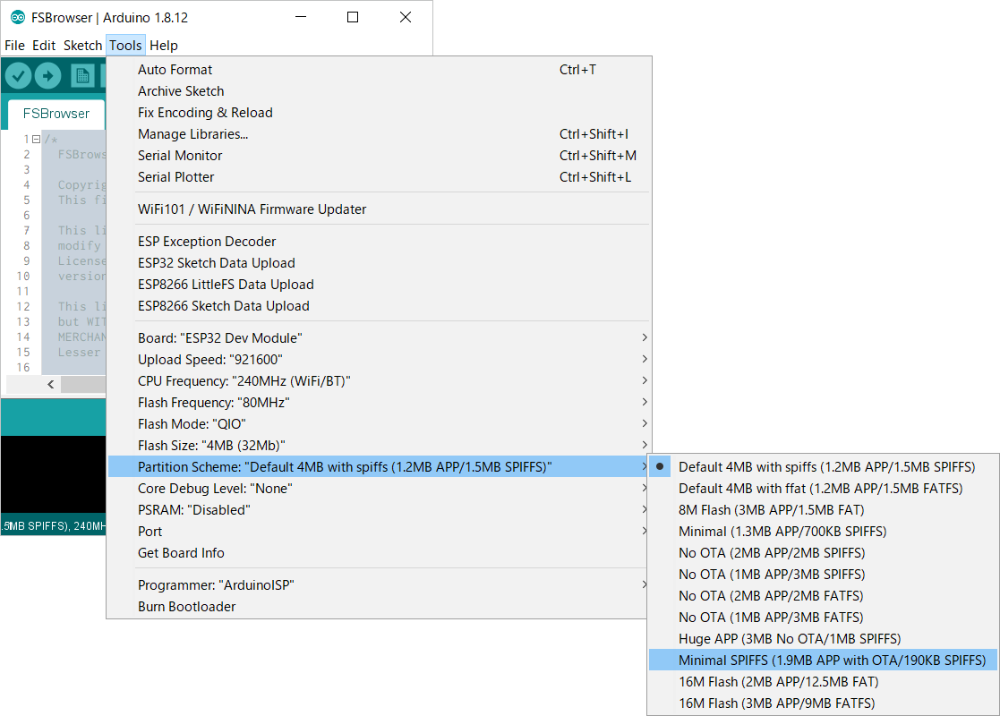

## <i class="fa fa-question-circle"></i> After connected, AutoConnect menu performs but no happens.

If you can access the **AutoConnect root path** as http://ESP8266IPADDRESS/_ac from browser, probably the Sketch uses *ESP8266WebServer::handleClient()* without [*AutoConnect::handleRequest()*](api.md#handlerequest).  
For AutoConnect menus to work properly, call [*AutoConnect::handleRequest()*](api.md#handlerequest) after *ESP8266WebServer::handleClient()* invoked, or use [*AutoConnect::handleClient()*](api.md#handleclient). [*AutoConnect::handleClient()*](api.md#handleclient) is equivalent *ESP8266WebServer::handleClient* combined [*AutoConnect::handleRequest()*](api.md#handlerequest).

See also the explanation [here](basicusage.md#esp8266webserver-hosted-or-parasitic).

## <i class="fa fa-question-circle"></i> After updating to AutoConnect v1.0.0, established APs disappear from Open SSIDs with ESP32.

Since AutoConnect v1.0.0 for ESP32, the storage location in the flash of established credentials has moved from EEPROM to Preferences. After You update AutoConnect to v1.0.0, past credentials saved by v0.9.12 earlier will *not be accessible* from the AutoConnect menu - **Open SSIDs**. You need to transfer once the stored credentials from the EEPROM area to the Preferences area.

You can migrate the past saved credentials using [**CreditMigrate.ino**](https://github.com/Hieromon/AutoConnect/tree/master/examples/CreditMigrate) which the examples folder contains.

!!! info "Needs to Arduino core for ESP32 1.0.2 or earlier"
    EEPROM area with arduino-esp32 core **1.0.3** has moved from **partition** to the **nvs**. CreditMigrate.ino requires arduino-esp32 core **1.0.2** or earlier to migrate saved credentials.

## <i class="fa fa-question-circle"></i> An esp8266ap as SoftAP was connected but Captive portal does not start.

Captive portal detection could not be trapped. It is necessary to disconnect and reset ESP8266 to clear memorized connection data in ESP8266. Also, It may be displayed on the smartphone if the connection information of esp8266ap is wrong. In that case, delete the connection information of esp8266ap memorized by the smartphone once.

## <i class="fa fa-question-circle"></i> Cannot automatically reconnect to a WiFi Hotspot

WiFi Hotspot ability using a cell phone has no official designation name, but it is commonly referred to as a mobile hotspot or a Personal Hotspot. Generally, this feature using data communication with your cellular to ensure the connection to the Internet. AutoConnect allows you to connect to a WiFi hotspot that has been temporarily launched as an access point and then stores a credential for establishing a connection in the same way as a regular fixed access point.

However, there's a case where it may not be able to reconnect automatically to a known WiFi hotspot. For security reasons, some device operating systems randomly change the MAC address of the WiFi hotspot at each boot for a hotspot. (Especially iOS14) AutoConnect uses the BSSID to find the known SSID from among WiFi signals being broadcast. (it's the MAC address) This method works if the BSSID that the hotspot originates is fixed, but AutoConnect will not be able to find known SSIDs when it changes.  
Consider activating the [AUTOCONNECT_APKEY_SSID](adconnection.md#match-with-known-access-points-by-ssid) definition if you want to reconnect automatically to a known WiFi hotspot.

!!! info "Cannot immobilize the MAC address of Personal Hotspot"
    We may not be able to immobilize the MAC address of Personal Hotspot on iOS14. This specification change seems to be related to the private network connection enhancement of iOS14 devices. I found this change during the testing phase, but it is not the confirmed information. (iOS14 offers an option to immobilize the MAC address as a client device, but there is still no option to immobilize it where the device became a hotspot)

## <i class="fa fa-question-circle"></i> Captive portal does not pop up.

If the ESP module is already transparent to the Internet, the device's captive portal screen does not pop up even if [**AutoConnectConfig::retainPortal**](apiconfig.md#retainportal) is enabled. The captive portal popup may also be misinterpreted as automatically activated when AutoConnect is disconnected from the Internet.

When your device connects to an access point, it determines if it is also transparent to the Internet according to the HTTP response from a specific URL. AutoConnect traps the HTTP request issued by the device and responds with a portal screen for AutoConnect. Then the device automatically pops up the HTML in response. It means the auto-popup when opening a captive portal is a feature your device OS has. In this mechanism, AutoConnect impersonates an internally launched DNS server response to trap HTTP requests for Internet transparency determination.

However, its DNS response disguise is very rough, redirecting all FQDNs that do not end in .local to the SoftAP IP address of the ESP module. The redirect location is `/_ac`, and the responder for `/_ac` is AutoConnect. This kind of hack is also available as an [example](https://github.com/esp8266/Arduino/blob/master/libraries/DNSServer/examples/CaptivePortal/CaptivePortal.ino) in the Arduino ESP8266/ESP32 DNS server library.

The reason AutoConnect shuts down the DNS server after establishing a connection with a WiFi access point and stops hacking HTTP requests for Internet transparency detection is because AutoConnect can only trap a broad range of DNS requests. After the ESP module connects to the access point, the sketch can access the Internet using the FQDN. To prevent it from interfering with that access, AutoConnect will stop the internally launched DNS. In other words, the only scene that allows automatic pop-ups to lead to the captive portal is when the ESP module is not transparent to the Internet.

Instead, AutoConnect has options to restart the internal DNS server when the ESP module loses WiFi connectivity, allowing the device to auto-pop up a captive portal screen. If the sketch enables [AutoConnectConfig::retainPotral](apiconfig.md#retainportal) and [AutoConnectConfig::autoRise](apiconfig.md#autorise), then when the WiFi connection is lost (i.e. `WiFi.status() != WL_CONNECTED`), AutoConnect will initiate a trap by starting the **SoftAP** and the internal DNS server. At this time, the ESP module will transition to **WIFI_AP_STA** mode. The [AutoConnect::handleClient](api.md#handleclient) function performs this restart sequence each time it is called, so the sketch can resume the captive portal automatic pop-up while the `loop` function is running.

## <i class="fa fa-question-circle"></i> Compile error due to File system header file not found

In [PlatformIO](https://docs.platformio.org/en/latest/), it may occur compilation error such as the bellows:

```ini
In file included from C:\Users\<user>\Documents\Arduino\libraries\AutoConnect\src\AutoConnect.h:30:0,
                 from src/main.cpp:28:
C:\Users\<user>\Documents\Arduino\libraries\PageBuilder\src\PageBuilder.h:88:27:
fatal error: SPIFFS.h: No such file or directory
```

```ini
In file included from C:\Users\<user>\Documents\Arduino\libraries\AutoConnect\src\AutoConnect.h:30,
                 from src\main.cpp:28:
C:\Users\<user>\Documents\Arduino\libraries\PageBuilder\src\PageBuilder.h:93:17:
fatal error: LittleFS.h: No such file or directory
```

This compilation error is due to PlatformIO's [Library Dependency Finder](https://docs.platformio.org/en/latest/librarymanager/ldf.html?highlight=ldf#library-dependency-finder-ldf
) not being able to detect `#include` with default [mode](https://docs.platformio.org/en/latest/librarymanager/ldf.html#dependency-finder-mode) `chain`. Chain mode does not recursively evaluate `.cpp` files. However, AutoConnect determines the default file system at compile time, depending on the platform. In order for LDF to detect it correctly, it is necessary to recursively scan `#include` of the header file, which depends on the file system used.

To avoid compilation errors in PlatformIO, specify [`lib_ldf_mode`](https://docs.platformio.org/en/latest/projectconf/section_env_library.html#lib-ldf-mode) in [`platformio.ini`](https://docs.platformio.org/en/latest/projectconf/index.html#platformio-ini-project-configuration-file) as follows:

```ini
[env]
lib_ldf_mode = deep
```

You should specify **`deep`** with [`lib_ldf_mode`](https://docs.platformio.org/en/latest/projectconf/section_env_library.html#lib-ldf-mode).

## <i class="fa fa-question-circle"></i> Compile error occurs due to the text section exceeds

When building the sketch, you may receive a compilation error message similar that *the text section exceeds the available space on the board*. This error occurs with ESP32 arduino core 2.0.0 or later. Since ESP32 arduino core 2.0.0, the object size of the library tends to be oversized, and the AutoConnect object size is also bloated.
And also for some example sketches such as mqttRSSI, the BIN size after linkage does not fit in the default partition scheme.

I'm aware of this issue[^1] and trying to reduce the size of the AutoConnect object, but for now, changing the partition table at build is the most effective workaround. See [How much memory does AutoConnect consume?](#how-much-memory-does-autoconnect-consume) for information on how to change the partition table.

[^1]: In this case, the underlying factor is mainly the bloat of ESP-IDF. This issue is also being discussed by many contributors of the Arduino core development community and efforts are underway to make a solution. Refs: [espressif/arduino-esp32/issue#5630](https://github.com/espressif/arduino-esp32/issues/5630)

## <i class="fa fa-question-circle"></i> Compile error that 'EEPROM' was not declared in this scope

If the user sketch includes the header file as `EEPROM.h`, this compilation error may occur depending on the order of the `#include` directives. `AutoConnectCredentials.h` including in succession linked from `AutoConnect.h` defines **NO_GLOBAL_EEPROM** internally, so if your sketch includes `EEPROM.h` after `AutoConnect.h`, the **EEPROM** global variable will be lost.

If you use EEPROM with your sketch, declare `#include <EEPROM.h>` in front of `#include <AutoConnect.h>`.

## <i class="fa fa-question-circle"></i> Compile error that 'ESPhttpUpdate' was not declared in this scope

If the user sketch includes the header file as `ESP8266httpUpdate.h`, this compilation error may occur depending on the order of the `#include` directives. `AutoConnectUpdate.h` including in succession linked from `AutoConnect.h` defines **NO_GLOBAL_HTTPUPDATE** internally, so if your sketch includes `ESP8266httpUpdate.h` after `AutoConnect.h`, the **ESPhttpUpdate** global variable will be lost.

You can avoid a compile error in one of two ways:

1. Disable an AutoConnectUpdate feature if you don't need.

    You can disable the AutoConnectUpdate feature by commenting out the [**AUTOCONNECT_USE_UPDATE**](https://github.com/Hieromon/AutoConnect/blob/master/src/AutoConnectDefs.h#L34) macro in the [`AutoConnectDefs.h`](api.md#defined-macros) header file.
    ```cpp
    #define AUTOCONNECT_USE_UPDATE
    ```

2. Change the order of `#include` directives.

    With the Sketch, `#include <ESP8266httpUpdate.h>` before `#include <AutoConnect.h>`.

## <i class="fa fa-question-circle"></i> Connection lost immediately after establishment with AP

A captive portal is disconnected immediately after the connection establishes with the new AP. This is a known problem of ESP32, and it may occur when the following conditions are satisfied at the same time.

- SoftAP channel on ESP32 and the connecting AP channel you specified are different. (The default channel of SoftAP is 1.)
- NVS had erased by erase_flash causes the connection data lost. The NVS partition has been moved. Never connected to the AP in the past.
- There are receivable multiple WiFi signals which are the same SSID with different channels using the WiFi repeater etc. (This condition is loose, it may occur even if there is no WiFi repeater.)
- Or the using channel of the AP which established a connection is congested with the radio signal on the same band. (If the channel crowd, connections to known APs may also fail.)

!!! info "Other possibilities"
    The above conditions are not absolute. It results from my investigation, and other conditions may exist.

To avoid this problem, try [changing the channel](#1-change-wifi-channel).

ESP32 hardware equips only one RF circuitry for WiFi signal. At the AP_STA mode, ESP32 as an AP attempts connect to another AP on another channel while keeping the connection with the station then the channel switching will occur causes the station may be disconnected. But it may not be just a matter of channel switching causes ESP8266 has the same constraints too. It may be a problem with AutoConnect or the arduino core or SDK issue. This problem will persist until a specific solution.

## <i class="fa fa-question-circle"></i> Data saved to EEPROM is different from my sketch wrote.

By default, AutoConnect saves the credentials of the established connection into EEPROM. The credential area of EEPROM used by AutoConnect will conflict with data owned by the user sketch if without measures taken. It will destroy the user sketch data and the data stored in EEPROM by AutoConnect with each other.  
You have the following two options to avoid this conflict:

- Move the credential saving area of EEPROM.  
  You can protect your data from corruption by notifying AutoConnect where to save credentials. Notification of the save location for the credentials uses [AutoConnectConfig::boundaryOffset](apiconfig.md#boundaryoffset) option. Refer to the chapter on [Advanced usage](advancedusage.md#move-the-saving-area-of-eeprom-for-the-credentials) for details.

- Suppresses the automatic save operation of credentials by AutoConnect.  
  You can completely stop saving the credentials by AutoConnect. However, if you select this option, you lose the past credentials which were able to connect to the AP. Therefore, the effect of the [automatic reconnection feature](advancedusage.md#automatic-reconnect) will be lost.  
  If you want to stop the automatic saving of the credentials, uses [AutoConnectConfig::autoSave](apiconfig.md#autosave) option specifying **AC_SAVECREDENTIAL_NEVER**. Refer to the chapter on [Advanced usage](advancedusage.md#autosave-credential) for details.

## <i class="fa fa-question-circle"></i> Does not appear esp8266ap in smartphone.

Maybe it is successfully connected at the [**1st-WiFi.begin**](lsbegin.md#autoconnectbegin-logic-sequence). ESP8266 remembers the last SSID successfully connected and will use at the next. It means SoftAP will only start up when the first *WiFi.begin()* fails.

The saved SSID would be cleared by  *WiFi.disconnect()* with WIFI_STA mode. If you do not want automatic reconnection, you can erase the memorized SSID with the following simple sketch.

```cpp
#include <ESP8266WiFi.h>

void setup() {
  delay(1000);
  Serial.begin(115200);
  WiFi.mode(WIFI_STA);
  delay(100);
  WiFi.begin();
  if (WiFi.waitForConnectResult() == WL_CONNECTED) {
    WiFi.disconnect();
    while (WiFi.status() == WL_CONNECTED)
      delay(100);
  }
  Serial.println("WiFi disconnected.");
}

void loop() {
  delay(1000);
}
```

??? hint "You can interactively check the WiFi state of ESP8266."
    Please try [**ESPShaker**](https://github.com/Hieromon/ESPShaker). It is ESP8266 interactive serial command processor.

    

## <i class="fa fa-question-circle"></i> Does not response from /\_ac.

Probably **WiFi.begin** failed with the specified SSID. Activating the [debug printing](advancedusage.md#debug-print) will help you to track down the cause.


## <i class="fa fa-question-circle"></i> Hang up after Reset?

If ESP8266 hang up after reset by AutoConnect menu, perhaps manual reset is not yet. Especially if it is not manual reset yet after uploading the Sketch, the boot mode will stay 'Uart Download'. There is some discussion about this on the Github's ESP8266 core: https://github.com/esp8266/Arduino/issues/1017 [^2]

[^2]: This issue has been resolved in ESP8266 core 2.5.0 and later.    

If you received the following message, the boot mode is still sketch uploaded. It needs to the manual reset once.

```powershell
ets Jan  8 2013,rst cause:2, boot mode:(1,6) or (1,7)
ets Jan  8 2013,rst cause:4, boot mode:(1,6) or (1,7)
wdt reset
```

The correct boot mode for starting the Sketch is **(3, x)**.

!!! info "ESP8266 Boot Messages"
    It is described by [ESP8266 Non-OS SDK API Reference](https://www.espressif.com/en/products/hardware/esp8266ex/resources), section A.5.

    | Messages | Description |
    |----------|-------------|
    | rst cause | 1: power on<br>2: external reset<br>4: hardware watchdog reset |
    | boot mode<br>(the first parameter) | 1: ESP8266 is in UART-down mode (and downloads firmware into flash).<br>3: ESP8266 is in Flash-boot mode (and boots up from flash). |

## <i class="fa fa-question-circle"></i> How can I detect the captive portal starting?

You can use the [AutoConnect::onDetect](api.md#ondetect) exit routine. For more details and an implementation example of the onDetect exit routine, refer to the chapter "[Captive portal start detection](advancedusage.md#captive-portal-start-detection)".

## <i class="fa fa-question-circle"></i> How change HTTP port?

HTTP port number is defined as a macro in [AutoConnectDefs.h](https://github.com/Hieromon/AutoConnect/blob/master/src/AutoConnectDefs.h#L123) header file. You can change it directly with several editors and must re-compile.

```cpp
#define AUTOCONNECT_HTTPPORT    80
```

## <i class="fa fa-question-circle"></i> How change SSID or Password in Captive portal?

You can change both by using [AutoConnectConfig::apid](apiconfig.md#apid) and [AutoConnectConfig::psk](apiconfig.md#psk). Refer to section [Change SSID and Password for SoftAP](advancedusage.md#change-ssid-and-password-for-softap) in [Advanced usage](advancedusage.md).

## <i class="fa fa-question-circle"></i> How do I detach the ArdunoJson?

If you don't use ArduinoJson at all, you can detach it from the library. By detaching ArduinoJson, the binary size after compilation can be reduced. You can implement custom Web pages with your sketches without using ArduinoJson. Its method is described in [Custom Web pages w/o JSON](wojson.md).  
To completely remove ArduinoJson at compile-time from the binary, you need to define a special `#define` directive for it. And if you define the directive, you will not be able to use the [OTA update with the update server](otaserver.md#updates-with-the-update-server) feature as well as AutoConnectAux described by JSON.

To exclude ArduinoJson at compile-time, give the following `#define` directive as a compiler option such as the [arduino-cli](https://github.com/arduino/arduino-cli) or [PlatformIO](https://platformio.org/).

```cpp
#define AUTOCONNECT_NOUSE_JSON
```

For example, add the following description to the `[env]` section of the `platformio.ini` file with the `build-flags`.

```ini
build-flags = -DAUTOCONNECT_NOUSE_JSON
```

## <i class="fa fa-question-circle"></i> How erase the credentials saved in EEPROM?

Make some sketches for erasing the EEPROM area, or some erasing utility is needed. You can prepare the Sketch to erase the saved credential with *AutoConnectCredential*. The *AutoConnectCrendential* class provides the access method to the saved credential in EEPROM and library source file is including it. Refer to '[Saved credential access](credit.md#saved-credential-in-eeprom)' on section [*Appendix*](credit.md) for details.

!!! hint
    With the [**ESPShaker**](https://github.com/Hieromon/ESPShaker), you can access EEPROM interactively from the serial monitor, and of course you can erase saved credentials.

## <i class="fa fa-question-circle"></i> How locate the link button to the  AutoConnect menu?

Link button to AutoConnect menu can be embedded into Sketch's web page. The root path of the menu is **/_ac** by default and embed the following ```<a></a>``` tag in the generating HTML.

```html
<a style="background-color:SteelBlue; display:inline-block; padding:7px 13px; text-decoration:none;" href="/_ac">MENU</a>
```

## <i class="fa fa-question-circle"></i> How much memory does AutoConnect consume?

### Sketch size

1. For ESP8266  
   It increases about 53K bytes compared to the case without AutoConnect. A sketch size of the most simple example introduced in the Getting started is about 330K bytes. (270K byte without AutoConnect)

2. For ESP32  
   The BIN size of the sketch grows to over 1M bytes. In the case of a sketch with many custom Web pages, when applying the partition table for the default scheme, the remaining flash size that can be utilized by the user application may be less than 200K bytes. Therefore, it is advisable to resize the partition to make more available space for the application. The ESP32 arduino core has various [partition schemes](https://github.com/espressif/arduino-esp32/tree/master/tools/partitions), and you can choose it according to your Sketch feature.  
   You can change the partition scheme from the **Tools > Partition Scheme** menu of Arduino IDE.

   

!!! hint "Change the partition scheme with PlatformIO"
    Use `board_build.partitions` directive with `platformio.ini`.
    ```ini
    [env:esp32dev]
    board_build.partitions = min_spiffs.csv
    ```
    Details for the [PlatformIO documentation](https://docs.platformio.org/en/latest/platforms/espressif32.html#partition-tables).

### Heap size

It consumes about 2K bytes in the static and about 12K bytes are consumed at the moment when menu executed.

## <i class="fa fa-question-circle"></i> How placing a style-qualified AutoConnectText horizontally?

When the [style](acelements.md#style) parameter is specified for [AutoConnectText](acelements.md#autoconnecttext), it is always enclosed by the `<div>` tag, so the element placement direction is vertical and subsequent elements cannot be horizontal. If you want to place an element after AutoConnectText with the style, you can place the AutoConnectText horizontally by specifying the [`display`](https://developer.mozilla.org/en-US/docs/Web/CSS/display) CSS property with `inline` or `inline-block` in the style value. 

```json
{
    "name": "text1",
    "type": "ACText",
    "value": "Hello,",
    "style": "display:inline;color:#f5ad42;font-weight:bold;margin-right:3px"
},
{
    "name": "text2",
    "type": "ACText",
    "value": "world",
    "posterior": "br"
}
```

See also [AutoConnectText](acelements.md#post_8) chapter, [CSS Flow Layout](https://developer.mozilla.org/en-US/docs/Web/CSS/CSS_Flow_Layout) by [MDN](https://developer.mozilla.org/en-US/).

## <i class="fa fa-question-circle"></i> How placing HTML elements undefined in AutoConnectElements?

[AutoConnectElement](acelements.md#autoconnectelement-a-basic-class-of-elements) can be applied in many cases when trying to place HTML elements that are undefined in AutoConnectElemets on custom Web pages. See [*Handling the custom Web Pages*](achandling.md#place-html-elements-undefined-in-autoconnectelements) section.

## <i class="fa fa-question-circle"></i> I cannot complete to WiFi login from smartphone.

Because AutoConnect does not send a login success response to the captive portal requests from the smartphone. The login success response varies iOS, Android and Windows. By analyzing the request URL of different login success inquiries for each OS, the correct behavior can be implemented, but not yet. Please resets ESP8266 from the AutoConnect menu.

## <i class="fa fa-question-circle"></i> I cannot see the custom Web page.

If the Sketch is correct, a JSON syntax error may have occurred. In this case, activate the [AC_DEBUG](faq.md#3-turn-on-the-debug-log-options) and rerun. If you take the message of JSON syntax error, the [Json Assistant](https://arduinojson.org/v5/assistant/) helps syntax checking. This online tool is provided by the author of ArduinoJson and is most consistent for the AutoConnect. 

## <i class="fa fa-question-circle"></i> nvs_open failed: NOT_FOUND occurs.

In ESP32, NVS open failure may occur during execution of AutoConnect::begin with the following message on the Serial monitor.

```ini
[E][Preferences.cpp:38] begin(): nvs_open failed: NOT_FOUND
```

This is not a malfunction and expected behavior. AutoConnect will continue to execute normally.

AutoConnect saves the credentials of the access point to which it was able to connect to the NVS of the ESP32 module as [Preferences](https://espressif-docs.readthedocs-hosted.com/projects/arduino-esp32/en/latest/api/preferences.html#preferences) instances. The above error occurs when the area keyed for AutoConnect credentials does not exist in NVS. Usually, this error occurs immediately after erasing the ESP32 module flash or when running the AutoConnect sketch for the first time. If the AutoConnect credentials area does not exist in NVS, AutoConnect will automatically allocate it. Therefore, this error can be ignored and will not affect the execution of the sketch.

## <i class="fa fa-question-circle"></i> Saved credentials are wrong or lost.

A structure of AutoConnect saved credentials has changed two times throughout enhancement with v1.0.3 and v1.1.0. In particular, due to enhancements in v1.1.0, AutoConnectCredential data structure has lost the backward compatibility with previous versions. You must erase the flash of the ESP module using the esptool completely to save the credentials correctly with v1.1.0.
```powershell
esptool -c esp8266 (or esp32) -p [COM_PORT] erase_flash
```

## <i class="fa fa-question-circle"></i> Some AutoConnect page is cut off.

It may be two possibilities as follows:

1. Packet loss during transmission due to a too weak WiFi signal.
2. Heap is insufficient memory. AutoConnect entrusts HTML generation to PageBuilder that makes heavy use the String::concatenate function and causes memory fragmentation. This is a structural problem with PageBuilder, but it is difficult to solve immediately.

If this issue produces with your sketch, Reloading the page may recover.  
Also, you can check the memory running out status by rebuilding the Sketch with [PageBuilder's debug log option](faq.md#fn:2) turned on.

If the heap memory is insufficient, the following message is displayed on the serial console.

```powershell
[PB] Failed building, free heap:<Size of free heap>
```

## <i class="fa fa-question-circle"></i> Submit element in a custom Web page does not react.

Is there the AutoConnectElements element named **SUBMIT** in the custom Web page? (case sensitive ignored) AutoConnect does not rely on the `input type=submit` element for the form submission and uses [HTML form element submit](https://developer.mozilla.org/en-US/docs/Web/API/HTMLFormElement/submit) function instead. So, the submit function will fail if there is an element named 'submit' in the form. You can not use **SUBMIT** as the element name of AutoConnectElements in a custom Web page that declares the AutoConnectSubmit element.

## <i class="fa fa-question-circle"></i> Unable to change any macro definitions by the Sketch.

The various macro definitions that determine the configuration of AutoConnect cannot be redefined by hard-coding with Sketch. The compilation unit has a different AutoConnect library itself than the Sketch, and the configuration definitions in AutoConnectDefs.h are quoted in the compilation for AutoConnect only. For example, the following Sketch does not enable AC_DEBUG and does not change HTTP port also the menu background color:

```cpp hl_lines="1 2 3"
#define AC_DEBUG                                    // No effect
#define AUTOCONNECT_HTTPPORT    8080                // No effect
#define AUTOCONNECT_MENUCOLOR_BACKGROUND  "#696969" // No effect
#include <ESP8266WiFi.h>
#include <ESP8266WebServer.h>
#include <AutoConnect.h>

AutoConnect Portal;

void setup() {
  Portal.begin();
}

void loop() {
  Portal.handleClient();
}
```

To enable them, edit `AutoConnectDefs.h` as the library source code directly, or supply them as the external parameters using a build system like [PlatformIO](https://platformio.org/platformio-ide) with [`platformio.ini`](https://docs.platformio.org/en/latest/projectconf/section_env_build.html?highlight=build_flags#build-flags):

```ini hl_lines="7 8 9 10"
platform = espressif8266
board = nodemcuv2
board_build.f_cpu = 160000000L
board_build.f_flash = 80000000L
board_build.flash_mode = dio
board_build.filesystem = littlefs
build_flags =
  -DAC_DEBUG
  -DAUTOCONNECT_HTTPPORT=8080
  -DAUTOCONNECT_MENUCOLOR_BACKGROUND='"#696969"'
```

## <i class="fa fa-question-circle"></i> Unauthorize error without prompting the login dialog.

The custom web pages that require authentication will occur unauthorized error always without prompting the login dialog under the captive portal state on some OS. This is a captive portal restriction and expected behavior. The captive portal web browser is almost a complete web browser, but while the captive portal session restricts the response to `WWW-authenticate` requests. (In intrinsically, the captive portal is a mechanism for authentication in itself)

Once you exit from the captive portal session and connect SoftAP IP directly afresh, you can access custom web pages along with prompting a login dialog.

## <i class="fa fa-question-circle"></i> Still, not stable with my sketch.

If AutoConnect behavior is not stable with your sketch, you can try the following measures.

### 1. Change WiFi channel

Both ESP8266 and ESP32 can only work on one channel at any given moment. This will cause your station to lose connectivity on the channel hosting the captive portal. If the channel of the AP which you want to connect is different from the SoftAP channel, the operation of the captive portal will not respond with the screen of the AutoConnect connection attempt remains displayed. In such a case, please try to configure the [channel](apiconfig.md#channel) with [AutoConnectConfig](apiconfig.md#autoconnectconfig) to match the access point.

```cpp
AutoConnect portal;
AutoConnectConfig config;

config.channel = 3;     // Specifies a channel number that matches the AP
portal.config(config);  // Apply channel configuration
portal.begin();         // Start the portal
```

!!! info "Channel selection guide"
    Espressif Systems has released a [channel selection guide](https://www.espressif.com/sites/default/files/esp8266_wi-fi_channel_selection_guidelines.pdf).

### 2. Change the arduino core version

I recommend change installed an arduino core version to the upstream when your sketch is not stable with AutoConnect on each board.

#### with ESP8266 arduino core

You can select the [lwIP](http://lwip.wikia.com/wiki/LwIP_Wiki) variant to contribute for the stable behavior. The **lwIP v2 Lower memory** option of Arduino IDE for core version 2.4.2 is based on the lwIP-v2. On the other hand, the core version 2.5.0 upstream is based on the lwIP-2.1.2 stable release.

You can select the option from Arduino IDE as **Tool** menu, if you are using ESP8266 core 2.5.0. It can be select `lwIP v2 Lower Memory` option. (not `lwIP v2 Lower Memory (no features)`) It is expected to improve response performance and stability.

#### with ESP32 arduino core

The [arduino-esp32](https://github.com/espressif/arduino-esp32) is still under development. It is necessary to judge whether the problem cause of the core or AutoConnect. Trace the log with the esp32 core and the AutoConnect debug option enabled for problem diagnosis and please you check the [issue of arduino-esp32](https://github.com/espressif/arduino-esp32/issues). The problem that your sketch possesses may already have been solved.

### 3. Turn on the debug log options

To fully enable for the AutoConnect debug logging options, change the following two files.

<i class="fas fa-angle-right"></i> AutoConnectDefs.h

```cpp
#define AC_DEBUG
```

<i class="fas fa-angle-right"></i> PageBuilder.h [^3]

```cpp
#define PB_DEBUG
```

!!! info "How to enable the AC_DEBUG, PB_DEBUG"
    See [*Debug Print*](adothers.md#debug-print) section, and [*one similarly*](faq.md#unable-to-change-any-macro-definitions-by-the-sketch) too.

[^3]: `PageBuilder.h` exists in the `libraries/PageBuilder/src` directory under your sketch folder.

### 4. Reports the issue to AutoConnect Github repository

If you can not solve AutoConnect problems please report to [Issues](https://github.com/Hieromon/AutoConnect/issues). And please make your question comprehensively, not a statement. Include all relevant information to start the problem diagnostics as follows:[^4]

* [ ] Hardware module
* [ ] Arduino core version Including the upstream commit ID if necessary
* [ ] Operating System which you use
* [ ] Your smartphone OS and version (Especially for Android)
* [ ] Your AP information (IP, channel) if related
* [ ] lwIP variant
* [ ] Problem description
* [ ] If you have a STACK DUMP decoded result with formatted by the code block tag
* [ ] the Sketch code with formatted by the code block tag (Reduce to the reproducible minimum code for the problem)
* [ ] Debug messages output (Including arduino core)

I will make efforts to solve as quickly as possible. But I would like you to know that it is not always possible.

Thank you.

[^4]:Without this information, the reproducibility of the problem is reduced, making diagnosis and analysis difficult.
