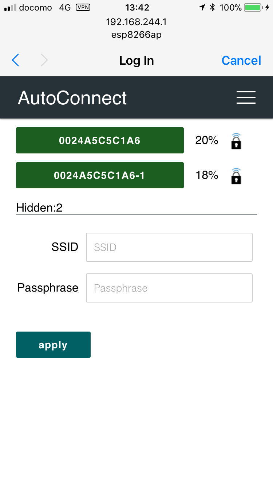
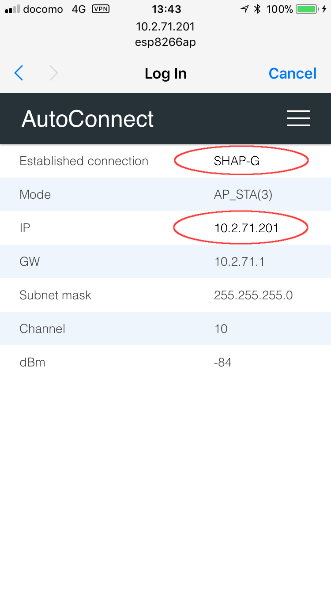
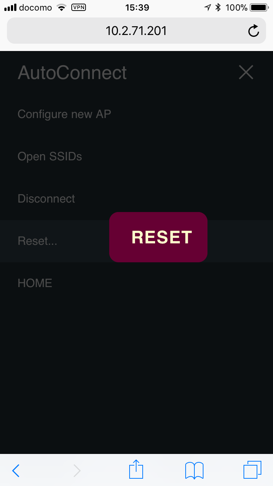
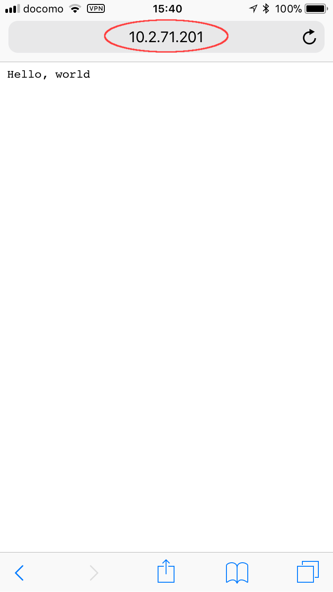

## Let's do the most simple sketch

Open the Arduino IDE, write the following sketch and upload it. The feature of this sketch is that the SSID and Password are not coded.

```cpp
#include <ESP8266WiFi.h>          // Replace with WiFi.h for ESP32
#include <ESP8266WebServer.h>     // Replace with WebServer.h for ESP32
#include <AutoConnect.h>

ESP8266WebServer Server;          // Replace with WebServer for ESP32
AutoConnect      Portal(Server);

void rootPage() {
  char content[] = "Hello, world";
  Server.send(200, "text/plain", content);
}

void setup() {
  delay(1000);
  Serial.begin(115200);
  Serial.println();

  Server.on("/", rootPage);
  if (Portal.begin()) {
    Serial.println("WiFi connected: " + WiFi.localIP().toString());
  }
}

void loop() {
	Portal.handleClient();
}
```

!!! note ""
    The above code can be applied to ESP8266. To apply to ESP32, replace ```ESP8266WebServer``` class with ```WebServer``` and include ```WiFi.h``` and ```WebServer.h``` of arduino-esp32 appropriately.

### <i class="fa fa-play-circle"></i> Run at first

After about 30 seconds, if the ESP8266 cannot connect to nearby Wi-Fi spot, you pull out your smartphone and open *Wi-Fi settings* from the *Settings* Apps. You can see the **esp8266ap** [^1] in the list of *"CHOOSE A NETWORK..."*. Then tap the esp8266ap and enter password **12345678**, a something screen pops up automatically as shown below.

[^1]:When applied to ESP32, SSID will appear as **esp32ap**.

<span style="display:inline-block;width:282px;height:501px;border:1px solid lightgrey;"></span></span>

This is the AutoConnect statistics screen. This screen displays the current status of the established connection, WiFi mode, IP address, free memory size, and etc. Also, the **hamburger icon** is the control menu of AutoConnect seems at the upper right. By tap the hamburger icon, the control menu appears as the below.

### <i class="fa fa-cog"></i> Join to the new access point

Here, tap *"Configure new AP"* to connect the new access point then the SSID configuration screen would be shown. Enter the **SSID** and **Passphrase** and tap **apply** to start connecting the access point.



### <i class="fa fa-rss"></i> Connection establishment

After connection established, the current status screen will appear. It is already connected to WLAN with WiFi mode as WIFI\_AP\_STA and the IP connection status is displayed there including the SSID. Then at this screen, you have two options for the next step.

For one, continues execution of the sketch while keeping this connection. You can access ESP8266 via browser through the established IP address after cancel to "**Log in**" by upper right on the screen.  
Or, "**RESET**" can be selected. The ESP8266 resets and reboots. After that, immediately before the connection will be restored automatically with WIFI\_STA mode.



### <i class="fa fa-play-circle"></i> Run for usually

The IP address of ESP8266 would be displayed on the serial monitor after connection restored. Please access its address from the browser. The "Hello, world" page will respond. It's the page that was handled by in the sketch with "**on**" function of *ESP8266WebServer*.



<script>
  window.onload = function() {
    Gifffer();
  };
</script>
