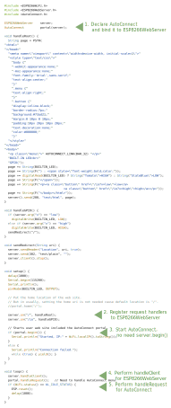
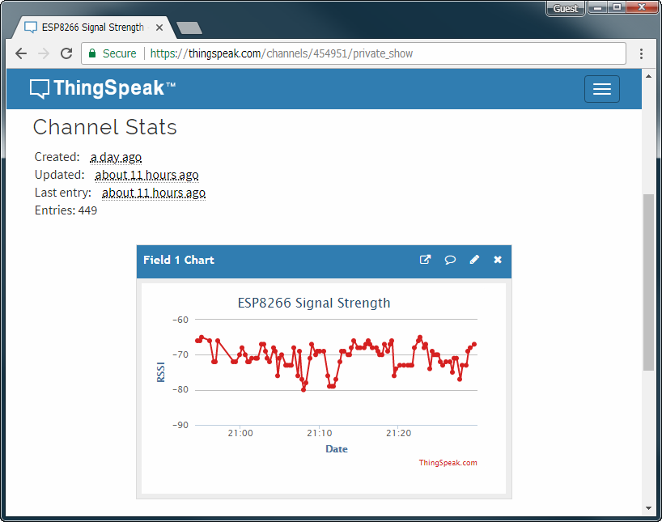
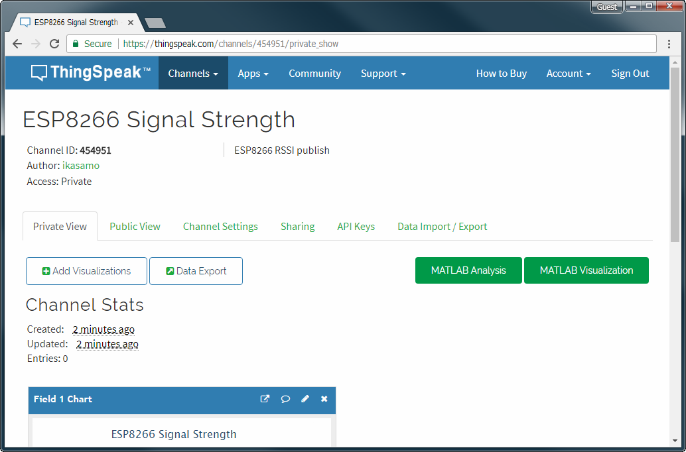
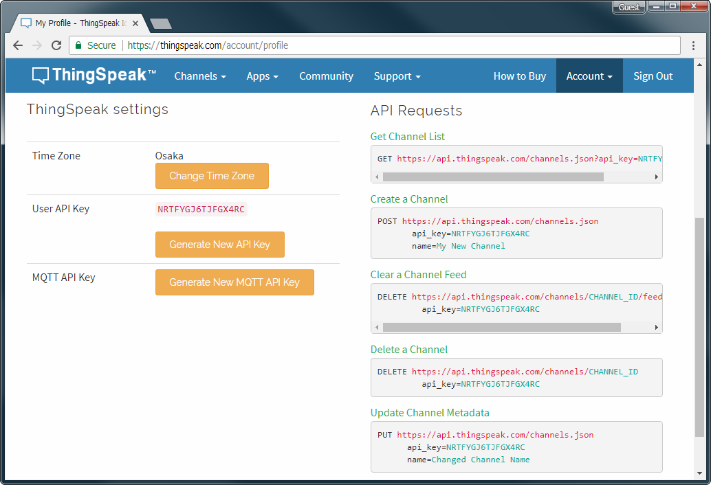
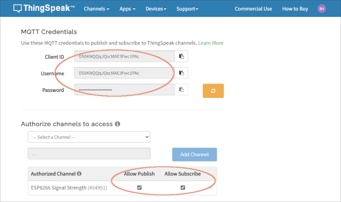
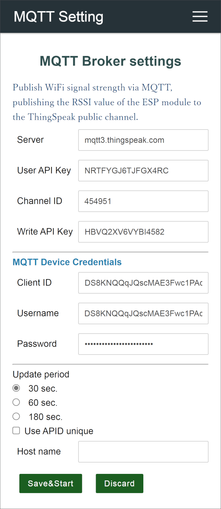
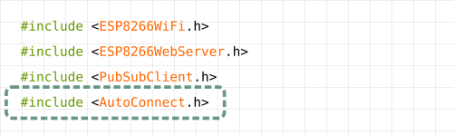
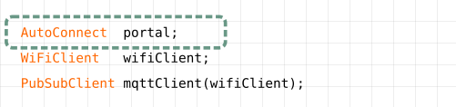
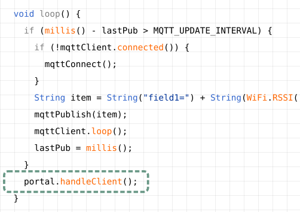

## Embed the AutoConnect to the Sketch

Here hold two case examples. Both examples perform the same function. Only how to incorporate the **AutoConnect** into the Sketch differs. Also included in the sample folder, HandlePortal.ino also shows how to use the [PageBuilder](https://github.com/Hieromon/PageBuilder) library for HTML assemblies.

## What does this example do?

Uses the web interface to light the LED connected to the D0 (sometimes called *BUILTIN_LED*) port of the **[NodeMCU](https://github.com/nodemcu/nodemcu-devkit-v1.0)** module like the following animation.

Access to the ESP8266 module connected WiFi from the browser then the page contains the current value of the D0 port would be displayed. The page has the buttons to switch the port value. The LED will blink according to the value with clicked by the button. This example is a typical sketch of manipulating ESP8266's GPIO via WLAN.


Embed AutoConnect library into this sketch. There are few places to be changed. And you can use AutoConnect's captive portal function to establish a connection freely to other WiFi spots.

## Embed AutoConnect

### <i class="fa fa-code" aria-hidden="true"></i> Pattern A.

Bind to ESP8266WebServer, performs handleClient with handleRequest.



!!! hint "In what situations should the handleRequest be used."
    It is something needs to be done immediately after the handle client. It is better to call only AutoConnect::handleClient whenever possible.

### <i class="fa fa-code" aria-hidden="true"></i> Pattern B.

Declare only AutoConnect, performs handleClient.


## Used with MQTT as a client application

The effect of AutoConnect is not only for ESP8266/ESP32 as the web server. It has advantages for something WiFi client as well. For example, AutoConnect is also convenient for publishing MQTT messages from various measurement points. Even if the SSID is different for each measurement point, it is not necessary to modify the Sketch.

In this example, it is trying to publish a WiFi signal strength being received ESP8266 through the services on the cloud that can visualize the live data streams for IoT. Using the IoT platform provided by [ThingSpeak](https://thingspeak.com/)&trade;, the ESP8266 publishes RSSI values to ThingSpeak MQTT broker channel via the [MQTT client](https://github.com/knolleary/pubsubclient) library.

This example is a good indication of the usefulness of AutoConnect, as RSSI values can typically measure different intensities for each access point. By simply adding a few lines to the Sketch, you do not have to rewrite and upload the Sketch for each access point.



### Advance procedures

- Arduino Client for MQTT - It's the [PubSubClient](https://github.com/knolleary/pubsubclient), install it to Arduino IDE. If you have the latest version already, this step does not need.
- Create a channel on ThingSpeak.
- Register the ESP module as an MQTT device to a ThingSpeak channel, allowing it to be published and subscribed to on that channel.
- Get the Channel API Keys and MQTT device credentials from ThingSpeak, and put its keys to the Sketch.

The ThingSpeak is the open IoT platform. It is capable of sending data privately to the cloud and analyzing, visualizing its data. If you do not have an account of ThingSpeak, you need that account to proceed further. ThingSpeak has the free plan for the account which uses within the scope of this example.[^1] You can sign up with the [ThingSpeak sign-up page](https://thingspeak.com/login).

!!! warning "Whether you should do sign-up or not."
    You are entrusted with the final judgment of account creation for ThingSpeak. Create an account at your own risk.

[^1]:As of March 21, 2018.

#### Create a channel on ThingSpeak

Sign in ThingSpeak. Select **Channels** to show the **My Channels**, then click **New Channel**.

At the **New Channel** screen, enter each field as a below. And click **Save Channel** at the bottom of the screen to save.

- Name: ```ESP8266 Signal Strength```
- Description: ```ESP8266 RSSI publish```
- Field1: ```RSSI```


#### Get Channel ID and API Keys

The channel successfully created, you can see the channel status screen as a below. **Channel ID** is displayed there.[^2]

[^2]:'454951' in the example above, but your channel ID should be different.



Here, switch the channel status tab to **API Keys**. The API key required to publish the message is the **Write API Key**.


The last key you need is the **User API Key** and can be confirmed it in the user profile. Pull down **Account** from the top menu, select **My profile**. Then you can see the ThingSpeak settings and the **User API Key** is displayed middle of this screen.



#### Add a new MQTT Device

Since January 2022, the ThingSpeak channel authentication scheme has changed, and the following procedures are for the new authentication. You will need to obtain the credentials of the MQTT device by registering it with the channel you created in the previous step.

Once you have defined your ThingSpeak channel, you can define devices: select **MQTT** from the **Devices** menu that appears in ThingSpeak's channel information to begin registering devices.


Give the device a name on the next page that appears after you select the MQTT device. In this example, its device should be the ESP module that the ThingSpeak MQTT channel would identify. You then specify the channel and message type you want to allow for the device. (i.e., the ESP module)

Upon successful registration of the MQTT device, **Client ID**, **Username**, and **Password** are issued as credentials for the device. You can retrieve the credentials and save them as JSON. After downloading the credential file, open it with a text editor and check the contents.



### Sketch publishes messages

The [mqttRSSI.ino](https://github.com/Hieromon/AutoConnect/blob/master/examples/mqttRSSI/mqttRSSI.ino) sketch in the [AutoConnect repository](https://github.com/Hieromon/AutoConnect) is the complete code for publishing RSSI to the ThingSpeak channel. The sketch comes with an AutoConnectAux custom Web page to flexibly configure channel information created as a ThingSpeak channel.



!!! hint "Parameters for the ThingSpeak MQTT channels"
    Various settings of the MQTT Setting for the ThingSpeak channels via the above AutoConnectAux are following:

    - **Server**: `mqtt3.thingspeak.com`
    - **User API Key**: Specify the User API Key that can be confirmed with [ThingSpeak My Profile](https://thingspeak.com/account/profile) page.
    - **Channel ID**: Specify the channel ID that can be confirmed with [ThingSpeak My Channels](https://thingspeak.com/channels) page.
    - **Write API Key**: Specify the Write API Key that can be confirmed by following navigate to "[ThingSpeak My Channels](https://thingspeak.com/channels) > Your Channel Name > API Keys Tab > **Write API Key**".
    - **Client ID**: Specify the client ID from the [MQTT Devices](https://thingspeak.com/devices/mqtt) page according to the previous step.
    - **Username**: Specify the user name from the [MQTT Devices](https://thingspeak.com/devices/mqtt) page according to the previous step.
    - **Password**: Specify the password from the [MQTT Devices](https://thingspeak.com/devices/mqtt) page according to the previous step.

### Publish messages

After uploading the mqttRSSI.ino and restarting the ESP module, Messages will begin to be issued via the connected WiFi access point. The message will carry the RSSI value of the current WiFi signal strength; changes in signal strength due to RSSI will be displayed on the ThingSpeak [Channel Stats](https://thingspeak.com/channels/454951) page.

### How embed to your sketches

For the client sketches, the code required to connect to WiFi is the following four parts only.

1. \#include directive[^3]
    
    Include ```AutoConnect.h``` header file behind the include of ```ESP8266WiFi.h```.

    

2. Declare AutoConnect
    
    The declaration of the [**AutoConnect variable**](api.md#autoconnect) is not accompanied by ESP8266WebServer.

    

3. Invokes "begin()"
    
    Call [**AutoConnect::begin**](api.md#begin). If you need to assign a static IP address, executes [AutoConnectConfig](apiconfig.md) before that. 

    

4. Performs "handleClent()" in "loop()"
    
    Invokes [**AutoConnect::handleClient()**](api.md#handleclient) at inside ```loop()``` to enable the AutoConnect menu.

    

[^3]:```#include <ESP8266WebServer.h>``` does not necessary for uses only client.

<script>
  window.onload = function() {
    Gifffer();
  };
</script>
