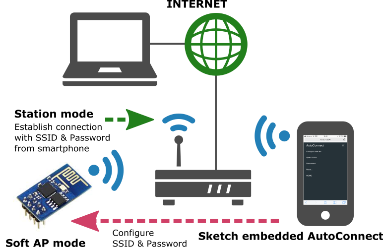
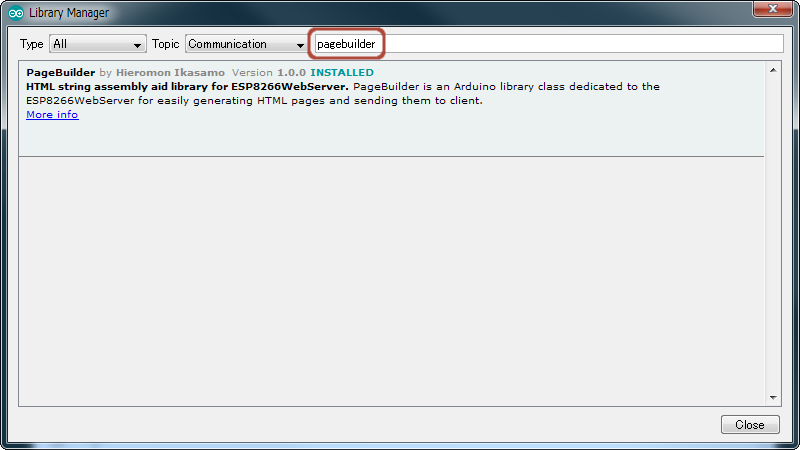
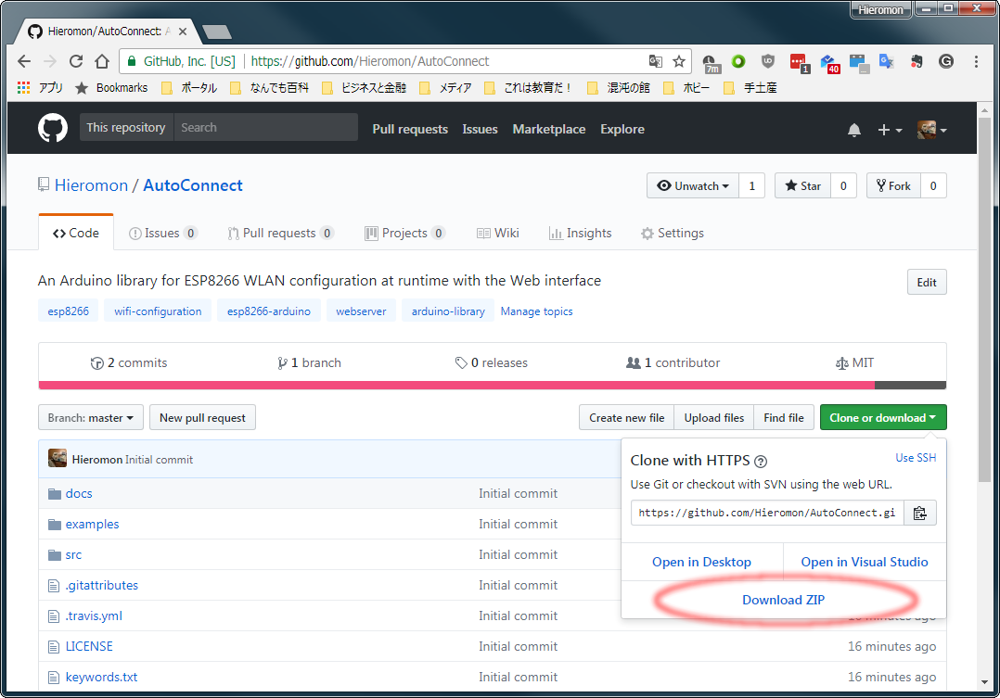
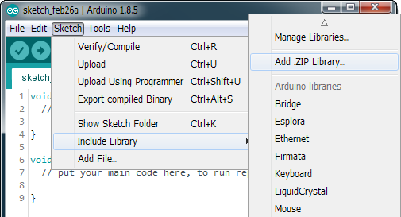

# AutoConnect <small>for ESP8266/ESP32</small>

An Arduino library for ESP8266/ESP32 WLAN configuration at run time with web interface.

## Overview

To the dynamic configuration for joining to WLAN with SSID and PSK accordingly. It an Arduino library united with *ESP8266WebServer* class for ESP8266 or *WebServer* class for ESP32.
Easy implementing the Web interface constituting the WLAN for ESP8266/ESP32 WiFi connection. With this library to make a Sketch easily which connects from ESP8266/ESP32 to the access point at runtime by the web interface without hard-coded SSID and password.

### <i class="fa fa-arrow-circle-right" aria-hidden="true"></i> No need pre-coded SSID &amp; password

It is no needed hard-coding in advance the SSID and Password into the Sketch to connect between ESP8266/ESP32 and WLAN. You can input SSID &amp; Password from a smartphone via the web interface at runtime.

### <i class="fa fa-arrow-circle-right" aria-hidden="true"></i> Simple usage

AutoConnect control screen will be displayed automatically for establishing new connections. It aids by the <a href="https://en.wikipedia.org/wiki/Captive_portal">captive portal</a> when vested the connection cannot be detected. By using the [AutoConnect menu](menu.md), to manage the connections convenient.

### <i class="fa fa-arrow-circle-right" aria-hidden="true"></i> Store the established connection

The connection authentication data as credentials are saved automatically in the flash of ESP8266/ESP32 and You can select the past SSID from the [AutoConnect menu](menu.md).

### <i class="fa fa-arrow-circle-right" aria-hidden="true"></i> Easy to embed in

AutoConnect can be placed easily in your Sketch. It's "**begin**" and "**handleClient**" only.

### <i class="fa fa-arrow-circle-right" aria-hidden="true"></i> Lives with your Sketches

The Sketches which provide the web page using ESP8266WebServer there is, AutoConnect will not disturb it. AutoConnect can use an already instantiated ESP8266WebServer object, or itself can assign it. This effect also applies to ESP32. The corresponding class for ESP32 will be the WebServer.

### <i class="fa fa-arrow-circle-right" aria-hidden="true"></i> Easy to add the [custom Web pages](acintro.md) ENHANCED w/v0.9.7

You can easily add your owned web pages that can consist of representative HTML elements and invoke them from the menu. Further it possible importing the custom Web pages declarations described with JSON which stored in PROGMEM, SPIFFS, or SD.

### <i class="fa fa-arrow-circle-right" aria-hidden="true"></i> Quick and easy to equip the [OTA update feature](otaupdate.md) UPDATED w/v1.1.5

You can quickly and easily equip the OTA update feature to your Sketch and also you can operate the firmware update process via OTA from AutoConnect menu.

## Installation

### Requirements

#### Supported hardware

  * [X] Generic ESP8266 modules (applying the ESP8266 Community's Arduino core)
  * [X] Adafruit HUZZAH ESP8266 (ESP-12)
  * [X] ESP-WROOM-02
  * [X] Heltec WiFi Kit 8
  * [X] NodeMCU 0.9 (ESP-12) / NodeMCU 1.0 (ESP-12E)
  * [X] Olimex MOD-WIFI-ESP8266
  * [X] SparkFun Thing
  * [X] SweetPea ESP-210
  * [X] ESP32Dev Board (applying the Espressif's arduino-esp32 core)
  * [X] SparkFun ESP32 Thing
  * [X] WEMOS LOLIN D32
  * [X] Ai-Thinker NodeMCU-32S
  * [X] Heltec WiFi Kit 32
  * [X] M5Stack
  * [X] And other ESP8266/ESP32 modules supported by the Additional Board Manager URLs of the Arduino-IDE.

!!! info "About flash size on the module"
    The AutoConnect Sketch size is relatively large. Large flash capacity is necessary. 512Kbyte (4Mbits) flash inclusion module such as ESP-01 is not recommended.

#### Required libraries

AutoConnect requires the following environment and libraries.

<i class="fa fa-download"></i> <strong>Arduino IDE</strong>

The current upstream at the 1.8 level or later is needed. Please install from the [official Arduino IDE download page](https://www.arduino.cc/en/Main/Software). This step is not required if you already have a modern version.

<i class="fa fa-download"></i> <strong>ESP8266 Arduino core</strong>

AutoConnect targets Sketches made on the assumption of [ESP8266 Community's Arduino core](https://github.com/esp8266/Arduino). Stable 2.4.0 or higher required and the [latest release](https://github.com/esp8266/Arduino/releases/latest) is recommended.  
Install third-party platform using the *Boards Manager* of Arduino IDE. Package URL is http://arduino.esp8266.com/stable/package_esp8266com_index.json

<i class="fa fa-download"></i> <strong>ESP32 Arduino core</strong>

Also, to apply AutoConnect to ESP32, the [arduino-esp32 core](https://github.com/espressif/arduino-esp32) provided by Espressif is needed. Stable 1.0.1 or required and the [latest release](https://github.com/espressif/arduino-esp32/releases/latest) is recommended.  
Install third-party platform using the *Boards Manager* of Arduino IDE. You can add multiple URLs into *Additional Board Manager URLs* field, separating them with commas. Package URL is https://dl.espressif.com/dl/package_esp32_index.json for ESP32.

!!! info "Arduino core for ESP32 1.0.3 or later"
    For ESP32, AutoConnect v1.0.0 later is required for arduino-esp32 1.0.3 or later.

<i class="fa fa-download"></i> <strong>Additional library (Required)</strong>

The [PageBuilder](https://github.com/Hieromon/PageBuilder) library to build HTML for ESP8266WebServer is needed.  
To install the PageBuilder library into your Arduino IDE, you can use the *Library Manager*. Select the board of ESP8266 series in the Arduino IDE, open the library manager and search keyword '**PageBuilder**' with the topic '**Communication**', then you can see the *PageBuilder*. The latest version is required **1.4.2** **later**.[^1]
[^1]:Since AutoConnect v1.2.0, PageBuilder v1.4.2 later is required.

<i class="fa fa-download"></i> <strong>Additional library (Optional)</strong>

By adding the [ArduinoJson](https://github.com/bblanchon/ArduinoJson) library, AutoConnect will be able to handle the [**custom Web pages**](acintro.md) described with JSON. Since AutoConnect v0.9.7 you can insert user-owned web pages that can consist of representative HTML elements as styled TEXT, INPUT, BUTTON, CHECKBOX, SELECT, SUBMIT and invoke them from the AutoConnect menu. These HTML elements can be added by Sketches using the AutoConnect API. Further it possible importing the custom Web pages declarations described with JSON which stored in PROGMEM, SPIFFS, or SD. [ArduinoJson](https://arduinojson.org/) is required to use this feature.[^2] AutoConnect can work with ArduinoJson both [version 5](https://arduinojson.org/v5/doc/) and [version 6](https://arduinojson.org/v6/doc/).
[^2]:Using the AutoConnect API natively allows you to Sketch custom Web pages without JSON.

### Install the AutoConnect

Clone or download from the [AutoConnect GitHub repository](https://github.com/Hieromon/AutoConnect).

When you select Download, you can import it to Arduino IDE immediately. After downloaded, the AutoConnect-master.zip file will be saved in your download folder. Then in the Arduino IDE, navigate to *"Sketch > Include Library"*. At the top of the drop down list, select the option to *"Add .ZIP Library..."*. Details for [Arduino official page](https://www.arduino.cc/en/Guide/Libraries#toc4).

!!! info "Supported by Library manager."
    AutoConnect was added to the Arduino IDE library manager. It can be used with the PlatformIO library also.

