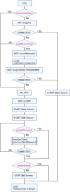

## AutoConnect::begin logic sequence

The following parameters of [AutoConnectConfig](apiconfig.md) affect the behavior and control a logic sequence of [AutoConnect::begin](api.md#begin) function. These parameters are evaluated on a case-by-case basis and may not be valid in all situations. The Sketch must consider the role of these parameters and the conditions under which they will work as intended. You need to understand what happens when using these parameters in combination.

- [autoReconnect](apiconfig.md#autoreconnect) : Attempts re-connect with past SSID by saved credential.
- [autoRise](apiconfig.md#autorise) : Controls starting the captive portal.
- [immediateStart](apiconfig.md#immediatestart) : Starts the captive portal immediately, without the 1st-WiFi.begin.
- [portalTimeout](apiconfig.md#portaltimeout) : Time out limit for the portal.
- [retainPortal](apiconfig.md#retainportal) : Keep DNS server functioning for the captive portal.

The following chart shows the AutoConnect::begin logic sequence that contains the control flow with each parameter takes effect.

For example, [AutoConnect::begin](api.md#begin) will not end without the [**portalTimeout**](apiconfig.md#portaltimeout) while the connection not establishes, but WebServer will start to work. Also, the DNS server will start to make a series of the captive portal operation on the client device. The custom web pages now respond correctly by the two internally launched servers, and the Sketch looks like working. But AutoConnect::begin does not end yet. Especially when invoking AutoConnect::begin in the **setup()**, control flow does not pass to the **loop()**.

However, [**portalTimeout**](apiconfig.md#portaltimeout) can be used effectively in various scenes in combination with [**immediateStart**](apiconfig.md#immediatestart). Its combination is useful for implementing Sketches that can work in situations where WiFi is not always available. Namely, Sketch will support a running mode with both offline and online.  
If AutoConnect staying in the captive portal exceeds the time limit, Sketch can switch a process-mode to offline according to WiFi signal detection. Conversely, it can start a captive portal immediately with intentional control to shift the process-mode to online from offline. Especially, You can activate the process-mode shift manually by trigger via external switches.

The [**retainPortal**](apiconfig.md#retainportal) option allows continuing the captive portal operation even after exiting from AutoConnect::begin. This option allows the use of the automatic portal pop-ups on the smartphone devices etc. even after the ESP module has established a connection with some access point in STA mode. (Excepts blocking a series of portal processes via intentionally accessing a URL outside the scope of **/_ac**. eg., if you try to communicate with the mqtt server without connecting to the access point, its access will be redirected to **/_ac** caused by the trap of the captive portal detection)

!!! info "The AutoConnect::begin 3rd parameter"
    Another parameter as the [3rd parameter](api.md#begin) of AutoConnect::begin related to timeout constrains the connection wait time after WiFi.begin. It is the **CONNECTED** judgment of the above chart that it has an effect.
