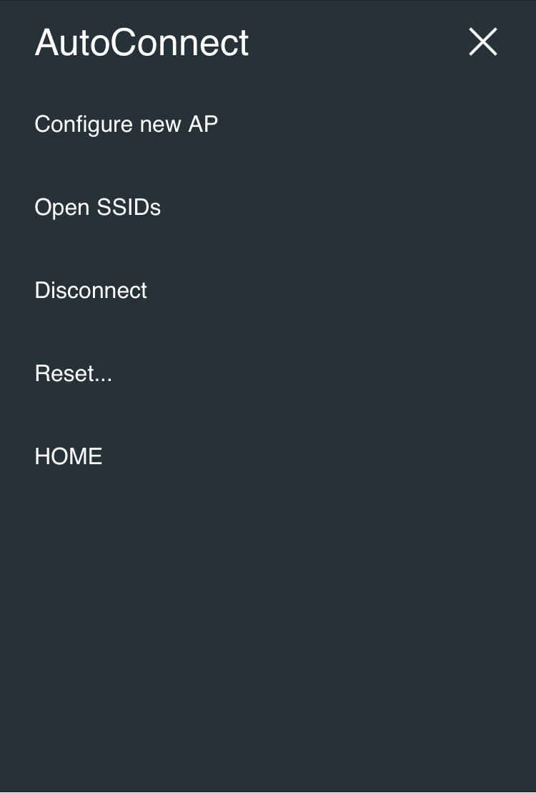
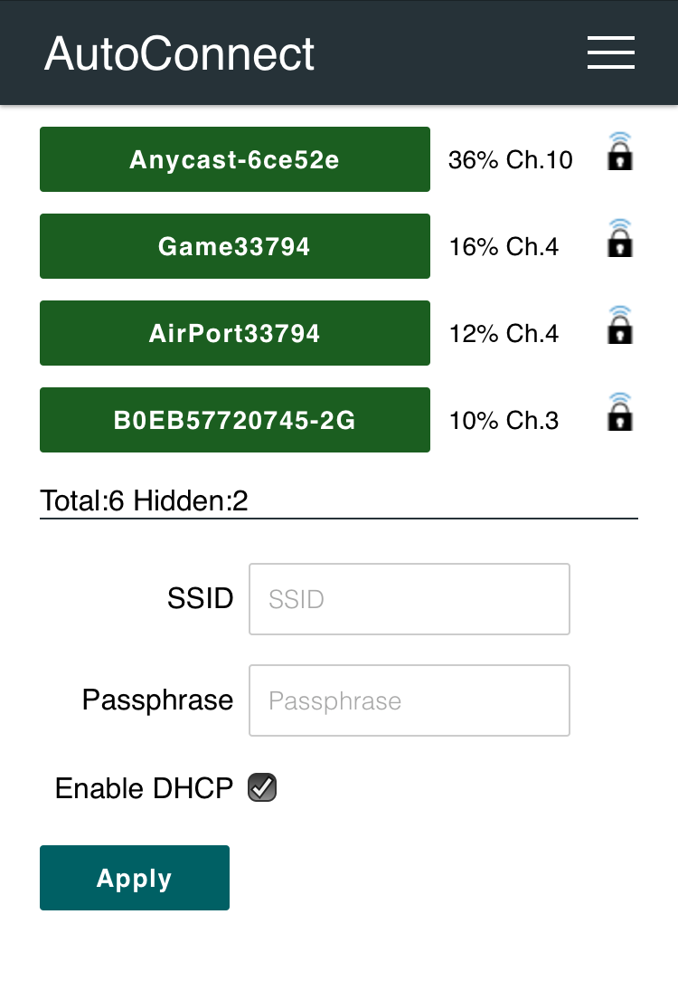
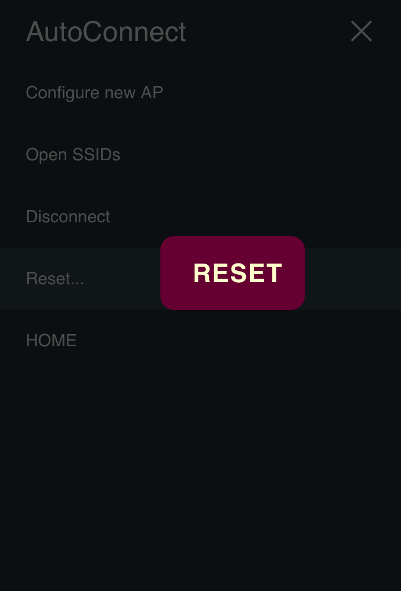

!!! info "Luxbar"
    The AutoConnect menu is developed using the [LuxBar](https://github.com/balzss/luxbar) which is licensed under the MIT License. See the [License](license.md).

## <i class="fa fa-external-link"></i> Where the from

The AutoConnect menu appears when you access the **AutoConnect root path**. It is assigned "**/_ac**" located on the *local IP address* of ESP8266/ESP32 module by default. This location can be changed in the sketch. The following screen will appear at access to `http://{localIP}/_ac` as the root path. This is the statistics of the current WiFi connection. You can access the menu from the here, to invoke it tap <i class="fa fa-bars"></i> at right on top. (e.g. `http://192.168.244.1/_ac` for SoftAP mode.)


!!! note "What's the local IP?"
    A local IP means Local IP at connection established or SoftAP's IP.

## <i class="fa fa-bars"></i> Right on top

Currently, AutoConnect supports four menus. Undermost menu as "HOME" returns to the home path of its sketch.

- **Configure new AP**: Configure SSID and Password for new access point.
- **Open SSIDs**: Opens the past SSID which has been established connection from EEPROM.
- **Disconnect**: Disconnects current connection.
- **Reset...**: Rest the ESP8266/ESP32 module.
- **HOME**: Return to user home page.



## <i class="fa fa-bars"></i> Configure new AP

Scan all available access point in the vicinity and display it. Strength and security of the detected AP are marked. The <i class="fa fa-lock"></i> is indicated for the SSID that needs a security key. "**Hidden:**" means the number of hidden SSIDs discovered.  
Enter SSID and Passphrase and tap "**apply**" to starts WiFi connection. 



## <i class="fa fa-bars"></i> Open SSIDs

Once it was established WiFi connection, its SSID and password will be saved in EEPROM of ESP8266/ESP32 automatically. The **Open SSIDs** menu reads the saved SSID credentials from the EEPROM. The stored credential data are listed by the SSID as shown below. Its label is a clickable button. Tap the SSID button, starts WiFi connection it.


## <i class="fa fa-bars"></i> Disconnect

Disconnect ESP8266/ESP32 from the current connection. It can also reset the ESP8266/ESP32 automatically after disconnection by instructing with using [API](api.md#autoreset) in the sketch.

After tapping "Disconnect", you will not be able to reach the AutoConnect menu. Once disconnected, you will need to set the SSID again for connecting the WLAN. 

## <i class="fa fa-bars"></i> Reset...

Reset the ESP8266/ESP32 module, it will start rebooting. After rebooting complete, the ESP8266/ESP32 module begins establishing the previous connection with WIFI_STA mode, and *esp8266ap* or *esp32ap* of an access point will disappear from WLAN.



!!! warning "Not every ESP8266 module will be rebooted normally"
    The Reset menu is using the **ESP.reset()** function for ESP8266. This is an almost hardware reset. In order to resume the sketch normally, the [state of GPIO0](https://github.com/esp8266/esp8266-wiki/wiki/Boot-Process#esp-boot-modes) is important. Since this depends on the circuit implementation for each module, not every module will be rebooted normally. See also [FAQ](faq.md#hang-up-after-reset).

## <i class="fa fa-bars"></i> Custom menu items

The menu items of the custom Web page line up at the below in the AutoConnect menu if the custom Web pages are joined. Details for [Custom Web pages in AutoConnect menu](acintro.md#custom-web-pages-in-autoconnectmenu).

## <i class="fa fa-bars"></i> HOME

A **HOME** item located at the bottom of the menu list is a link to the home path. The URI as the home path is `/` by default, and it is defined by `AUTOCONNECT_HOMEURI` with **AutoConnectDefs.h** file.

```cpp
#define AUTOCONNECT_HOMEURI     "/"
```

You can change the HOME path using the AutoConnect API. The [**AutoConnect::home**](api.md#home) function sets the URI as a link of the HOME item of the AutoConnect menu.

## <i class="fa fa-bars"></i> by attaching AutoConnect menu

The AutoConnect menu can contain HTML pages of your owns sketch as custom items. It works for HTML pages implemented by **ESP8266WebServer::on** handler or **WebServer::on** handler for ESP32. That is, you can make it as menu items to invoke the legacy web page. The below screenshot is the result of adding an example sketch for the ESP8266WebServer library known as [FSBrowser](https://github.com/esp8266/Arduino/tree/master/libraries/ESP8266WebServer/examples/FSBrowser) to the AutoConnect menu item. It adds Edit and List items with little modification to the legacy sketch code.

<div style="float:left;width:auto;height:420px;"></div>


You can extend the AutoConnect menu to improve the original sketches and according to the procedure described in section [*Advanced Usage*](advancedusage.md#casts-the-html-pages-to-be-add-on-into-the-menu).
