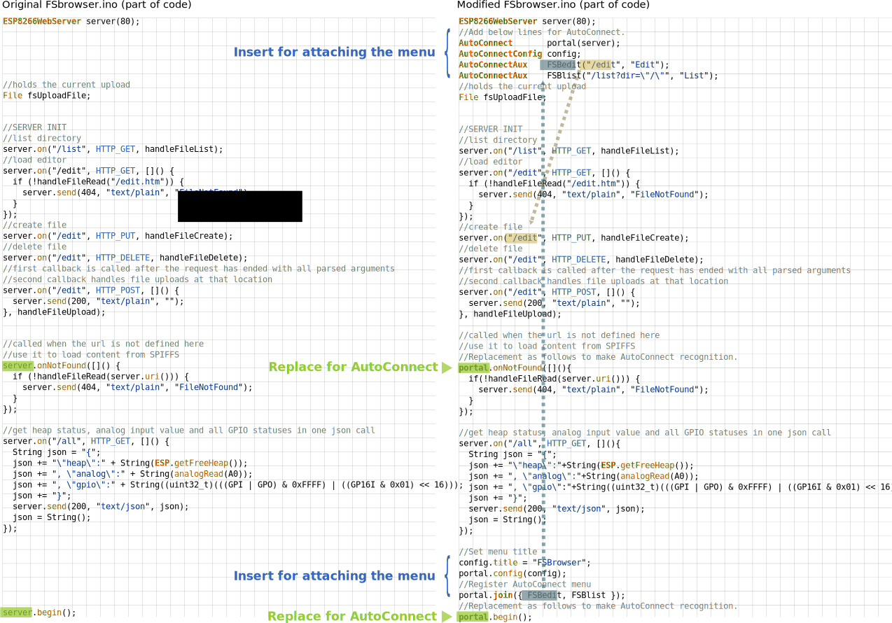

## The feature of menu attaching using AutoConnect

In this section, it presents numerous ways to customize the AutoConnect menu with your Sketch. AutoConnect dynamically materializes menu items at the Sketch run time  with joined [AutoConnectAux](acintro.md#how-it-works) as a sourced configuration. Typically, it has [AutoConnectElements](acintro.md#how-it-works) for page rendering in its composition but can configure a Web page as a menu item without having AutoConnectElements. In other words, the AutoConnect Menu component allows you to easily embed a navigation menu with WiFi connection expansion in your Sketch, which has legacy pages for ESP8266WebServer or WebServer of ESP32.

## The basic mechanism for menu generation

Sketch can equip the [AutoConnect menu](menu.md) by using three patterns according to the appropriate usage of the [AutoConnect API](api.md).

<i class="fa fa-desktop"></i>&ensp;**Basic menu**
:    It is the most basic menu for a WiFi connection only. Sketch can automatically display it using the typical calling sequence of the [AutoConnect API](api.md) with [AutoConnect::begin](api.md#begin) and [AutoConnect::handleClient](api.md#handleClient).

<i class="fa fa-desktop"></i>&ensp;**Extra menu with custom Web pages which is consisted by [AutoConnectElements](acelements.md)**
:    It is an extended menu that appears when the Sketch consists of the custom Web pages with [AutoConnectAux](acintro.md#how-it-works) and AutoConnectElements. Refer to section [*Custom Web pages section*](acintro.md#custom-web-pages-in-autoconnect-menu).

<i class="fa fa-desktop"></i>&ensp;**Extra menu which contains legacy pages**
:    It provides an item for including a legacy page in the AutoConnect menu that natively uses the page request handler attached by the [ESP8266WebServer::on](https://github.com/esp8266/Arduino/tree/master/libraries/ESP8266WebServer#client-request-handlers) function. (Similarly, WebServer::on for ESP32)

The mechanism by which AutoConnect dynamically generates the menu is simple. The member variables [**title**](apiaux.md#title) and [**uri**](apiaux.md#uri) of AutoConnectAux will be transferred into **&lt;li&gt;** HTML tag as they are. Then all **&lt;li&gt;** elements are included in the form that makes up the menu.
Therefore, the Sketch can register the legacy web pages to the menu by simply declaring the [title](apiaux.md#autoconnectaux) and [URI](apiaux.md#autoconnectaux) with AutoConnectAux and binding it to AutoConnect.

## Place the item for the legacy sketches on the menu

To implement this with your sketch, use only the [AutoConnectAux](apiaux.md#autoconnectaux) constructed with the title and URI of that page. [AutoConnectElements](acelements.md) is not required.

The AutoConnect library package contains an example sketch for ESP8266WebServer known as FSBrowser. Its example is a sample implementation that supports AutoConnect without changing the structure of the original FSBrowser and has the menu item for **Edit** and **List**.

<span style="display:block;margin-left:auto;margin-right:auto;width:282px;height:492px;border:1px solid lightgrey;"></span>

### <i class="fa fa-edit"></i>  Slightly changes to adapt FSBrowser to AutoConnect menu

The changes I made to adapt the FSBrowser to the AutoConnect menu are slight as follows:

1. Add AutoConnect declaration.
2. Add AutoConnectConfig declaration to replace the menu title to `FSBRowser`.
3. Set the menu title using [AutoConnectConfig::title](apiconfig.md#title).
4. Replace the destination of the not found handler (404 handler) from ESP8266WebServer to AutoConnect. [^1]<sup><sub>**IMPORTANT**</sub></sup>
5. Add AutoConnectAux using [AutoConnect::append](api.md#append) and combine an item for **Edit**.
6. Add AutoConnectAux using [AutoConnect::append](api.md#append) and combine an item for **List**.
7. Establish a WiFi connection using [AutoConnect::begin](api.md#begin) and execute [AutoConnect::handleClient](api.md#handleclient) in the **loop**, as in the case of handling the basic menu.

[^1]: Missing this step, AutoConnect cannot handle the menu. Refs: [404 handler](advancedusage.md#404-handler)

### <i class="fa fa-code"></i> FSBrowser with embedded AutoConnect

Modification for FSBrowser as follows: <small>(Excerpt of the sketch code)</small>

<div style="overflow:auto"></div>

... and embeds a hyperlink with an [icon](apiextra.md#icons) in the bottom of the body section of *index.htm* contained in the data folder to jump to the AutoConnect menu.

```html
<p style="padding-top:15px;text-align:center">
  <a href="/_ac"></a>
</p>
```

<script>
  window.onload = function() {
    Gifffer();
  };
</script>
