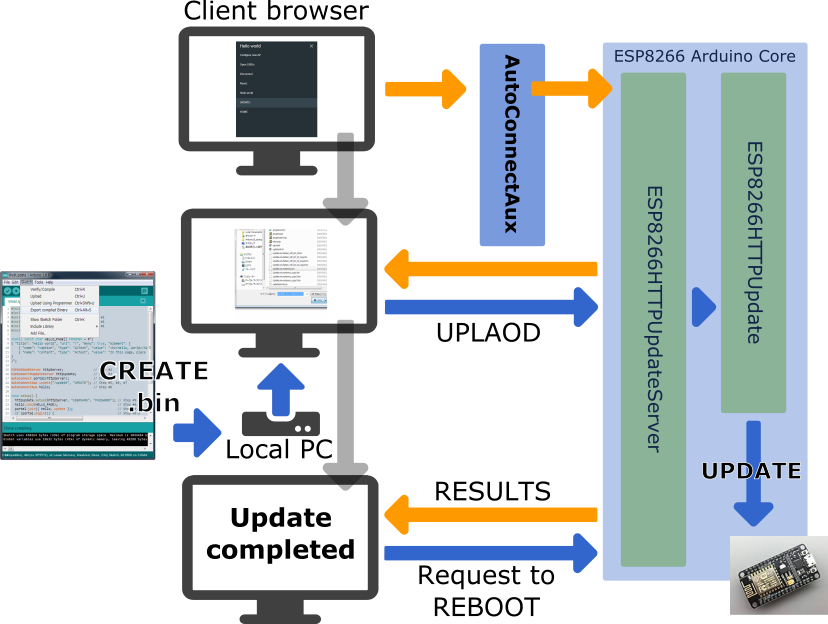
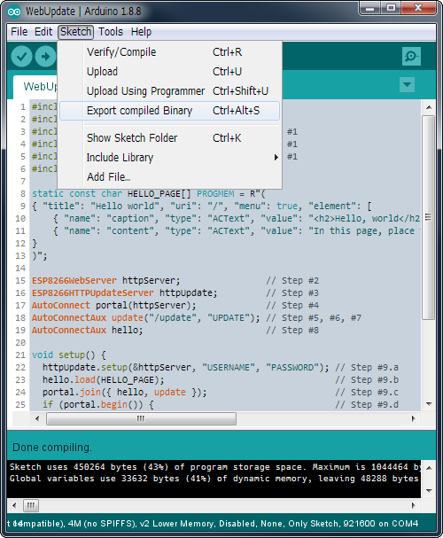

## Updates with the Web Browser

You can implement the user sketch as described in the [ESP8266 Arduino Core documentation](https://arduino-esp8266.readthedocs.io/en/latest/ota_updates/readme.html#implementation-overview) to realize using the web browser as an update client. By incorporating the ESP8266HTTPUpdateServer class into AutoConnect, you can operate the dialog page for selecting the updating binary sketch file owned by ESP8266HTTPUpdateServer from the AutoConnect menu. 

Update feature with a web browser is implemented using ESP8266HTTPUpdateServer class and ESP8266mDNS class. However, **ESP32 Arduino core does not provide a class implementation equivalent to ESP8266HTTPUpdateServer**. Therefore, it is necessary to implement an HTTPUpdateServer class for ESP32 to realize the update using a Web browser. **The AutoConnect library includes an implementation of the HTTPUpdateServer class for ESP32 to make it easy for you to experience**. [^1]

[^1]: You can find the implementation of the **HTTPUpdateServer** class in the **WebUpdate** folder included in the **AutoConnect library examples folder**.



!!! warning "For the client devices equipped with Android OS"
    Depending on the state of Android OS configuration, Bonjour service may not be incorporated. This method does not work with some Android devices as the client.

### <i class="fa fa-edit"></i> How to embed ESP8266HTTPUpdateServer in AutoConnect

To embed the ESP8266HTTPUpdateServer class with AutoConnect into your sketch, basically follow these steps:

1. Include `ESP8266mDNS.h` and `ESP8266HTTPUpdateServer.h`, also `WiFiClient.h`, in addition to the usual directives as `ESP8266WebServer.h` and `AutoConnect.h`.
2. Declare an ESP8266WebServer object. (In ESP32, as WebServer)
3. Declare an ESP8266HTTPUpdateServer object.
4. Declare an AutoConnect object with an ESP8266WebServer object as an argument.
5. Declare an AutoConnectAux object for the update operation page.
6. Assign `/update` to the URI of the update dialog page.
7. Assign any title as the AutoConnect menu for the update dialog page.
8. Declare additional AutoConnectAux pages for your application intention if needed.
9. Perform the following procedure steps in the `setup()` function:
    1. Invokes `ESP8288HTTPUpdateServer::setup` function, specifies the **USERNAME** and the **PASSWORD** as needed.
    2. Load the AutoConnectAux pages declared in step #8 for your application. (Except the update dialog page)
    3. Join these pages to AutoConnect along with the update dialog page declared in step #5.
    4. Invokes [AutoConnect::begin](api.md#begin) function.
    5. Call the `MDNS.begin` and `MDNS.addServer` functions to start the multi cast DNS service.
10. Perform the following procedure steps in the `loop()` function:
    1. Call the `MDNS.update` function to parse requests for mDNS. (No needed as ESP32)
    2. Invokes [AutoConnect::handleClient](api.md#handleclient) function.

```cpp
#include <ESP8266WiFi.h>
#include <ESP8266WebServer.h>
#include <ESP8266HTTPUpdateServer.h>    // Step #1
#include <ESP8266mDNS.h>                // Step #1
#include <WiFiClient.h>                 // Step #1
#include <AutoConnect.h>

static const char HELLO_PAGE[] PROGMEM = R"(
{ "title": "Hello world", "uri": "/", "menu": true, "element": [
    { "name": "caption", "type": "ACText", "value": "<h2>Hello, world</h2>",  "style": "text-align:center;color:#2f4f4f;padding:10px;" },
    { "name": "content", "type": "ACText", "value": "In this page, place the custom web page handled by the sketch application." } ]
}
)";

ESP8266WebServer httpServer;                // Step #2
ESP8266HTTPUpdateServer httpUpdate;         // Step #3
AutoConnect portal(httpServer);             // Step #4
AutoConnectAux update("/update", "UPDATE"); // Step #5, #6, #7
AutoConnectAux hello;                       // Step #8

void setup() {
  httpUpdate.setup(&httpServer, "USERNAME", "PASSWORD"); // Step #9.a
  hello.load(HELLO_PAGE);                                // Step #9.b
  portal.join({ hello, update });                        // Step #9.c
  if (portal.begin()) {                                  // Step #9.d
    if (MDNS.begin("esp-webupdate"))                     // Step #9.e
        MDNS.addService("http", "tcp", 80);              // Step #9.e
  }
}

void loop() {
  MDNS.update();            // Step #10.a
  portal.handleClient();    // Step #10.b
}
```

!!! hint "For ESP32"
    This procedure is equally applicable to ESP32. If the target module is ESP32, change the following items:

    - Change the include directives appropriately for the ESP32 environment.
    - Change ESP8266HTTPUpdaetServer to HTTPUpdateServer using an implementation provided from AutoConnect library example code.
    - Remove `MDNS.update` line from the sketch code.

!!! example "Share an ESP8266WebServer"
    AutoConnect shares the ESP8266WebServer instance with the ESP8266HTTPUpdateServer class. You can give the same instance as ESP8266WebServer instance given to AutoConnect to ESP8266HTTPUpdateServer class.
    ```cpp
    ESP8266WebServer httpServer;
    ESP8266HTTPUpdateServer updateServer;
    AutoConnect portal(httpServer);
    updateServer(&httpServer);
    ```
    This sharing specification is the same for ESP32.

The result of the above sketch should be as follows. [^2]

[^2]: The authentication dialog is displayed first.

<span style="display:block;margin-left:auto;margin-right:auto;width:282px;height:362px;border:1px solid lightgrey;"></span>

!!! faq "How LED ticking during updates"
    You **cannot** get the ticker with LED during updates by using this way. It is since the current implementation of the ESP8266HTTPUpdateServer class of the Arduino core **library does not assign an LED PIN** to the ESP8266HTTPUpdate class.

### <i class="fa fa-wrench"></i> How to make the binary sketch

Binary sketch files for updating can be retrieved using the Arduino IDE. Open the **Sketch** menu and select the **Export compiled Binary**, then starts compilation.



When the compilation is complete, a binary sketch will save with the extension `.bin` in the same folder as the sketch.

<script>
  window.onload = function() {
    Gifffer();
  };
</script>
