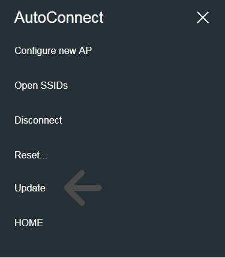
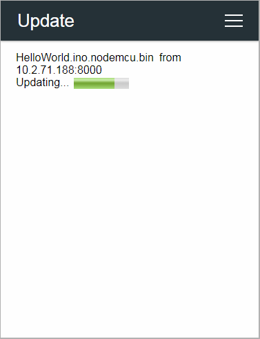
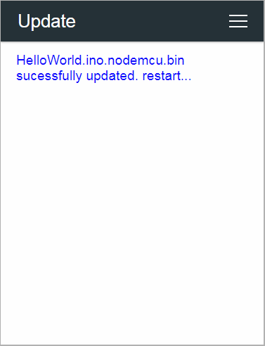

## Updates with the update server

Since the v1.0.0 release, AutoConnect provides new feature for updating sketch firmware of ESP8266 or ESP32 modules via OTA using the [AutoConnectUpdate](apiupdate.md#autoconnectupdate) class that is an implementation of the Sketch binary update by the HTTP server mentioned in the [OTA update](https://arduino-esp8266.readthedocs.io/en/latest/ota_updates/readme.html#http-server) of the ESP8266 Arduino Core documentation, which inherits from the ESP8266HTTPUpdate class (as HTTPUpdate class in the case of ESP32). It acts as a client agent for a series of update operations.

This method allows you to remotely update the ESP module's firmware beyond the network segments from the update server, as long as you can ensure proper routing and forwarding.


If you choose this update method, you need to prepare the server process as a variant of the HTTP server that supplies the binary sketch files to the updating client agent. Its server requires to be able to handle the HTTP headers extended by ESP8266HTTPUpdate class as described in the [ESP8266 Arduino Core documentation](https://arduino-esp8266.readthedocs.io/en/latest/ota_updates/readme.html#server-request-handling). There are various implementations of the update server that provide binary sketch files. For example, the ESP8266 Arduino Core documentation suggests an [advanced updater](https://arduino-esp8266.readthedocs.io/en/latest/ota_updates/readme.html#id5) php script that can be fully communicated with the client agent using the ESP8266HTTPUpdate class.  That is, the update server for AutoConnect must work with the client agent, and its implementation should make the handshake well with the AutoConnectUpdate class which wraps an ESP8266HTTPUpdate class.  
The AutoConnect library provides an update server script implemented in Python that can combine with the AutoConnectUpdate class.

### <i class="fa fa-edit"></i> How to embed AutoConnectUpdate to your sketch

To embed the AutoConnectUpdate class into your sketch, basically follow these steps:

1. Declare an ESP8266WebServer object. (In ESP32, as WebServer)
2. Declare an AutoConnect object with an ESP8266WebServer object.
3. Declare an [AutoConnectUpdate](apiupdate.md) object with the update server address and the HTTP port as parameters.
4. Invokes [AutoConnect::begin](api.md#begin) function.
5. Attach the AutoConnectUpdate object to AutoConnect using [AutoConnectUpdate::attach](apiupdate.md#attach) function.
6. Invokes [AutoConnect::handleClient](api.md#handleclient) function in the `loop()`.

```cpp
#include <ESP8266WiFi.h>
#include <ESP8266WebServer.h>
#include <AutoConnect.h>

ESP8266WebServer server;                          // Step #1
AutoConnect portal;                               // Step #2
AutoConnectUpdate update("192.168.0.100", 8000);  // Step #3

void setup() {
  if (portal.begin()) {     // Step #4
    update.attach(portal);  // Step #5
  }
}

void loop() {
  portal.handleClient();    // Step #6
}
```

<span style="display:block;margin-left:auto;margin-right:auto;width:282px;height:362px;border:1px solid lightgrey;"></span>

### <i class="fas fa-desktop"></i> Behavior of the AutoConnectUpdate class

A sketch incorporating the AutoConnectUpdate class has an extended menu item as **UPDATE** in the AutoConnect menu. **UPDATE** as menu item will be attached by the AutoConnectUpdate automatically.

When an UPDATE item started, its first action is requesting a [catalog list](#2-the-catalog-list-content) of updatable binary sketch files to the [update server](#update-server-for-the-autoconnectupdate-class). Then the update server sends back the catalog list of stored binary sketch files to a client which is the ESP module. The AutoConnectUpdate class will display responded list to a custom Web page[^1] on the browser.

[^1]: You can scroll horizontally on the browser to see the timestamp and file size that the catalog list contains.




The substance of Available firmware list is a custom Web page by AutoConnectAux, and you can select the target binary sketch file with the radio button (AutoConnectRadio). A progress bar will appear to notify the updating status once the update has begun. When the update finished, the ESP module will reset automatically to launch a new firmware.




The AutoConnectUpdate class performs the above series of operations in conjunction with the update server. All you need to do is attach the AutoConnectUpdate class to AutoConnect and execute the [AutoConnect::handleClient](api.md#handleclient) function in the `loop()`.

### <i class="fas fa-server"></i> Update server for the AutoConnectUpdate class

The above series of operations using AutoConnectUpdate class requires an update server that can work with it. AutoConnect provides an update server script implemented in Python. This server script conforms to a sketch that uses the AutoConnectUpdate class as an update client agent.[^2]

In the OTA platform, you can place the update server operated by the script in a location that is reachable from the ESP module on the network.

[^2]: The folders containing the script:  
For Python2: *AUTOCONNECT\_LIBRARY\_PATH*/src/updateserver/python2  
For Python3: *AUTOCONNECT\_LIBRARY\_PATH*/src/updateserver/python3

```powershell
updateserver.py [-h] [--port PORT] [--bind IP_ADDRESS] [--catalog CATALOG] [--log LOG_LEVEL]
```

<dl class="apidl">
  <dt></dt>
  <dd><span class="apidef"><strong>--help | -h</strong></span><span class="apidesc">Show help message and exit.</span>
  <dd><span class="apidef"><strong>--port | -p</strong></span><span class="apidesc">Specifies <strong>PORT</strong> number (Default: 8000)</span>
  <dd><span class="apidef"><strong>--bind | -b</strong></span><span class="apidesc">Specifies the IP address to which the update server binds. Usually, it is the host address of the update server. When multiple NICs configured, specify one of the IP addresses. (Default: HOST IP or 127.0.0.0)</span>
  <dd><span class="apidef"><strong>--catalog | -d</strong></span><span class="apidesc">Specifies the directory path on the update server that contains the binary sketch files. (Default: The current directory)</span>
  <dd><span class="apidef"><strong>--log | -l</strong></span><span class="apidesc">Specifies the level of logging output. It accepts the <a href="https://docs.python.org/3/library/logging.html?highlight=logging#logging-levels">Logging Levels</a> specified in the Python logging module.</span>
</dl>

!!! example "updateserver.py usage"
    1. Python  
       First, prepare a Python environment. It is also possible with a tiny single-board computer like the [raspberry pi](https://www.raspberrypi.org/). Popular distributions such as Ubuntu for Linux include Python. You can easily set up a Python 2 or 3 environment. If you are using a Mac, you already have the Python 2 environment. macOS is equipped with Python 2.7 by default. In the case of Windows OS, it is necessary to install the Python environment intentionally. Please refer to the [Python official page](https://wiki.python.org/moin/BeginnersGuide/Download) to install Python in your environment.

    2. Deploy the binary sketch files  
       Use the Arduino IDE to output a binary file of sketches and deploy it[^3] under the update server. The path which specifies for the **--catalog** option of updateServer.py is the path of the binary sketch files you deployed.

    3. Start updateserver.py  
       For example, to start the update server on the host with IP address 172.16.1.10 using 8080 port[^4], execute the following command:
      ```powershell
      python updateserver.py --port 8080 --bind 172.16.1.10 --catalog bin --log debug
      ```  
      In this example assumes that the binary sketch files are deployed under the path `bin` from the current directory.

[^3]: Deploying the binary sketch file output by Arduino IDE is usually just copying to the folder for deployment. However, its folder must be accessible from the updateserver.py script.
[^4]: The port of the update server and the port used by the AutoConnectUpdate class must be the same.

!!! note "Limitations of the updateserver.py"
    The updateserver.py script equips only the minimum facility because it assumes a private small OTA platform without identifying individual modules and version restrictions etc. To operate a larger OTA platform, it is necessary to identify the individual ESP module and to consider version control and security.

### <i class="far fa-handshake"></i> HTTP contents and the sequence for the AutoConnectUpdate class

You can also equip an update server that works with the AutoConnectUpdate class. It can be improved more widely applicable by adding extensions such as version control and authentication to the updateserver.py script. It is necessary to understand the specifications related to HTTP data streams and sequences to enhance the update server that the AutoConnectUpdate class assumes.

This section describes the contents of the HTTP data stream required by the communication with AutoConnectUpdate class. To work correctly with the AutoConnectUpdate class, the update server must meet two requirements:

- The update server notifies the catalog list of updatable binary files which stored in the update server to the client agent. [^5]
- Send an updating binary file and MD5 hash to a client in response to URI request (HTTP GET). [^6]

[^5]: The **client agent** is an instance of the AutoConnectUpdate class.
[^6]: The client agent will send its URI request to the update server.

Above requirements will be implemented on along the HTTP protocol. The AutoConnectUpdate class requests an update server to notify the client for a catalog list of binary sketch files using an HTTP URL query string. The specifications of the HTTP query and the contents of the catalog list to be returned are as follows:

#### 1. HTTP URL query for the catalog list of the updatable

```powershell
[address]/_catalog?op=list&path=[path]
```

<dl class="apidl">
  <dt></dt>
  <dd><span class="apidef"><strong>address</strong></span><span class="apidesc">URL of the update server</span>
  <dd><span class="apidef"><strong>/_catalog</strong></span><span class="apidesc">Request path, it is fixed.</span>
  <dd><span class="apidef"><strong>op</strong></span><span class="apidesc">Operation command for the update server. Currently, only '<strong>list</strong>' occurs.</span>
  <dd><span class="apidef"><strong>path</strong></span><span class="apidesc">Path containing the updatable binary files on the update server.</span>
</dl>

#### 2. The catalog list content

The response (that is, the catalog list) to the above query from the server is the following specification in JSON format.

```js
{
  "name" : FILE_NAME,
  "type" : FILE_TYPE,
  "date" : FILE_TIMESTAMP_DATED,
  "time" : FILE_TIMESTAMP_TIMED,
  "size" : FILE_SIZE
}
```

<dl class="apidl">
  <dt></dt>
  <dd><span class="apidef"><strong>name</strong></span><span class="apidesc">Binary sketch file name for update (String)</span>
  <dd><span class="apidef"><strong>type</strong></span><span class="apidesc">One of '<strong>bin</strong>', '<strong>directory</strong>' or '<strong>file</strong>'. AutoConnect Update recognizes only file types of '<strong>bin</strong>' as update targets. (String)</span>
  <dd><span class="apidef"><strong>date</strong></span><span class="apidesc">File update date. AutoConnect v1.0.0 treats the file update date as an annotation and is not equip the version control feature yet. (String)</span>
  <dd><span class="apidef"><strong>time</strong></span><span class="apidesc">File update time. AutoConnect v1.0.0 treats the file update date as an annotation and is not equip the version control feature yet. (String)</span>
  <dd><span class="apidef"><strong>size</strong></span><span class="apidesc">File byte count (Numeric)</span>
</dl>

The above JSON object is one entry. The actual catalog list is an array of this entry since it  assumes that an update server will provide multiple update binary files in production. The update server should respond with the MIME type specified as `application/json` for the catalog list.[^7]

[^7]: It should be represented as `Content-Type: application/json` in the HTTP response header.

#### 3. The binary sketch file used for updating

The AutoConnectUpdate class issues a HTTP GET request with the specified host address and URI. The update server responds by sending back a binary sketch file with the following header:

```powershell
Content-Type: application/octet-stream
Content-Disposition: attachment; filename="BINARY_SKETCH_FILE_NAME"
Content-Length: LENGTH_OF_CONTENT
x-MD5: HEXDIGEST
```

The header **x-MD5** is a 128-bit hash value (digest in hexadecimal) that represents the checksum of the binary sketch file for updates required for the ESP8266HTTPUpdate class.

<script>
  window.onload = function() {
    Gifffer();
  };
</script>
